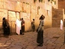

  
[Intangible Textual Heritage](../../index)  [Judaism](../index.md) 
[Index](index)  [Previous](pol10)  [Next](pol12.md) 

------------------------------------------------------------------------

[Buy this Book at
Amazon.com](https://www.amazon.com/exec/obidos/ASIN/B002F9NQVE/internetsacredte.md)

------------------------------------------------------------------------

  
*The Talmud: Selections*, by H. Polano, \[1876\], at Intangible Textual
Heritage

------------------------------------------------------------------------

p. 155

### Chapter II

#### THE TEN PLAGUES.

"*Thus hath said the Lord, 'By this thou shalt know that I am the lord;
behold I will smile . . . . the waters of the river, and they shall be
turned to blood.'*"

When a human being designs to injure another, or to take vengeance on an
enemy, he comes upon him suddenly and without warning. Not so, however,
does God act. He warned Pharaoh of every plague which He brought upon
Egypt, in order to give him the opportunity for repentance.

Why were the waters first smitten? Because the Egyptians worshipped the
river Nile, and the Lord said, "I will first smite the god and then its
nation," according to the proverb, "I will first smite the gods, then
the priests will be terrified."

*Blood*.

Why did the Lord punish the Egyptians with blood? Because they shed the
blood of innocent infants, therefore was the water of their rivers
turned to blood.

"*And the Lord said unto Moses, say to Aaron, Take thy staff and stretch
out thy hand over the waters of Egypt*."

Why could not Moses himself smite the river?

Because the waters had protected and guarded him when he slumbered, a
helpless infant, in the ark of bulrushes, and the wise sayings teach us,
"Into the well wherefrom thou drawest water thou shouldst cast no
stones."

p. 156

*Frogs*.

We are apt to think the frog superfluous, not requisite in the economy
of the universe. Not so,--every living thing has its purpose, and the
frogs became an instrument in Pharaoh's punishment. The river Nile
brought forth frogs in abundance, but they strayed not from its banks.
Then God said, "Thou sayest, 'the river is mine,'--verily I will show
thee that even thy house is not thy own; the frogs shall enter into it,
even into thy kneading trough, they will sit in thy dough and consume
it."

The frogs caused the Egyptians morn annoyance than that occasioned by
the mere pecuniary loss which they carried with them, for they were very
noisy; therefore it is written, "Moses cried (*i.e.*, spoke with a loud
voice) to the Lord, on account of the frogs."

*Lice*.

"*Say to Aaron . . . and smite the dust of the earth*."

Why did not Moses himself smite the dust?

Because Moses hid in the dust the body of the Egyptian whom he found
smiting a Hebrew, and the dust concealed his action. Therefore were the
plagues involving the water and the dust wrought through Aaron.

Why were the Egyptians afflicted with this plague?

Because they had forced the Israelites to sweep the streets and to work
in mortar, dust, and bricks. Therefore was the dust of the streets
turned to lice. The magicians were unable to produce the lice, because
they could not imitate articles smaller than a barleycorn; therefore
they said, "This is the finger of God."

*The Multitude of Beasts*.

"*Rise up early*," &c.

p. 157

God said to Moses, "This man persists in his obstinacy, despite the
plagues already brought upon him; therefore say to him that the next
will be more dreadful than the others all combined; bid him let Israel
go."

The beasts swarmed first into the house of Pharaoh, because he was the
first to oppress Israel, and then into the houses of his servants,
because they followed in his lead.

Why were these beasts brought upon the Egyptians? Because they had
forced the Israelites to endanger their lives by hunting wild beasts.

We find that the frogs died in the land of Egypt, but that the beasts
were removed. Why this difference? Because the frogs were worthless, but
the Egyptians might have profited from the furs of the wild beasts.

*Pestilence*.

Why was this plague brought upon them?

To show that the plagues were directed only against the Egyptians, for
as the Bible tells us, "There had not died of the cattle of the
Israelites even one." Even cattle belonging to a Hebrew and in the
possession of an Egyptian was saved, as was also the cattle owned in
shares by an Egyptian and an Israelite.

*Boils*.

Why did He bring boils upon them?

Because they had compelled the Israelites to clean their houses and
courts, thus making their blood impure, and producing boils.

Why were the magicians unable to stand before Moses on account of the
inflammation?

Because they had advised that every son born to Israel should be cast
into the river.

p. 158

"*The Lord hardened*," &'c.

When the Lord saw that the five plagues already brought upon Pharaoh did
not cause his repentance, he said, "Even should he wish to repent
hereafter, I will harden his heart that he may receive the full measure
of his punishment."

*Hail*.

"*Behold, then will I let rain about this time to to-morrow*," &c.

Moses made a mark upon the wall of Pharaoh's house, saying, "When the
sun shall shine to-morrow upon this spot there will be hail, therefore
bring in thy cattle," &c.

Again, the compassion of God is displayed to us. Even in his anger He
was still mercifully inclined towards the wicked people and their
cattle. He intended the plague of hail to destroy vegetation, not life;
therefore He warned the people to keep themselves and their flocks under
shelter.

"*The lord said . . . Stretch out thy hand towards the heaven*," &c.

Although "the heavens are the heavens of the Lord," yet "the earth hath
He given to the children of men" (Psalm 120: 16).

An emperor, ruling Rome and Syria, might issue a decree forbidding
Romans to visit Syria, and Syrians to visit Rome. So God in creating the
world pronounced the heavens "the heavens of the Lord," the residence of
godly beings.

"But the earth hath He given to the children of men;" the earth must be
the scene of their sojournings. Yet, "whatsoever the Lord willeth hath
He done, in the heavens and on the earth; in the seas and in all the
deeps" (Psalm 135:16).

He descended upon the earth at Mount Sinai; at the

p. 159

time of the creation He said, "Let the waters gather together in one
place," and when it pleased Him so to do, He made the sea dry land, even
as it is written, "And the children of Israel walked upon dry land in
the midst of the sea."

In the same manner God gave Moses permission to rule over the heavens,
to stretch his hands towards them, and bring down a hailstorm over the
land of Egypt.

Why were they punished with hail?

Because they had compelled the Israelites to plough their fields, sow
their grain, care for their trees, and to perform all the menial labour
incidental to the cultivation of the soil. Therefore God sent this
hailstorm to destroy the products of the ground, that the Egyptians
might reap no profit from the enforced labour of His people. When God
saw that they disregarded His warning, and neglected to put their cattle
under shelter, He caused the cattle to die from the effects of the
storm.

The hailstones were very large, each of them being about the size of an
infant's head; and as they touched the ground they burst into flame.

*Locusts*.

Why did God bring the locusts into Egypt?

The Israelites had sowed the fields with grain, and the locusts were
brought to destroy all that had escaped the hail.

This plague was so grievous as to wring from Pharaoh the acknowledgment,
"I have sinned against the Lord your God that I did not let Israel go."
"And against you" (Moses and Aaron), "that I have driven you out of my
house."

p. 160

*Darkness*.

"*But for all the children of Israel there was light in their
dwellings*."

Why, is it not written, "There was light in the land of Goshen?"

Because, wherever the Israelites were, there was light for them; but to
an Egyptian, even in the same room with an Israelite, all was
impenetrable darkness.

*The Slaying of the First-Born*.

"*Thou shalt not see my face any more*."

Such were the words of Pharaoh, when Moses appeared before him, to warn
him for the last time of the doom awaiting him should he still oppose
the exodus of Israel. Moses answered:

"Thou hast spoken well. Nevermore will I come to thee, but thou wilt
come to me, and thy servants and thyself will entreat me, bending, to
depart from thy country, and then will I go."

Some of the Egyptians, fearing Moses's prophecy, slept that night in the
houses of the Israelites. But the death-stroke found them, and the
Israelite awakening, found an Egyptian's corpse beside him.

Great was the distress in Egypt. Pharaoh called to Moses and Aaron, and
said, "Arise!" They replied, "What would Pharaoh with us? Has he come to
us?" "Arise!" he cried, "arise and go."

The Israelites went forth from Egypt on the eve of the fifteenth of
Nissan; on this same night, many years later, the army of Sennacherib,
encamped before Jerusalem, was slain by the Lord. King Hezekiah, and the
inhabitants of the besieged city, celebrated the feast of Passover
according

p. 161

to the command of God, and sang praises and hallelujahs to His Holy
Name.

But Hezekiah was heavy at heart, and he said:

"To-morrow the city may be taken." Yet, lo, when they arose in the
morning, the Lord had again passed over for His people, and the invading
army lay dead in its camp.

Before inflicting the last plague, God warned Pharaoh, as it is written,
"*I will smite all the first-born of Egypt*."

Had God wished to make this the first, instead of the last of the
plagues, He could have done so; but He desired to increase the severity
with the number of the plagues, and accordingly the lightest he sent
first.

"*The Lord will pass through the land of Egypt and smite all the
first-born*."

A certain king sent his son to a distant country, the people of which
received him with great honours, and conferred distinction upon him,
finally making him their ruler. When his father heard this, he said:

"What honour shall I do them in return? I will call that country after
the name of my son."

After some time had elapsed, he again received news from the distant
land; its people had taken away the honours conferred upon his son, and
made him a slave He therefore went to war with them and delivered his
son.

Joseph went down to Egypt and was made governor. Great respect was also
paid to Jacob, for whose death "the Egyptians mourned seventy days."

For this God named Egypt after the garden of Eden, as it is written, "As
the garden of the Lord is the land of Egypt." When, however, the
Israelites were oppressed and reduced to slavery, God made war upon
Egypt, through the medium of the ten plagues, and through the last
delivered his "son," Israel, from bondage.

p. 162

During the night, while the Hebrews sang praises to God, Pharaoh came to
the place where Moses and Aaron dwelt, and he cried, "Arise, get thee
out," &c. Then the people scattered themselves among the Egyptians,
borrowing vessels of gold and silver. But Moses sought the sepulchre of
Joseph, and carried forth his bones, according to the charge transmitted
to him.

"*And it came to pass at the end of four hundred and thirty years*," &c.

These years are counted from the time that God appeared to Abraham in
the vision known as "The Covenant of the Pieces," and told him that his
seed should be "strangers in a land not theirs." They lived in Egypt,
however, only two hundred and ten years. Upon the same month and day, as
they had entered Egypt, they left it. On that date Joseph was released
from prison, and in subsequent years it witnessed the performance of
many wonders in behalf of God's people.

In King Hezekiah's time Jerusalem was delivered from Sennacherib; during
the Babylonian captivity, Shedrach, Meshach, and Abednego were delivered
from the fire of furnace, and Daniel came forth unharmed from the lion's
den.

------------------------------------------------------------------------

[Next: III. The Death of Moses](pol12.md)
