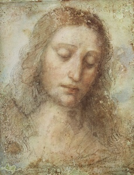

  
[Intangible Textual Heritage](../../index)  [Judaism](../index) 

------------------------------------------------------------------------

[Buy this Book at
Amazon.com](https://www.amazon.com/exec/obidos/ASIN/1417963468/internetsacredte)

------------------------------------------------------------------------

<table width="75%">
<colgroup>
<col style="width: 50%" />
<col style="width: 50%" />
</colgroup>
<tbody>
<tr class="odd">
<td width="50%" data-valign="TOP"></td>
<td width="50%" data-valign="CENTER"><h1 id="a-rabbis-impressions-of-the-oberammergau-passion-play" data-align="CENTER">A Rabbi's Impressions of the Oberammergau Passion Play</h1>
<h2 id="by-joseph-krauskopf" data-align="CENTER">by Joseph Krauskopf</h2>
<h4 id="section" data-align="CENTER">[1901]</h4></td>
</tr>
</tbody>
</table>

------------------------------------------------------------------------

[Contents](#contents)    [Start Reading](rio00)

------------------------------------------------------------------------

|                                                                                                                           |
|---------------------------------------------------------------------------------------------------------------------------|
|  |

Four centuries ago a village high in the Bavarian Alps, Oberammergau,
promised that, if God interceded against the bubonic plague, they would
stage a Passion play every ten years. A Passion play is a medieval
dramatic form which depicts the life and (principally) death of Jesus.
All of the actors are residents, and the entire community participates
in one way or another. The pageant continues in the 21st century.

This book is an American Reform Rabbi's encounter with this quaint, and
at the time insidiously anti-Semitic, production. He vividly describes
his own feelings at each stage of the play. Krauskopf uses the 1900
Oberammergau Passion as a springboard to examine a whole set of issues
which will make both Jews and Christians uncomfortable, but which need
looking at, even today. He is a virtual attorney-for-the-defense,
working every angle to clear the reputation of the Jews.

Krauskopf points out many inconsistencies in the narrative. He describes
how bits of folklore accreted to the story, and how the four Gospel
accounts don't match up. In particular he illustrates how the legal
procedures don't remotely match what was customary at the time, let
alone the question of why such a trial would even be conducted during
the high holy days. He exhibits a long (but unfortunately unattributed)
list of parallels between the teachings attributed to Jesus and the
Talmud.

The Second Vatican Council, in Nostra Aetate no. 5, October 28, 1965,
stated that "the Jews should not be presented as rejected or accursed by
God as if this followed from Sacred Scripture." The Oberammergau script
has been rewritten to soften the anti-Semitism and to remind viewers
that Jesus was Jewish (!). However, the issue keeps coming up. Recently
the movie adaptation of [The Dolorous Passion of Our Lord Jesus
Christ](../../chr/pjc/index) revived the controversy.

------------------------------------------------------------------------

 [Title Page](rio00)  
[Contents](rio01)  
[Foreword](rio02)  
[I. Introductory](rio03)  
[II. In the Forenoon](rio04)  
[III. In the Forenoon (Continued)](rio05)  
[IV. In the Afternoon](rio06)  
[V. The End](rio07)  
[VI. The Summary](rio08)  

 

[What of the Old Testament Prophecies of Christ?](rio09)  
[Talmudic Parallels to New Testament Teachings](rio10)  
[Paul—The Founder and Spreader of Christology](rio11)  
[Index](rio12)  
