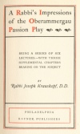
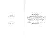

  
[Intangible Textual Heritage](../../index)  [Judaism](../index) 
[Index](index)  [Next](rio01) 

------------------------------------------------------------------------

[Buy this Book at
Amazon.com](https://www.amazon.com/exec/obidos/ASIN/1417963468/internetsacredte)

------------------------------------------------------------------------

*A Rabbi's Impressions of the Oberammergau Passion Play*, by Joseph
Krauskopf, \[1901\], at Intangible Textual Heritage

------------------------------------------------------------------------

p. 1

p. 2 p. 3

###### A Rabbi's Impressions of the Oberammergau Passion Play

p. 4 p. 5

# A Rabbi's Impressions of the Oberammergau Passion Play

##### BEING A SERIES OF SIX LECTURES.—WITH THREE SUPPLEMENTAL CHAPTERS BEARING ON THE SUBJECT

###### BY

## Rabbi Joseph Krauskopf, D.D.

#### PHILADELPHIA

#### RAYNER, PUBLISHERS

#### \[c. 1901\], no date in this edition. Author b. 1858 d. 1923.

Scanned, proofed and formatted by John Bruno Hare at Intangible Textual
Heritage, October, 2007. This text is in the public domain in the US
because it was published prior to 1923. These files may be used for any
purpose.

[  
Click to enlarge](img/fcover.jpg)  
Front Cover and Spine  

[  
Click to enlarge](img/title.jpg)  
Title Page  

[  
Click to enlarge](img/verso.jpg)  
Verso and Dedication  

p. 6

Copyright.

All rights reserved.

Eighth Edition.

p. 7

*To My Wife*,

BY WHOSE SUGGESTION I WITNESSED  
THE PASSION PLAY AT OBERAMMERGAU, AND  
BY WHOSE ENCOURAGEMENT I GAVE  
UTTERANCE TO THE THOUGHTS EXPRESSED  
WITHIN THESE PAGES,

*I dedicate this volume with affection  
and appreciation*.

------------------------------------------------------------------------

[Next: Contents](rio01)
