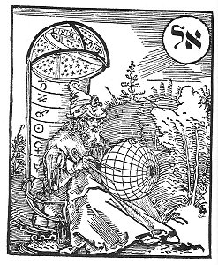

  
[Intangible Textual Heritage](../../index)  [Judaism](../index) 

------------------------------------------------------------------------

<table width="75%">
<colgroup>
<col style="width: 50%" />
<col style="width: 50%" />
</colgroup>
<tbody>
<tr class="odd">
<td width="50%" data-valign="TOP"></td>
<td width="50%" data-valign="CENTER"><h1 id="the-kabbalah" data-align="CENTER">The Kabbalah</h1>
<h4 id="or-the-religious-philosophy-of-the-hebrews" data-align="CENTER">or, The Religious Philosophy of the Hebrews</h4>
<h2 id="by-adolphe-franck" data-align="CENTER">by Adolphe Franck</h2>
<h2 id="translated-by-i.-sossnitz" data-align="CENTER">translated by I. Sossnitz</h2>
<h4 id="not-renewed" data-align="CENTER">[1926, not renewed]</h4></td>
</tr>
</tbody>
</table>

------------------------------------------------------------------------

This is a scholarly study of the origin and evolution of the Kabbalah.
Originally published in French in 1843, with a second French edition in
1889, this book traces the origins of the philosophical concepts of the
Kabbalah to the ancient Zoroastrians. Franck goes into fascinating
detail about the doctrine of the Kabbalah, as expressed in the Sepher
Yetzirah and the Zohar. He uses internal evidence to trace the origins
of these texts many centuries prior to their first known publication in
the thirteenth century C.E.

Franck carefully compares the philosophy of the Kabbalah with Greek
philosophy, the Alexandrians, Philo, and the Gnostics, and concludes
that, although there are similarities, none of them can claim to be the
source of the Kabbalah. However, he does find many more similarities
with the ancient Zoroastrian beliefs. By this process of elimination, he
comes to the conclusion that the doctrines of the Kabbalah had their
origin during the Babylonian exile circa 500 B.C.E., which was also the
time when Zoroaster was active in the same geographical region. This
thesis is worth considering, and potentially adds more weight to the
already numerous contributions of [Zoroastrianism](../../zor/index) to
world culture.

--John Bruno Hare

PRODUCTION NOTES: This text has extensive quotes in Hebrew and Greek.
Viewing the Hebrew and Greek text requires that your browser be set up
correctly to view Unicode: for more information, please refer to [the
Unicode instruction page](../../unicode). In particular, please follow
the instructions on that page before firing off an email to me that the
file is defective: it isn't, if you can't see the Hebrew or Greek text,
*the problem is your browser*.

------------------------------------------------------------------------

[Title Page](rph00)  
[Dedication Page](rph01)  
[Errata](rph02)  
[Diagram of the Sephiroth](rph03)  
[Summary of Contents](rph04)  
[Preface to the English Translation](rph05)  
[Preface to the German Translation of the First French Edition](rph06)  
[Foreword to the Second French Edition](rph07)  
[Preface of the Author](rph08)  
[Introduction](rph09)  

### Part One

[Chapter I. The Antiquity of the Kabbalah](rph10)  
[Chapter II. The Kabbalistic Books. Authenticity of the Sefer
Yetzirah](rph11)  
[Chapter III. The Authenticity of the Zohar](rph12)  

### Part Two

[Chapter I. The Doctrine Contained in the Kabbalistic Books. Analysis of
the Sefer Yetzirah](rph13)  
[Chapter II. Analysis of the Zohar. Allegorical Method Of The
Kabbalists](rph14)  
[Chapter III. Analysis of the Zohar. The Kabbalists' Conception of the
Nature of God](rph15)  
[Chapter IV. Analysis of the Zohar. The Kabbalists' View Of The
World](rph16)  
[Chapter V. Analysis of the Zohar. View of the Kabbalists on the Human
Soul](rph17)  

### Part Three

[Chapter I. Systems Which Offer Some Resemblance to the Kabbalah.
Relation of the Kabbalah to the Philosophy of Plato](rph18)  
[Chapter II. Relation of the Kabbalah to the Alexandrian
School](rph19)  
[Chapter III. Relation of the Kabbalah to the Doctrine of
Philo](rph20)  
[Chapter IV. Relation of the Kabbalah to Christianity](rph21)  
[Chapter V. Relation of the Kabbalah to the Religion of the Chaldeans
and Persians](rph22)  

 

[Appendix](rph23)  
[Index](rph24)  
