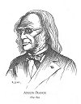
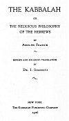
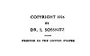

  
[Intangible Textual Heritage](../../index)  [Judaism](../index.md) 
[Index](index)  [Next](rph01.md) 

------------------------------------------------------------------------

# THE KABBALAH

###### OR

##### THE RELIGIOUS PHILOSOPHY OF THE HEBREWS

###### BY

## ADOLPH FRANCK

#### REVISED AND ENLARGED TRANSLATION

#### BY

### DR. I. SOSSNITZ

#### NEW YORK

#### THE KABBALAH PUBLISHING COMPANY

#### \[1926\]

[  
Click to enlarge](img/front.jpg.md)  
ADOLPH FRANCK  
1809-1893  

[  
Click to enlarge](img/title.jpg.md)  
Title Page  

[  
Click to enlarge](img/verso.jpg.md)  
Verso  

NOTICE OF ATTRIBUTION  
Scanned at Intangible Textual Heritage, October, 2005. Proofed and
formatted by John Bruno Hare. This text is in the public domain in the
United States because it was published between 1/1/1923 and 12/31/1963,
and was not renewed in a timely fashion as required by law at the time.
These files may be used for any non-commercial purpose, provided this
notice of attribution remains intact in all copies, electronic or
printed

------------------------------------------------------------------------

[Next: Dedication Page](rph01.md)
