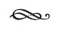

  
[Intangible Textual Heritage](../../index)  [Judaism](../index) 
[Index](index)  [Previous](rph00)  [Next](rph02) 

------------------------------------------------------------------------

DEDICATED TO THE MEMORY

OF MY UNFORGETTABLE TEACHER

AND FATHER

JOSEPH L. SOSSNITZ

GREAT KABBALIST, THOROUGH SCIENTIST, TRUE PHILOSOPHER

AND INDEFATIGABLE SEEKER

FOR. TRUTH

 

IN HUMBLE DEVOTION

THE TRANSLATOR

------------------------------------------------------------------------

[Next: Errata](rph02)
