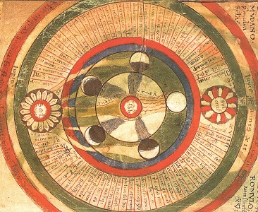

  
[Intangible Textual Heritage](../../index)  [Judaism](../index) 

------------------------------------------------------------------------

[Buy this Book at
Amazon.com](https://www.amazon.com/exec/obidos/ASIN/0827600607/internetsacredte)

------------------------------------------------------------------------

<table width="75%">
<colgroup>
<col style="width: 50%" />
<col style="width: 50%" />
</colgroup>
<tbody>
<tr class="odd">
<td width="50%" data-valign="TOP"></td>
<td width="50%" data-valign="CENTER"><h1 id="selected-religious-poems-of-solomon-ibn-gabirol" data-align="CENTER">Selected Religious Poems of Solomon ibn Gabirol</h1>
<h2 id="tr.-by-israel-zangwill" data-align="CENTER">tr. by Israel Zangwill</h2>
<h4 id="section" data-align="CENTER">[1923]</h4></td>
</tr>
</tbody>
</table>

------------------------------------------------------------------------

[Contents](#contents)    [Start Reading](sig00)    [Text](sig.txt)

------------------------------------------------------------------------

|                                                                                                                           |
|---------------------------------------------------------------------------------------------------------------------------|
|  |

> The years are a thousand  
> Since, broken and scattered,  
> We wander in exile,  
> Like waterfowl lost in  
> The depths of the desert.--[p. 71](sig46.htm#page_71).

Solomon ibn Gabirol (b. 1021, d. ca. 1058) was a Jewish Neoplatonist
philosopher and poet who lived in Spain during the Islamic period. His
devotional poetry, featured here, is considered among the best
post-canon, and portions of his poetic works have been incorporated into
the Jewish liturgy. However, only two extensive works of his have
survived, a collection of his poems, translated here, and a
philosophical treatise, the Fountain of Life, which, ironically, was
thought to be the work of a Christian until the mid-19th century.

An [extended extract](../fons/index) from the Fountain of Life is also
available at this site.

Of some interest here is the extensive discussion of the structure of
the cosmos in the extended poem 'The Royal Crown,' which includes a
section which describes each of the celestial spheres in turn. He gives
specific astronomical facts which were state of the art in the 11th
century. He states that the outer planets, the sun and stars are much
larger than the earth (although the specific numbers he gives are a bit
too small!). The Royal Crown additionally provides a poetic abstract of
the philosophical theories found in the Fountain of Life. Also apparent
are references to Kabbalistic concepts, or perhaps Gabirol influenced
later Kabbalists. But the focus of these poems is Gabirol's intense
relationship with God, which pervades every aspect of his writing.
Interwoven are themes of the anticipation of the Messiah, the sorrow of
the diaspora, and the meaning of life. Indeed, at one point (\#
[37](sig40)) he laments that his only prayer is for God to explain
"life's interpretation."

Production Notes: For technical reasons the Hebrew text and notes from
the original book have been omitted from this etext. I have also
supplied titles for some of the files in the Royal Crown sequence.

------------------------------------------------------------------------

 [Title Page](sig00)  
[Contents](sig01)  
[Introduction](sig02)  
[On Translating Gabirol](sig03)  

 

[1. At the Dawn](sig04)  
[2. My Soul Shall Declare](sig05)  
[3. The Messiah](sig06)  
[4. Invitation](sig07)  
[5. Three Things Conspire](sig08)  
[6. Before My King](sig09)  
[7. Open the Gate](sig10)  
[8. Pour Out Thy Heart](sig11)  
[9. Six Years Were Decreed](sig12)  
[10. ’Tis Joy to Me](sig13)  
[11. My Refuge](sig14)  
[12. Ecstasy](sig15)  
[13. I Have Sought Thee Daily](sig16)  
[14. Humble of Spirit](sig17)  
[15. For a Marriage](sig18)  
[19. The Sun](sig19)  
[17. The Redemption](sig20)  
[18. God and Israel](sig21)  
[19. Reassurance: A Trialogue](sig22)  
[20. Duologue](sig23)  
[21. Establish Peace](sig24)  
[22. Judgment](sig25)  
[23. Prayer For the Hazzan](sig26)  
[24. Two Things Have Met](sig27)  
[25. For New Year’s Day](sig28)  
[26. My Lord and King](sig29)  
[27. Blow Ye the Trumpet](sig30)  
[28. Let the Isles Rejoice](sig31)  
[29. For The Day of Memorial](sig32)  
[30. God Dwelleth High](sig33)  
[31. For Atonement Eve](sig34)  
[32. Lord of the World](sig35)  
[33. Lord, What Is Man?](sig36)  
[34. The Day of Judgment](sig37)  
[35. Lamentation](sig38)  
[36. The Dwellers In Clay](sig39)  
[37. Almighty God](sig40)  
[38. The Lord of Heaven](sig41)  
[39. Ask of Me](sig42)  
[40. Forget Thy Affliction](sig43)  
[41. To My Soul](sig44)  
[42. Look Up To Thy Maker](sig45)  
[43. Invocation](sig46)  
[44. Benediction](sig47)  
[45. My Heart Clamours](sig48)  
[46. Arise, O My Rapture](sig49)  
[47. Passover Psalm](sig50)  
[48. O God, My Sun](sig51)  
[49. The Love of God](sig52)  

### 50. The Royal Crown

[I.](sig53)  
[II.](sig54)  
[III.](sig55)  
[IV.](sig56)  
[V.](sig57)  
[VI.](sig58)  
[VII.](sig59)  
[VIII.](sig60)  
[IX.](sig61)  
[X.](sig62)  
[XI.](sig63)  
[XII.](sig64)  
[XIII. Mercury](sig65)  
[XIV. Venus](sig66)  
[XV. Sun](sig67)  
[XVI. Sun](sig68)  
[XVII. Moon](sig69)  
[XVIII. Mars](sig70)  
[XIX. Jupiter](sig71)  
[XX. Saturn](sig72)  
[XXI. The Zodiac](sig73)  
[XXII. The Zodiac](sig74)  
[XXIII. The Ninth Sphere](sig75)  
[XXIV. The Sphere of Intelligence](sig76)  
[XXV. The Angels](sig77)  
[XXVI. The Throne](sig78)  
[XXVII. The World to Come](sig79)  
[XXVIII. The Treasuries of Heaven](sig80)  
[XXIX. The Soul](sig81)  
[XXX. The Soul](sig82)  
[XXXI. The Soul](sig83)  
[XXXII.](sig84)  
[XXXIII.](sig85)  
[XXXIV.](sig86)  
[XXXV.](sig87)  
[XXXVI.](sig88)  
[XXXVIII.](sig89)  
[XXXVIII.](sig90)  
[XXXIX.](sig91)  
[XL.](sig92)  
