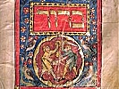

  
[Intangible Textual Heritage](../../index)  [Judaism](../index) 
[Index](index)  [Previous](spb40)  [Next](spb42) 

------------------------------------------------------------------------

  
*The Standard Prayer Book*, tr. by Simeon Singer, \[1915\], at
Intangible Textual Heritage

------------------------------------------------------------------------

p. 420

### SERVICE FOR CHANUKAH

*The Feast of Dedication lasts eight days. On the first evening a light
is kindled, the number of lights being increased by one on each
consecutive evening. The Chanukah lights should be kindled as soon as
possible after nightfall*.

*On Friday the lights are kindled before the beginning of the Sabbath*.

*Before kindling the lights the following Blessings are said:—*

Blessed art thou, O Lord our God, King of the universe, who hast
sanctified us by thy commandments, and commanded us to kindle the light
of Chanukah.

Blessed art thou, O Lord our God, King of the universe, who wroughtest
miracles for our fathers in days of old, at this season.

*The following Blessing is said on the first evening only:—*

Blessed art thou, O Lord our God, King of the universe, who hast kept us
in life, and hast preserved us, and enabled us to reach this season.

*After kindling the first light, the following is said:—*

We kindle these lights on account of the miracles, the deliverances and
the wonders which thou didst work for our fathers, by means of thy holy
priests. During all the eight days of Chanukah these lights are sacred,
neither is it permitted us to make any profane use of them; but we are
only to look at them, in order that we may give thanks unto thy name for
thy miracles, thy deliverances and thy wonders.

*In the Synagogue Psalm xxx., [p. 103](spb07.htm#page_103) is chanted*.

p. 421

*In the home the following Hymn is chanted*.

O Fortress, Rock of my salvation, unto thee it is becoming to give
praise: let my house of prayer be restored, and I will there offer thee
thanksgivings when thou shalt have prepared a slaughter of the
blaspheming foe, I will complete with song and psalm the dedication of
the altar.

Full sated was my soul with ills, my strength was spent with sorrow;
they embittered my life by hardship during my subjection to the dominion
of Egypt, [\*](#fn_47) but God with his great
power brought forth the chosen race, while the host of Pharaoh and all
his seed sank like a stone into the deep.

To his holy oracle he brought me, yet there also I found no peace, for
the oppressor came and led me captive, because I had served strange
gods: I had to quaff the wine of bewilderment; well nigh had I perished,
when Babylon's end drew near; through Zerubbabel I was saved after
seventy years.

The Agagite (Haman), the son of Hammedatha, sought to cut down the lofty
fir tree (Mordecai) [†](#fn_48); but his design
became a snare to himself, and his pride was brought to an end. The head
of the Benjamite thou didst exalt, but the enemy's name thou Midst blot
out: the many sons he had gotten thou didst hang upon the gallows.

The Grecians were gathered against me in the days of the Hasmoneans;
they broke down the walls of my towers, and defiled all the oils; but
from one of the last remaining flasks a miracle was wrought for thy
beloved [‡](#fn_49), and their men of
understanding appointed these eight days for song and praises.

------------------------------------------------------------------------

### Footnotes

[421:\*](spb41.htm#fr_52) "The kingdom of the
heifer," see Jeremiah xlvi. 20

[421:†](spb41.htm#fr_53) See Talmud Babli, Tr.
Megillah, 10 b.

[421:‡](spb41.htm#fr_54) Likened to a lily in
Song of Solomon ii. 2.

------------------------------------------------------------------------

[Next: Service for Purim](spb42)

