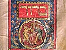

  
[Intangible Textual Heritage](../../index)  [Judaism](../index) 
[Index](index)  [Previous](spb56)  [Next](spb58) 

------------------------------------------------------------------------

  
*The Standard Prayer Book*, tr. by Simeon Singer, \[1915\], at
Intangible Textual Heritage

------------------------------------------------------------------------

p. 467

### MEMORIAL SERVICE FOR THE DEAD

*On Holy Days, when the Memorial Service is held, and on the
Anniversaries of the Death of Parents, the following is said:—*

Lord, what is man, that thou regardest him? or the son of man, that thou
takest account of him? Man is like to vanity; his days are as a shadow
that passeth away. In the morning he flourisheth, and sprouteth afresh;
in the evening he is cut down, and withereth. So teach us to number our
days that we may get us a heart of wisdom. Mark the innocent man, and
behold the upright: for the latter end of that man is peace. But God
will redeem my soul from the grasp of the grave: for he will receive me.
My flesh and my heart faileth: but God is the strength of my heart and
my portion for ever. And the dust returneth to the earth as it was, but
the spirit returneth unto God who gave it. I shall behold thy face in
righteousness; I shall be satisfied, when I awake, with thy likeness.

May God remember the soul of my revered father \[mother\] who has gone
to his \[her\] repose. May his \[her\] soul be bound up in the bond of
life. May his \[her\] rest be glorious, with fulness of joy in thy
presence, and pleasures for evermore at thy right hand.

Father of mercy, in whose hand are the souls of the living and the dead,
may thy consolation cheer us as we remember (on this holy day) our
beloved and honored kinsfolk who have gone to their rest, our dear
parents, the crown of our head and our glory, whose desire it was to
train us in the good and righteous way, to teach us thy statutes and
commandments,

p. 468

and to instruct us to do justice and to love mercy. We beseech thee, O
Lord, grant us strength to be faithful to their charge while the breath
of life is within us. And may their souls repose in the land of the
living, beholding thy glory and delighting in thy goodness.

And now, O good and beneficent God, what shall we say, what shall we
speak unto thee? Our needs are many, our knowledge slender. Shame covers
us as often as the remembrance of all thy love for us rises within our
minds. O turn this day in lovingkindness and tender mercy to the prayers
of thy servants who pour out their souls before thee. May thy
lovingkindness not depart from us. Give us our needful sustenance, and
let us not be in want of the gifts of flesh and blood. Remove from us
care and [sorrow](errata.htm#10), distress and fear, shame and contempt.
Let thy grace be with us, that we may rear our children to keep thy
commandments and to fulfil thy will all the days of their life. O God,
take us not hence in the midst of our days. Let us complete in peace the
number of our years. Verily we know that our strength is frail, and that
thou hast made our days as handbreadths. Help us, O God of our
salvation, to bear ourselves faithfully and blamelessly during the years
of our pilgrimage. And when our end draws nigh and we depart this world,
be thou with us, and may our souls be bound up in the bond of life with
the souls of our parents and of the righteous who are ever with thee.
Amen, and Amen.

------------------------------------------------------------------------

------------------------------------------------------------------------

[Next: Night Prayer for Young Children](spb58)

