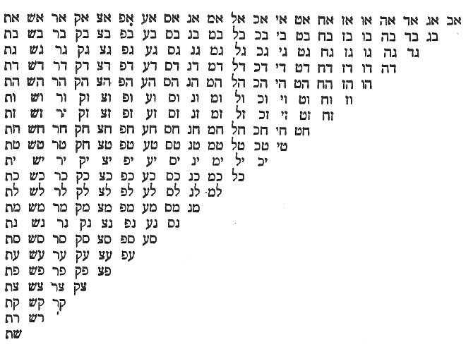
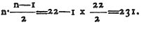

  
[Intangible Textual Heritage](../../index)  [Judaism](../index) 
[Index](index)  [Previous](sy07)  [Next](sy09) 

------------------------------------------------------------------------

[Buy this Book at
Amazon.com](https://www.amazon.com/exec/obidos/ASIN/091205719X/internetsacredte)

------------------------------------------------------------------------

p. 50

# NOTES.

1) Our author maintains that there is a first
intelligent, self-existing, almighty, eternal ruling cause of all
things, and that an everlasting entity produced nonentities by a
progression of effects. The divine knowledge, he adds, differs from the
human knowledge in such a degree, that it gives existence to all that
is. ‏חקק יח ח״ צבאות‎ is a talmudical expression. (See Treatise Bava
Bathra p. 93.) It seems to me, that the author not only wanted to
contradict Plato's assertion that the Supreme Being had need of a plan,
like the human architect, to conduct the great design, when he made the
fabric of the Universe, but also the common belief that God reasons and
acts by ideas like a human being. As the prophet Isaiah exclaimed:
"Behold! God has no ideas like you, and his ways of acting are not like
yours." (Isaiah 55, 8-9.)

2) The number thirty-two is not only the fifth
power of two, and the sum of ten units and twenty-two letters, but is
also the sum of the first and last letter of the Hebrew Pentateuch,
namely: ‏בּ‎ 2 and 30, equal thirty-two. (See Kusari p. 343, translated
into German by Dr. David Cassel.)

3) Paths denote powers, effects, kinds, forms,
degrees or stages.

4) These Sepharim or three words of similar
expression signify: first, number, calculation or idea; second, the
word; third, the writing of the \*word. The idea, word and writing (of
the word), are signs to man for a thing, and is not the thing itself, to
the Creator, however, idea, word and writing (of the word) are the thing
itself, or as some ancient Rabbis remarked: ",‏מחשבח דביר ימעשה הכל הרא
דבו אחד בהק״ב״ה״‎ Idea, word and work are one and the same to God."
There is an ideal world in the divine intellect, according to which this
sensible world was made. The difference between the human and divine
manner of thinking admits no comparison.

5) This means to say, that there has not been
any matter or hyle existing from all eternity, containing different
kinds of primitive atoms or molecules etc., as the Greek philosopher,
Anaxagoras, taught, but that all things are the gradual emanations of
one everlasting being. This idea is then symbolically explained in the
next paragraph.

6) The design of the author is evidently to
deduce the proof of the decade from the phenomena in the nature of man,
who is generally considered the crown or the final cause of the
[terrestrial](errata.htm#1) creation, and upon whom God vouchsafed two
most precious gifts, namely: the articulated word, and the

p. 51

religious element (spiritual purity). This passage is explained by Isaac
Satanow in his Hebrew Dictionary entitled Sephath Emeth, p. 44, b:

‏דחנח הלשין הוא עט סופר לתולדות חשכלים ואבר המוליד‎

‏לתולדות החמריים ובל אחד הוּא ברית עולם לקיים את האדם‎

‏לפליטה נצחרת על שתי צלעותיו חמרו וצורתו האי כדאיתיח‎

‏והאי כדאיתיה זה בחמרו וזה בצורתו‪.‫‎

The tongue is, as it were, the descriptive pen of all the spiritual
issues, and the genital parts are the originators of the corporeal
substances. Every one of them is an eternal covenant in order to
preserve the human race for ever, according to its two-fold being: body
and spirit. Each working after its own way, physically and spiritually.

7) Like Pythagoras, who taught that the digits
inclusive number ten which are typified in Tetraktys, (Τετρακτὺς)
namely: 1 plus 2 plus 3 plus 4 equal 10, and which comprise the whole
arithmetical system of nature, etc. Our author endeavors to show the
gradual emanation of all things from God, which were completely finished
in ten spheres.

8) My Hebrew reading is: ‏והושב יוצר על‎ There
are various readings; therefore Postellus rendered it: "restitue
figmentum in locum suum;" Rittangel, "restitue formatorem in throno
suo;" Pistorius, "fac sedere creatorem in throno suo." The author seems
to ridicule here the Gnosticians who maintained that Demiurg was the
creator of man and the sensual world.

9) In God is the beginning and he is the
boundary of the Universe. Compare also the Talmud treatise Chagigah p.
12.

10) Here is contradicted the system of
ditheism, consisting of an eternal God, the Author of all good and of
"Hyle" or "Satan," the co-eternal and co-equal principle of evil,
maintaining that an all-perfect God alone is the author of all good and
evil, and has in his infinite wisdom so wonderfully contrived the nature
of things, that physical and moral evil may produce good, and hence
contribute to carry out the great design of the Supreme Being. Compare
also Chap. 6 §5.

11) As the infinite series of numbers starts
from one unit, so was the whole Universe formed a unity, that centres in
the Godhead.

12) The meaning is, that as the living
creatures which the prophet saw in his vision were stricken with such an
awe, that they could not go any further to see the divine glory, and had
to return, so is the decade an eternal secret to us and we are not
permitted to understand it. We find this very idea in the Pythagorean
system. The disciples of Pythagoras looked upon the decade as a holy
number, and swore by it and by the Tetraktys which contain the number
ten,

13) See above Note 1, God, idea and word are
indivisible.

p. 52

14) I adopted here the reading of Judah
Halevi, namely:

‏חקק וחצב בהו‎

‏בהו רפש וטיט וגו‪,‫‎

with the exception of the word ‏תהו‎ because it is obvious from
"Yezirah," Chap. II, that the author signifies by the word "Tohu,"
nothing, and not something, as Judah Halevi erroneously thought. Moses
Butarel and others tell us that they had before them a correct copy of
"Sepher Yezirah," where it reads:

‏תהו זה קו ירוק וכו׳ בהו אלו אבנים‎

‏מפולמות׃‎

The same passage is mentioned in the Talmud treatise Chagigah, p. 12, a,
with the addition of

‏המשוקעות בתהום שמהן יוצאין‎

‏מים.‎

The word ‏חמפולמות‎ is translated by Rashi, *moist*. Some say it is a
compound word of ‏מפול מות‎; others of ‏פלוני אלמוני,‎ etc. But the word
is not of Semitic origin; it is, according to my opinion, borrowed from
the Greek as the word ‏סימן,‎ etc., Πλημη *flood*. ‏אבנים מפלמות‎
flood-stones. The same word is used treatise Beza, p. 24, b, ‏דגים
המפולמין‎ fish that are caught from out of the flood.

15) According to the author, the space and six
dimensions emanated from the ether.

16) Judah Halevi in his book entitled
"Kusari," p. 456, illustrates it thus: The Creator is one, and the space
has in the figurative expression six dimensions. The book "Yezirah,"
having ascribed to the Creator some names in the spiritual language,
chooses now in the human language the finest sounds which are, as it
were, the spirits of the other sounds, namely: "‏הוי‎" and says, that
when the divine will was expressed by such a sublime name, it became
that which the Exalted by praise wished to call forth according to the
combination of ".‏הוי‎" Hence it follows, that the material world was
created in such a way and manner which corresponds with the material,
namely, by the sublime spiritual name, which corresponds with the
material name, ‏יהו, יוה, הוי, היו, ויה, והי,‎ and out of each of them
became one dimension of the world, the sphere.

17) The author shows here by the symbol of a
scale and the phonetic character of the fundamental letters ,‏א״מ״ש‎
that the opposite forces and the struggle which prevail in the smallest
as well as in the largest circles of creation are appeased and calmed.

18) Meaning outlets, outgates of the creative
power, formations.

19) The word ‏ענג‎ signifies joy, and when
transposed, forming the word ‏נגע‎ it signifies just the contrary,
trouble, plague. He means to say, that the letters of the words ‏ענג‎
and ‏נגע‎ are the same, but they signify nevertheless, opposite ideas on
account of transposition. Just as the sphere remains the same during the
rotation on its axis in its setting and in its rising; yet it appears to
us as if it had undergone a great change on account of its different
position.

p. 53

20) My reading is ‏עָרְפָן שָׁקְלָן
וְחֵמִיוָן‎.

21) The combination of the twenty-two letters
without permutation is represented in the following table:

 

22) The number of combinations of twenty-two
letters two and two without any permutation is according to the
mathematical formula

 

23) The ancient philosophers maintained that
if God is the first cause, and He is necessarily, He, the immediate
effect of Him, as an absolute unity,

p. 54

can only be again a unity. Hence from a being that is in every respect a
unique being, there can only emanate one being; because would two
essentially and truly different things issue conjointly from one being,
they can only proceed from two different things of substance, that would
consequently admit a division that is inconceivable. They then put the
question, how came so many various beings into existence? Our author is
therefore endeavoring to show that the whole universe emanated gradually
from the spirit of the one living God.

24) The reading of Von Jo. Meyer and others is
as follows:

‏יצר מתוחו‎

‏ממש ועשח אינו ישנו והצב עמודימ גדולימ מאויר שאינו נתפס‎

‏ויח סימן צופח ומימר עושח כל הּיצור ואת כל הדברים בשמ אחר‎

‏וסימן לדבר עשרים ושתים מניינם דגוף אחג׃‎

My reading according to a manuscript of Rabbi Isaac Luria, which I have
preferred to all others, is thus:

‏יצר ממש מתוהו ועשה את אינו ישנו וחצב עמודים גדולים‎

‏מאדיר שאינו נתפס וזח סימן אות א עם כולן וכולן עם א צופה‎

‏ומימר ועשח את כל היצור ואת כל חדבור שם אחד וסימן לדבר‎

‏עשרומ ושתים חפצים בגוף א׃‎

25) It has been already mentioned above Chap.
i, §1, that God, his idea and his word are a unity; hence the author
signifies by the letter Aleph the air from which emanated the creative
speech, etc.

26) Here is meant: ethereal air, ethereal
water, ethereal fire, the macrocosm, the courses of time and microcosm.
Many offspring or derivations came from the latter three, as their
progenitors, as it is explained afterwards in the chapter.

27) The author endeavors to show how the
creative divine word became more condensed and how a new series of
productions came out of three elements.

28) In ancient times coldness was considered
to be a substance. \[See Psalm 147, 17.\]

29) Id est, made it the reigning power.

30) Namely, with the two other elements.

31 That is to say a different combination of
the elements.

32) According to the opinion of the author, it
may be arranged as follows:

<table data-border="1">
<colgroup>
<col style="width: 25%" />
<col style="width: 25%" />
<col style="width: 25%" />
<col style="width: 25%" />
</colgroup>
<tbody>
<tr class="odd">
<td data-valign="top" width="164">
 
</td>
<td data-valign="top" width="164">
Aleph.
</td>
<td data-valign="top" width="164">
Mem.
</td>
<td data-valign="top" width="164">
Sheen.
</td>
</tr>
<tr class="even">
<td data-valign="top" width="164">
World:
</td>
<td data-valign="top" width="164">
Air,
</td>
<td data-valign="top" width="164">
Earth, 
(Inclusive of Land and Sea)
</td>
<td data-valign="top" width="164">
Heaven or Atmosphere.
</td>
</tr>
<tr class="odd">
<td data-valign="top" width="164">
Man:
</td>
<td data-valign="top" width="164">
Breast,
</td>
<td data-valign="top" width="164">
Belly,
</td>
<td data-valign="top" width="164">
Head.
</td>
</tr>
<tr class="even">
<td data-valign="top" width="164">
Year:
</td>
<td data-valign="top" width="164">
Moistness,
</td>
<td data-valign="top" width="164">
Coldness, Heat.
</td>
<td data-valign="top" width="164">
 
</td>
</tr>
</tbody>
</table>

33) The aspirating pronunciation of ρ in the
Greek, was adopted by the ancient Jews in Palestine for the Hebrew
letter ‏ר‎. They pronounced it partly aspirated and partly unaspirated.
\[See Dr. Geiger's Lehr-und Lese-buch der Mischnah, p. 22, and Dr.
Graetz's Gnosticismus, p. 117.\]

p. 55

34) According to the idea of our author, there
emanated from the unity of God three ethereal elements: primitive air
from the spirit, from the air, primitive water, and from the water,
primitive fire or ether, out of which came other spheres of existence in
the significant and highly important number, seven, from which descended
smaller spheres and which produced again others. He endeavors to show
how the ideal became, after numerous emanations, more condensed,
palpable and concrete. The whole creation is thus contemplated as a
pyramid, terminating in a point at the top with a broad basis. \[See Dr.
Graetz's Gnosticismus, p. 224.\]

35) Compare Chapter I, Section 3, Note, 8.

36) The order of the planets (including the
Sun) is stated here according to the Ptolemaic system which was in vogue
even among the learned men till the middle of the fifteenth century,
namely: Moon, Mercury, Venus, Sun, Mars, Jupiter and Saturn. But this
arrangement is undoubtedly an interpolation of a later time, as the
author of the book "Yezirah" lived many years before Ptolemy. And indeed
Prof. Jo. Friedrich Von Meyer and others of reliable authority had in
their copies of "Yezirah" the following order: .‏חמח ניגח כוכב לבנה שבתי
צדק מאדינ‎ Mars, Jupiter, Saturn, Moon, Mercury, Venus, Sun.

37) Philo (Allegor 1, 42,) after having called
attention to the fact that the heptade is to be found in many biblical
laws, in the vowels of the Greek language, in the gamut and in the
organs of the human body, exclaims, similar to our author: "The whole
nature exults in the heptade!"

38) The rule for permutation is as follows:
(n--1) n. 1 x 2 x 3 x 4 x 5 x 6 x 7=5040. In our edition it reads: ‏חמשת
אלפים וארבע בתימ‎ Five thousand and four houses, which is obviously a
mistake, it should read: 5040 houses. .‏חמשת אלפים וארבעם בתים‎

39) I read ‏גרגרת‎ instead of ‏קורקובן‎ for
two reasons. In the first place, the same thing is mentioned afterwards,
and in the second place, it is proved by the expression ‏לעיטה‎ that the
author meant ‏גרגרת‎ and not ‏קורקובן.‎

40) Some maintain that by the expression Tali
is understood the constellation Draco or Dragon, which is a very large
constellation extending for a great length from East to West; beginning
at the tail which lies half way between the Pointers and the Pole Star,
and winding round between the Great and Little Bear by a continued
succession of bright stars from 5 to 10 degrees asunder, it coils round
under the feet of the Little Bear, sweeps round the pole of the
ecliptic, and terminates in a trapezium formed by four conspicuous stars
from 30 to 35 degrees from North Pole. Dr. Steinshneider (see Magazin
fuer Literatur des Auslandes, 1845) and Dr. Cassel (in his commentary to
the book entitled Kusari,) maintain that the ancient Jewish

p. 56

astronomers signified by the word Tali, not the constellation Draco, but
the line which joins together the two points in which the orbit of the
moon intercepts the ecliptic (Dragon's head and tail). Dr. Cassel is of
the opinion that our author meant here, probably the invisible,
celestial or universal axis that carries the whole Universe.

41) Our author means to say that the water has
a great disposition to unite itself with the caloric, thus for instance
is the fire latent in steam, but the air equipoises them.

42) The meaning is, as God is the centre of
the Universe, so have the macrocosm, the seasons and temperature and the
microcosm, their centres receiving power from the principal centre to
regulate and rule.

43) The substance of this Mishnah is mentioned
in the Talmud treatise Berachoth, p. 55, a. It reads there:

‏אמר רב יחידח אמר רב יודע חיה‎

‏בצלעל לצרף אותיות שנבראו בהן שמיס וארץ׃‎

"Rab Jehudah stated in the name of Rab, that Bezalel understood to
combine letters by which heaven and earth were created." To this the
commentator Rashi adds: "as it is taught in the book Yezirah." It is
undoubtedly certain that the book Yezirah, or a cosmogony as it is
represented there, was known to Rab, who was a disciple of Jehudah
Hanasi, during the second part of the second century. (C. E.) See
treatise Berachoth, p. 55 a, where the commentator Rashi referred to the
book Yezirah.

44) This whole paragraph is an interpolation
of an unknown hand, as it can be easily proved.

45) I have translated according to the reading
of Rabbi Judah Halevi. The reading of Rabbi Luria is as follows:

‏וקשר עשרים ושתים אותיות‎

‏בלשונו וגילח לו את סודו משכן במים דלקן באש רעשן בויח בערן‎

‏בשבעח נהגין בשנים עשר‎

"He fastened twenty-two letters on his tongue and revealed to him His
mystery, He drew them by water, kindled them by fire and thundered them
by the wind, He lighted them by seven, and rules them by twelve
constellations." Pistor. renders it: "Tranat per aquam, accendit in igne
grandine signavit in äere. Disposuit cum septem et gubernavit cum
duodecim." Postellus' version is: "Attraxit eam in aqua, accendit in
spiritu, inflammavit in septem aptatum cum duodecim signis." Meyer
translates it: "Er zog sie mit Wasser, zündet sie an mit Feuer, erregte
sie mit Geist, vebrannte sie mit sieben, goes sie aus mit den swoelf
Gestirnen."

------------------------------------------------------------------------

[Next: Glossary of Rabbinical Words](sy09)
