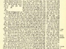

  
[Intangible Textual Heritage](../../index)  [Judaism](../index.md) 
[Talmud](../talmud)  [Index](index)  [Next](mac01.md) 

------------------------------------------------------------------------

  
*Babylonian Talmud, Book 9: Tracts Maccoth, Shebuoth, Eduyoth, Abuda
Zara, and Horioth*, tr. by Michael L. Rodkinson, \[1918\], at Intangible
Textual Heritage

------------------------------------------------------------------------

p. i

#### NEW EDITION

###### OF THE

# BABYLONIAN TALMUD

#### Original Text, Edited, Corrected, Formulated and Translated into English

###### BY

### MICHAEL L. RODKINSON

##### SECTION JURISPRUDENCE (DAMAGES)

#### TRACTS MACCOTH, SHEBUOTH AND EDUYOTH

##### Volume IX. (XVII.)

##### BOSTON

#### THE TALMUD SOCIETY

##### 1918

###### Scanned at Intangible Textual Heritage, November 2002. Jean Lelievre, Redactor. This text is in the public domain. This file may be reproduced for any purpose provided this paragraph is left intact.

------------------------------------------------------------------------

[Next: Explanatory Remarks](mac01.md)
