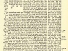

  
[Intangible Textual Heritage](../../index)  [Judaism](../index) 
[Talmud](../talmud)  [Index](index)  [Previous](shb09) 

------------------------------------------------------------------------

  
*Babylonian Talmud, Book 9: Tracts Maccoth, Shebuoth, Eduyoth, Abuda
Zara, and Horioth*, tr. by Michael L. Rodkinson, \[1918\], at Intangible
Textual Heritage

------------------------------------------------------------------------

### APPENDIX TO PAGE 13.

R. Na'hman b. R. 'Hisda lectured: A fowl burnt-offering must not be
bought from the money of the treasury. Said Rabha: This is nonsense!
Said R. Na'hman b. Itz'hak to him: Why nonsense? I said it to R. Na'hman
b. 'Hisda, in the name of R. Shimi of Nahardea, and the reason is that
for the remaining money of the treasury burnt-offerings for the
congregation are bought, and there is no fowl-offering for the
congregation. In like manner Samuel holds what was said in the name of
R. Johanan concerning daily offerings; as R. Jehudah said in his name
that all the offerings of the congregation are prepared for what they
are intended by the application of the knife to them (and no knife is
used to a fowl-offering). So also we have learned

p. 109

in the following Boraitha: R. Simeon admits concerning a he-goat that
was not offered on the festival, that he may be offered on the new-moon
or day of atonement, on the feast of Tabernacles, and may as well remain
for the next holidays, since originally he was intended as an offering
to be brought on the exterior altar.

END OF TRACT SHEBUOTH.

 
