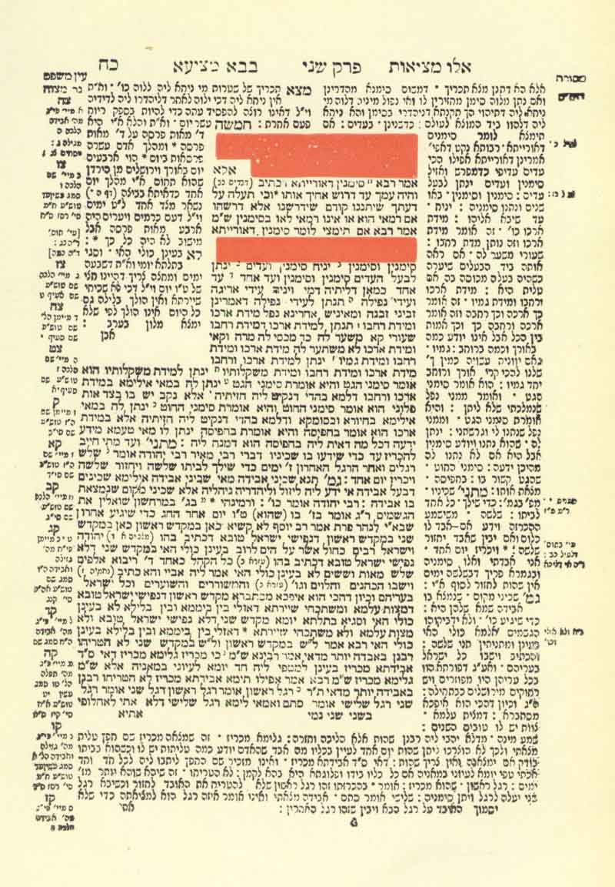

  
[Intangible Textual Heritage](../../index)  [Judaism](../index) 
[Talmud](../talmud)  [Index](index)  [Previous](ht214)  [Next](ht216) 

------------------------------------------------------------------------

  
*Babylonian Talmud, Book 10: History of the Talmud*, tr. by Michael L.
Rodkinson, \[1918\], at Intangible Textual Heritage

------------------------------------------------------------------------

Plate facing page 100: Page of the Talmud in Hebrew (*125,827 bytes*)

 

 

------------------------------------------------------------------------

[Next: Part IV: Criticism](ht216)
