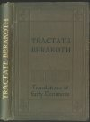
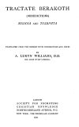

  
[Intangible Textual Heritage](../../index)  [Judaism](../index.md) 
[Index](index)  [Next](tbr01.md) 

------------------------------------------------------------------------

*Tractate Berakoth*, by , by A. Lukyn Williams, \[1921\], at Intangible
Textual Heritage

------------------------------------------------------------------------

p. i

TRANSLATIONS OF EARLY DOCUMENTS  
SERIES III  
RABBINIC TEXTS  
GENERAL EDITORS:  
W. O. E. OESTERLEY, *M*.A., D.D. G. H. BOX, *M*.A., D.D.  
  
TRACTATE BERAKOTH

p. iii

# TRACTATE BERAKOTH

##### (BENEDICTIONS)

##### MISHNA AND TOSEPHTA

###### TRANSLATED FROM THE HEBREW WITH INTRODUCTION AND NOTES

###### BY

## A. LUKYN WILLIAMS, D.D.

###### HON. CANON OF ELY CATHEDRAL

#### LONDON

#### SOCIETY FOR PROMOTING

#### CHRISTIAN KNOWLEDGE

#### NORTHUMBERLAND AVENUE, W.C.

#### NEW YORK: THE MACMILLAN COMPANY

#### \[1921\]

Scanned at sacred—texts.com, November 2006. Proofed and formatted by
John Bruno Hare. This text is in the public domain in the United States
because it was published prior to January 1st, 1923. These files may be
used for any non—commercial purpose, provided this notice of attribution
is left intact in all copies.

[  
Click to enlarge](img/cover.jpg.md)  
Front Cover and Spine  

[  
Click to enlarge](img/title.jpg.md)  
Title Page  

------------------------------------------------------------------------

[Next: Editor's Preface](tbr01.md)
