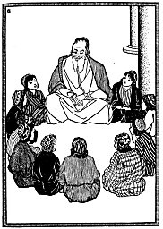

  
[Intangible Textual Heritage](../../index)  [Judaism](../index.md) 

------------------------------------------------------------------------

<table width="75%">
<colgroup>
<col style="width: 50%" />
<col style="width: 50%" />
</colgroup>
<tbody>
<tr class="odd">
<td data-valign="CENTER" width="50%"></td>
<td data-valign="CENTER" width="50%"><h1 id="the-great-march" data-align="CENTER">The Great March</h1>
<h2 id="by-rose-g.-lurie" data-align="CENTER">by Rose G. Lurie</h2>
<h4 id="copyright-not-renewed" data-align="CENTER">[1931, copyright not renewed]</h4></td>
</tr>
</tbody>
</table>

------------------------------------------------------------------------

This is a collection of Post-Biblical Jewish stories, written for 3rd to
4th graders. However, this book is also thoroughly enjoyable for adults,
not the least because of the finely-drawn illustrations. The anecdotes
include sublime Talmudic humor, tales of resistance to injustice and
persecution, and profound spiritual lessons. It also includes many
incidents of cooperation between Jews, Christians, and Muslims. Written
in a time of looming peril for Jewish people, this book is still
meaningful to people of all faiths today.

------------------------------------------------------------------------

[Title Page](tgm00.md)  
[Editor's Introduction](tgm01.md)  
[Note to Fourteenth Printing, Revised](tgm02.md)  
[Contents](tgm03.md)  
[1. The Happy Return](tgm04.md)  
[2. With Peace They Conquer](tgm05.md)  
[3. Follow Me](tgm06.md)  
[4. Fight For Right](tgm07.md)  
[5. Walking Between Raindrops](tgm08.md)  
[6. School on the Roof](tgm09.md)  
[7. The Bet](tgm10.md)  
[8. Torah On One Foot](tgm11.md)  
[9. Two Who Were Wrong](tgm12.md)  
[10. The School that Saved a People](tgm13.md)  
[11. Enough for Wash Day](tgm14.md)  
[12. The Temple in Ruins](tgm15.md)  
[13. A B C at Twenty-Two](tgm16.md)  
[14. The Wicked Neighbor](tgm17.md)  
[15. The Shepherd Rabbi](tgm18.md)  
[16. The Cock, the Donkey, and the Candle](tgm19.md)  
[17. Fish Out of Water](tgm20.md)  
[18. The Guardians of the Torah](tgm21.md)  
[19. Ki-Tov--’Twas Good](tgm22.md)  
[20. As Faithful As That](tgm23.md)  
[21. The Law is Kind](tgm24.md)  
[22. Even Though I Lose](tgm25.md)  
[23. A Gift to the Caliph](tgm26.md)  
[24. The Choice](tgm27.md)  
[25. The Slave Rabbi](tgm28.md)  
[26. The Wondrous Tree](tgm29.md)  
[27. In the East is my Heart](tgm30.md)  
[28. An Angel Did It](tgm31.md)  
[29. The Doctor Arrives](tgm32.md)  
[30. Tables Turned](tgm33.md)  
[31. The Rabbi Wins](tgm34.md)  
[32. Not for his Crown](tgm35.md)  
[33. How Rashi was Saved](tgm36.md)  
[34. The Fourth Horse](tgm37.md)  
[35. Flying from the Roofs](tgm38.md)  
[36. The Messiah is Coming](tgm39.md)  
[37. So This is Your Answer](tgm40.md)  
[38. Whither--Now?](tgm41.md)  
