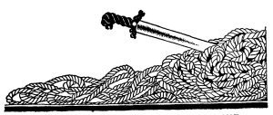
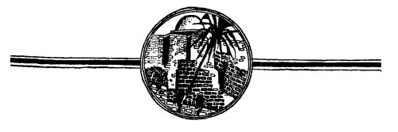

  
[Intangible Textual Heritage](../../index)  [Judaism](../index) 
[Index](index)  [Previous](tgm04)  [Next](tgm06) 

------------------------------------------------------------------------

p. 10

 

# 2. WITH PEACE THEY CONQUER

WHILE the Jews were busy rebuilding the Temple in Jerusalem, other
nations were busy building temples and palaces of their own. One of the
nations which had greatly influenced the Jewish people was Macedonia, a
country far, far away.

Many years after the Jewish Temple had been finished, a boy was born in
that far-off country. This boy was different from most boys. Even as a
very young lad, he made up his mind to become king of the whole world.
Have you ever known such a boy? Or did you ever know a girl who said,
"I'll be queen of the whole world"? Alexander, for that was his name,
said, "My father is king of Macedon, but I mean to be king of the whole
world."

When he grew up, he was tall and strong. It did not worry him that his
left eye was blue and his right

 

[  
Click to enlarge](img/01100.jpg)

 

p. 12

one black. One day an excellent horse was brought to his father, the
king. The steed was wild and fiery.

"See what you can do with him," said the king to the chief of his
horsemen.

"He--looks--mighty--fierce," said the chief jerkily. And the horse was
truly very fierce. The chief of the horsemen could not keep him quiet
long enough to mount him. Then another of the king's servants tried. He,
too, failed to control the animal. Then Alexander asked if he might try
to mount the horse. Everyone was astonished. The king became uneasy, as
Alexander leaned his curly yellow head on the horse and stroked him
gently. "Take care, he's dangerous," everyone shouted. But to their
surprise, Alexander mounted him. The horse stopped jumping and kicking.
He was wholly tamed.

This was only one of the brave things Alexander did. When he was twenty
years old, he began to war on Thrace and Greece and other countries. He
said:

"*Now* I will become king of the whole world."

On one of his campaigns he came to a big Greek temple. In that temple
there was an ordinary cart. But on that cart there were knots of heavy,
thick ropes. It was believed among the Greeks that the one who untied
these knots would surely become king of the world. Many had tried but no
one had ever succeeded.

p. 13

\[paragraph continues\] Do you think Alexander took a chance? He most
certainly did! Boldly, he said to his soldiers:

"Stand by while I try." And walking up quickly to the cart (he always
did walk quickly), he began to work on one of the knots. Slowly and
patiently he worked away. But still the knot remained unbroken. Then a
sudden light flashed from his eyes. Snatching his sword he exclaimed:

"*How* I do it does not matter"--and with one stroke, he cut the knots.

\*        \*        \*

And Alexander continued to capture city after city and province after
province. He became so mighty that he was called Alexander the Great.

One day Alexander sent a troop of soldiers to Jerusalem to get corn and
wheat for his city, Tyre.

The Jews were worried. They said:

"If we give corn to Alexander, we shall not be loyal to Persia." So they
refused to give either corn or wheat to Alexander's soldiers. The Greek
soldiers did not fight with the Jews but went back to Alexander and
reported to him their answer.

This naturally made Alexander very, very angry. He called his soldiers
together, and said:

"We would have gone up to Jerusalem later. Now

p. 15

we will go at once. These Jews shall learn that they have no king but
Alexander.

"Parmenio! Send out a proclamation that in three days from now Alexander
the Great will attack Jerusalem," he commanded.

Can you imagine the fear that came upon the Jews when they received this
notice? What would happen to them now? Would they again be driven out of
their beloved Jerusalem? Would they have to bow down to strange gods?
Would they never be left in peace?

Then Jaddua, the high priest of the Jews, called all the people
together.

"Do not fear Alexander. Let us offer up sacrifices and let us pray to
our God, the God of Abraham, and no harm will come to us," he said
encouragingly, though his voice trembled.

"And then I shall put on my long white priestly robe, and all the
priests will do likewise. In addition to this we shall throw flowers on
the streets of Jerusalem and deck our houses with all the colored
banners we have. We shall meet Alexander as if his coming were a great
day,--a great festive day. We shall greet him peacefully, rather than
with arms. All will thus be well."

The people looked at one another in silence. They shrugged their
shoulders. But no one dared say anything

p. 15

against the advice of the high priest. When they left the Temple,
however, they began to grumble.

"I think we shall all be destroyed," said one who looked very wise, and
seemed to know all about it.

"Alexander has a big army," said another.

"Yes, even if we did arm ourselves, what could we do against his army?"

"As it is, we may just as well prepare to meet a sure death," said the
first.

The three days passed quickly. The streets of Jerusalem looked pretty
with all the red, yellow and purple flowers strewn over them. The
fragrance, too, was very pleasant. The banners waving from the houses
and the Temple added to the festive air. Suddenly the blare of the
trumpets was heard. Alexander the Great and his mighty army were
approaching. Jaddua, in all his priestly splendor, followed by the
priests and people, came forth to meet them. Not a spear, no, not a
single ax nor sword could be seen amongst the Jews. "No arms at any
price!" was their slogan. "No bloodshed."

The moment Alexander saw the procession he stopped. He was surprised and
pleased.

To the amazement of everyone, Alexander the Great, the mighty ruler of
more than half the world, bowed down before Jaddua, the Jewish high
priest.

p. 16

\[paragraph continues\] What could it mean? How easily he could have
conquered them!

"Surely," thought his soldiers, "he must be out of his mind. Think of
it, to give up such an easy victory!"

Then Alexander said,

"Come, let us join with the Jews in merrymaking."

He entered the city and together with the high priest offered sacrifices
to the God of Israel.

"What has happened to Alexander?" cried his soldiers. "What has happened
to Alexander?" cried the Jews.

Wonderful, wonderful! It simply cannot be explained. But Alexander could
explain. And he did!

The soldiers and Jews sat down in the Temple. Alexander, who was near
the altar, arose and said:

"When I began my march on Jerusalem I thought I would capture it, as I
had done all the rest of the cities; but I expected to meet men in full
armor, ready for battle."

"We thought so too!" shouted his soldiers. "But if they didn't fight, so
much the easier for us."

"I would have killed them all," called a soldier who was bolder than the
rest. "Every last one of them," he mumbled, as he clenched his fists and
ground his teeth.

p. 17

"No, my dear man, not at all," said Alexander quietly and calmly.

"When I saw not a spear nor a sword, nor even an ax, I could not raise
my hand against them. This is the only people that has met me peacefully
instead of with arms. The more glory to their leader, Jaddua, who was
brave enough and wise enough to do this."

"Praised be the Lord who helped us do it," said Jaddua, modestly.

A loud cheer arose from the throng.

"Hail to Alexander the Great! All hail to the high priest, Jaddua!"

"Now is there any favor you would ask of me?" said Alexander, kindly.

"Only that we may have our own Jerusalem and that we may worship in our
Temple," answered the Jews.

"It is little that you ask. Your prayer shall surely be granted." And
Alexander kept his promise.

 

 

------------------------------------------------------------------------

[Next: 3. Follow Me](tgm06)
