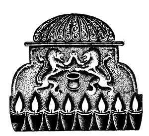

  
[Intangible Textual Heritage](../../index)  [Judaism](../index.md) 
[Index](index)  [Previous](tgm06)  [Next](tgm08.md) 

------------------------------------------------------------------------

p. 22

 

# 4. FIGHT FOR RIGHT

"HE HIT me, he hit me," cried Simon, a little boy with light-brown hair
and black eyes. His father, the high priest, came out of the house and
looking straight into Simon's eyes asked, "Are you sure that you didn't
hit him first?"

"No, no, father," sobbed Simon. "I never hit anyone, though I do wish
you hadn't made us promise not to hit. It's awfully hard to keep from
hitting back when one is struck for no good reason."

"It's for the best," quietly answered Mattathias, the boy's father.

Simon had four brothers and each one had been taught the same lesson by
his father.

Many years had passed since this little incident. The five sons of
Mattathias had grown to be big, strong men. Antiochus, the cruel king of
Syria, had ordered a regiment of soldiers to go down to the market

p. 23

place. There in the longest and widest street of the city, they built an
altar, and on the altar they set up the Greek idol, Zeus. Then the
officers went from one Jewish house to another calling:

"Come out, come out and sacrifice to the Greek god. By order of the
king, Antiochus, come out!" And the Jews, fearing for their lives, began
to gather at the market place.

Now what were the sons of Mattathias to do? Should they offer sacrifices
to a Greek idol? If not, they would have to fight the Greeks. And had
they not always been taught by their father that they must not fight?

While the Greek soldiers were marching through the town, Mattathias and
his sons quickly made their plans. Mattathias, his face lit up by a holy
fire, spoke to his sons gently:

"Alas, the time has come when we must fight. Not to fight now would mean
to live a life of shame, to be traitors to our faith. We must fight, not
for our own lives, not for our own bodies, but for the life of our
people. So let us go out, my sons, and let us gather our people
together. As many as will be brave enough to go, we will lead to the
market place. And then before all the Jews and the Greeks, we will
refuse to sacrifice to the idol."

p. 24

So, while the soldiers were gathering Jews to sacrifice to the idol,
Mattathias and his sons were gathering those Jews who were brave enough
to refuse.

Before long, the market place was crowded with people, and one of the
Greek officers called:

"Who will be the first to sacrifice to the god of the Greeks? Who will
set the good example?" One Jew who feared for his life went up to the
altar and began to prepare the animal. No sooner had he begun than
Mattathias ran up to the coward, snatched the knife from his hand, and
killed him. Then waving his sword he called out:

"All those who are for the Law and God, come with me."

A little group of courageous men gathered around him. Together with his
five sons, they formed a brave little army.

But they were too few in number to meet the Greeks face to face in open
battle. So guess what they did! They hid themselves in the mountains. At
night, they would come out of their hiding place and destroy all the
altars and idols. When the Greek soldiers pursued them, they would
quickly escape to the mountains again. You see, they had to do it that
way. Otherwise, the Greeks would surely have killed them. Running in and
out of the caves, they soon tore their

p. 25

 

[  
Click to enlarge](img/02500.jpg.md)

 

p. 26

clothes. So do you know what they put on for clothes? They had to wear
the skins of wild animals to keep from freezing. And they had to eat the
meat of the mountain sheep and goats to keep from starving.

They kept this up for a number of months. The long struggle was too much
for Mattathias. He died and his five brave sons mourned for their
father. Though they were strong and brave, they felt lost without their
father. But Judas, who. was the strongest, said:

"Of course, our dear father gave us the courage to do everything. But,
let us not forget that he asked us to fight for our nation. The way we
can best show our love for our father is by fighting to the end."

Judas was chosen leader. And he was glad to have a chance to lead his
people. He thought of the great leader, Moses. Oh, how he had always
admired Moses! Perhaps, he, Judas, might himself become another Moses!

Antiochus meanwhile was getting more and more cruel. He took away all
the golden treasures from the Temple, and placed heathen idols on the
altars and set fire to the gates around the temple.

Can you imagine how Judas and his band grieved when they heard that the
rough soldiers were shouting and making merry in the Temple, that holy
Temple

p. 27

which had been built with so much, so much trouble?

Things were becoming terrible indeed. Judas gave up hiding in the
mountains. He and his followers came out and met the Greeks face to
face, in a very thrilling battle. I shall tell you all about it.

One night when the Jewish warriors were near Emmaus, Judas said:

"I have a fine plan for a battle. If you will help me carry it out,
victory will be ours." The soldiers listened attentively. And Judas
continued:

"Half of you will stay here and keep the campfires burning as always.
The other half, I will take with me and we will attack the Greeks from
the rear. It will be like this:

"The Greeks are in front of you who are left at the camp. They will
suspect nothing, since the camp, with its lights, will appear as usual.
I shall come up and attack them from behind. So they will be sandwiched
between my party in the rear and yours in front of them. Then they will
have no way out."

The next day this battle of Emmaus was fought, and Judas' attack turned
out just as he had planned. Of course, the Greeks were defeated.

Then loudly and happily, Judas and his army sang:

p. 28

*Give thanks to the Lord,  
For He is good--  
His mercy lasts forever*.

*Give thanks to the Lord,  
For He is good--  
*His mercy lasts forever.

Victorious, the Jews could hardly wait to enter the Temple again. No
sooner were they inside than they quickly cast out all the Greek idols
and the Greek altars. Then they put back the golden candlesticks, the
golden vessels, and all the other sacred things which the Greeks had
removed.

When that was finished, they wanted to light the lamp that had always
been kept burning in the Temple. But they found only one little bottle
of oil. That little bottle could last only one day, and they didn't know
how soon they could get more oil. It worried them greatly. But do you
know what happened? That little bottle of oil, we are told, lasted eight
days instead of one. For eight days there was great merrymaking and
rejoicing, and even now we celebrate this holiday called Hanukkah. On
this holiday we tell about the wonderful victory which Judas and his
little band won over the Greeks and their religion. And

p. 29

every Hanukkah as little Jewish boys and girls light the Hanukkah
lights, I can hear them sing:

*Little candles burning bright,  
What do we see in your light?  
We see heroes strong and brave,  
Who gave their lives, their faith to save*.

 

 

 

------------------------------------------------------------------------

[Next: 5. Walking Between Raindrops](tgm08.md)
