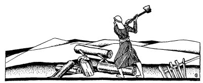
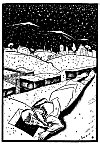
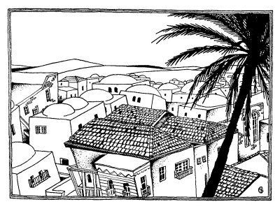

  
[Intangible Textual Heritage](../../index)  [Judaism](../index.md) 
[Index](index)  [Previous](tgm08)  [Next](tgm10.md) 

------------------------------------------------------------------------

p. 35

 

# 6. SCHOOL ON THE ROOF

LITTLE by little the Jews began to build schools. These schools were not
only for little children, but for big men, with children of their own. I
see one of these men, Hillel, at work now.

Whack! Whack! Whack! goes his ax on the wood.

"Hard work, this chopping," says Hillel as he puts down the ax and wipes
his face with his handkerchief. "But I have a family to take care of,
and I must pay for my schooling, too."

Hillel is grown up but he still keeps on studying. And he works hard to
be able to go to school. One-half of what he earns he gives to his
family, and the other half he pays the doorkeeper for admission to the
school.

Wheez-wheez-z-z, goes the saw on the wood. Hillel begins to saw the wood
instead of chopping it. He thinks it might be a little easier.

p. 36

A few more whacks with the ax and a few more cuts with the saw, and the
day is over.

Evening comes and, happily, Hillel goes to the school of Shemayah and
Abtalyon. He forgets all about his hard day's work. He forgets all about
his family. He forgets that he will have to look for a new job the next
day. The whole of Hillel,--his heart and his mind and his body, is
listening to the words of the teacher.

But even good things have an end, so school, too, is soon over.

The next morning, Hillel starts out to look for another job. He goes
from house to house, but everyone has already prepared enough wood for
winter. Hillel is hungry and cold and worried. Where will he get the
money to pay the doorkeeper at the school? And what will his family do?

At last the sun is beginning to set. Hillel goes home and eats what
little food he can find. Then, as is his habit, he goes to school.

When he comes to the door, the doorkeeper asks him as always, "Where is
your dinar?"

"I could not get any work today," mumbles Hillel. "I'll pay you
tomorrow."

"Have you a prutah at least?" asks the doorkeeper.

p. 37

 

[  
Click to enlarge](img/03700.jpg.md)

 

p. 38

"No. Not even a prutah." Hillel hangs his head. "Then you can't come in
today," says the doorkeeper sternly.

Hillel looks about him. He will find a way. And he does find a way. He
will not miss school even for one evening.

Hillel notices that on the, top of the roof there is a skylight, and in
the skylight a little hole. Quietly Hillel climbs up to the roof and
lies down across the skylight, putting his ear to the little hole. From
this position he listens to the teachings of the rabbis.

Meanwhile the snow begins to fall. Thicker and still thicker it falls.
But Hillel doesn't even notice it. He is too busy listening to the
rabbis. And so one of his feet becomes frozen and then the other, and
then one arm and then the other arm, until Hillel becomes very weak and
faints away.

The next morning when Shemayah and Abtalyon come into the school room,
Shemayah says, "Isn't it dark here? And the sun is shining so brightly
outside!"

"Yes," answers Abtalyon, "I have been wondering about it." At this
moment, they both raise their eyes up to the skylight.

"Why, it looks as if someone is lying up there! Is that possible? It
can't be!"

p. 39

They hurry up to the roof and there, buried deep in the snow, lies
Hillel, all numb.

They take him down and rub him with hot oil until he wakes up. Then
Hillel tells them the whole story of how and why he came to the roof.
From that day Hillel was admitted without charge to the school.

Some years later Hillel became the head of this very school.

 

 

------------------------------------------------------------------------

[Next: 7. The Bet](tgm10.md)
