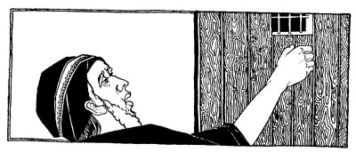
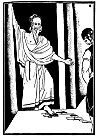
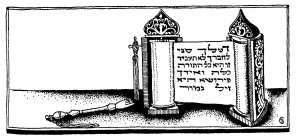

  
[Intangible Textual Heritage](../../index)  [Judaism](../index) 
[Index](index)  [Previous](tgm09)  [Next](tgm11) 

------------------------------------------------------------------------

p. 40

 

# 7. THE BET

HILLEL was so kind and good-natured and, above all, so patient, that
even those who were not Jews heard about his good qualities.

One day a heathen said to a Jew:

"I'll bet you four hundred dinar that I can get Hillel angry."

"All right, let's see," said the Jew.

So the heathen found out just when Hillel took his bath, and at that
very time he came and cried:

"Hillel! Hillel! Where is Hillel?"

Now this was very disrespectful. Even the rabbis called Hillel, "*Rabbi*
Hillel."

Hillel wrapped himself in some coverings and came out.

"What is it, my son? Is there anything I can do for you?" he asked in
his quiet, peaceful way.

"Why do the tadmors have sore eyes?"

p. 41

 

[  
Click to enlarge](img/04100.jpg)

 

p. 42

"Indeed, that is an important question. They have sore eyes because they
live near the desert and the sand gets into their eyes and makes them
sore." So the heathen went away. And Hillel went back to his bath.

After a few minutes, the heathen returned and again he called:

"Hillel! Hillel! Where is Hillel?"

Again Hillel covered himself and came out.

"Is there anything else I can do for you? I'll be glad to do it," said
Hillel kindly.

"Why do the Africans have flat feet?"

"That too is an important question. They have flat feet because they
live in the marshes, and, since they walk in flat damp places, their
feet get flat, too."

Again the heathen went away.

"I must not lose my four hundred dinar," he muttered to himself. "I'll
get Hillel angry yet. I know what I'll do. I'm going to insult him! That
will surely make him angry."

So, after a short while, the heathen again came back and again he
called:

"Hillel! Hillel! Where is Hillel?"

Again without getting angry, Hillel, came out of his bath.

"Is there anything I can tell you, my son? Ask, and I shall be glad to
answer."

p. 43

"Are you the one whom they call Hillel, the Prince of Israel?"

"Yes," said Hillel, "that's what they call me."

"Well, then, I wish there were no others like you in Israel."

"And why do you say that?" asked Hillel, still keeping his temper.

"Because on account of you I shall lose four hundred dinar. I bet four
hundred dinar that I could make you angry, and no matter how I tried, I
did not succeed."

"Well," smiled Hillel good-naturedly, "it is better that you should lose
your money than that Hillel should lose his patience."

 

 

 

------------------------------------------------------------------------

[Next: 8. Torah On One Foot](tgm11)
