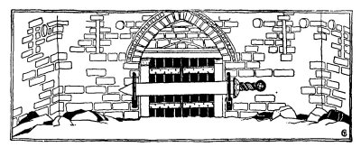
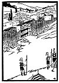
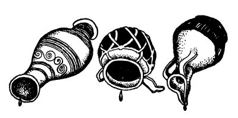

  
[Intangible Textual Heritage](../../index)  [Judaism](../index) 
[Index](index)  [Previous](tgm13)  [Next](tgm15) 

------------------------------------------------------------------------

p. 62

 

# 11. ENOUGH FOR WASH DAY

HUNDREDS and hundreds of Roman soldiers guarded the walls of Jerusalem
so that no one might go in or come out of the city.

What do you think would happen to the people of Jerusalem? Their food
couldn't last forever. Neither could their water, for they had no
running water as most people now have. Before long they had nothing to
eat and nothing to drink.

That was just what the Romans were waiting for. There were no battles.
They just wanted to keep the Jews in the city until they would either
starve or give themselves up to the Romans. They would have to
surrender.

One day the Roman soldiers noticed some wet sheets and blankets hanging
over the walls.

"Those Jews must have lots of water," said one soldier to another.

p. 63

 

[  
Click to enlarge](img/06300.jpg)

 

p. 64

"If they knew what was good for them they would save their water for
drinking. What a waste! Poor fools. Don't they know it is better to keep
alive than to have clean sheets for a day!"

But what do you think was really going on in the Jewish camp? I wonder
if you can guess? Do you think that the Jews really had enough water to
bathe in? Do you think they had enough water to wash their clothes?

No. Of course not! They were just reaching the end of their supply. But
would they let the Romans know it? They would rather die! So what did
they do? They let their throats get dry and dipped their sheets into the
little water they had left! "Let the Romans think we have plenty!" they
said. Can you imagine anyone washing towels when he has not enough water
to drink?

Can you imagine such bravery?

 

 

 

------------------------------------------------------------------------

[Next: 12. The Temple in Ruins](tgm15)
