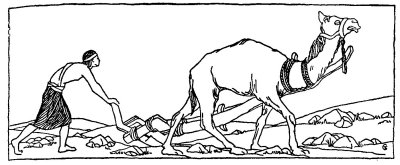
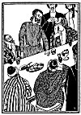
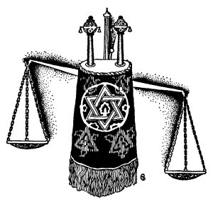

  
[Intangible Textual Heritage](../../index)  [Judaism](../index) 
[Index](index)  [Previous](tgm15)  [Next](tgm17) 

------------------------------------------------------------------------

p. 69

 

# 13. A B C AT TWENTY-TWO

"ROCKS, rocks, and again rocks," said Eliezer ben Hyrcanus to himself.
"It certainly is very hard to plow here. Besides, I don't like to plow;
I don't want to plow. I don't want to plow here or anywhere else, even
if the ground were smooth and level. Oh, I do wish father would let me
go away to study!" Eliezer put his plow aside, sat down on one of the
rocks and began to cry. just then his father, who had been observing
him, came over to him.

"What!" he called, "You, a man of twenty-two crying. What's the matter?
Is anything wrong with you? Oh, maybe you are tired of plowing among the
rocks. Well, there are enough fields. You can change off with your
brothers who are plowing in the smooth, level fields."

But Eliezer didn't seem to hear his father at all. He sat and cried just
as before.

p. 70

"Why don't you answer me?" demanded his father sternly.

"Oh, I don't want to plow all my life; I want to go to school and study
all about my people. Why haven't you ever sent me to school?"

"What!--You, a man of twenty-two, wish to begin to go to school? Ha, ha,
ha I You make me laugh. You ought to be married and taking your children
to school."

"Well, I wanted to tell you for some time, father," Eliezer said. "I've
made up my mind; I'm going to study."

"You won't do anything of the kind," answered Hyrcanus. "You won't get
anything to eat until this whole field is plowed."

So Eliezer got up very, very early and plowed the whole field. As he was
finishing his plowing, he fell and broke his leg.

Through all his pain, Eliezer thought, "At any rate, this will give me a
good excuse for going away to study until my leg gets well." And so it
turned out. Eliezer went to Javneh to the school which Johanan ben
Zakkai had built.

Eliezer supported by a crutch, hopped along very slowly from six o'clock
one day, until six o'clock the next day.

p. 71

At last, hungry and tired, he came to Johanan. Approaching Johanan he
said:

"I am twenty-two years old, but I have never gone to school. Please
teach me the blessings, and some Hebrew. Maybe later on I shall be able
to study Torah." So Johanan began to teach Eliezer.

All this time Eliezer had scarcely anything to eat. He began to look
very pale. He could hardly speak. In fact, he could hardly stand. Rabbi
Johanan noticed this. One morning he asked Eliezer kindly:

"Have you had your breakfast yet, my son?" Eliezer did not reply.

Rabbi Johanan repeated, "Eliezer, have you had your breakfast yet?"

"Oh!" answered Eliezer, as if he had not heard the Rabbi before, "I have
eaten at the house where I stay."

Rabbi Johanan knew that Eliezer was not telling the truth. And so he
sent a number of his pupils to Eliezer's lodging place to find out what
they could about Eliezer's meals. There the housekeeper told them that
Eliezer had never eaten at her house. "But," she said, "he has a sack,
and often I see him put his head into it and suck something. It looks as
if he were sucking from a bottle." Having heard her story, they went up
to his room and found the sack. When they

p. 72

opened it, they found it full of earth. The pupils returned to the Rabbi
and told him the story. Rabbi Johanan then invited Eliezer to eat with
him.

For three years he lived and studied with Rabbi Johanan. But all these
years Eliezer did not write any letters to his father, because there was
no way of getting them delivered. And Eliezer was too weak to walk such
a great distance.

At last Eliezer's brothers said:

"How long will you wait for Eliezer to return? He does not care for you.
He is waiting until you die. Then he will come and claim his share of
your riches. Go up to Jerusalem and make a will saying that Eliezer
shall not receive any of your land or money."

Hyrcanus thought a while. Then he said:

"I guess you are right. He is no son of mine. He never told me why or
where he was going. He does not care whether I live or die. So--why
should I care about him? Tomorrow I shall leave for Javneh."

When Hyrcanus came to Javneh, Rabbi Johanan was holding a feast. The
rich and learned men of the city had been invited. Johanan, hearing that
Hyrcanus was in town, invited him, too. Everything was ready. All sat
down to the feast.

Then Rabbi Johanan called on Eliezer to explain certain parts of the
Torah.

p. 73

 

[  
Click to enlarge](img/07300.jpg)

 

p. 74

Eliezer blushed. He felt nervous to think that he, Eliezer, should
explain things before all these learned men!

"No, Rabbi, please. I can't-not before all these men."

"Don't be foolish, Eliezer," said Rabbi Johanan. "You can do it as well
as anybody else."

Eliezer's face lit up. His eyes began to sparkle. The room seemed lit up
as if by sun rays. In a clear, loud voice he began to recite the Torah.
When he finished, Rabbi Johanan arose and kissed him. "Blessed are
Abraham, Isaac and Jacob that you are a great, great grandson of
theirs."

When Hyrcanus heard this, he could no longer keep quiet.

"No, no," he called, "blessed am I, who have such a learned son. My son,
Eliezer--a rabbi in Israel." Then Hyrcanus mounted the platform.
"Listen, O men of Jamnia," said Hyrcanus through his tears. "I came to
Jerusalem to tell the people that Eliezer would no longer be a son of
mine. His brothers told me not to give him his share of my riches. And I
was about to do as they had suggested. But instead he shall be my only
heir. To Eliezer, to him who starved himself to become a learned man--to
him I will give all my fortune."

p. 75

Thus, though Eliezer had been very poor as a student, he became a very
rich and famous rabbi--Rabbi Eliezer ben Hyrcanus.

But as you may have expected, Eliezer did not keep the whole fortune for
himself. Even though his brothers had been so unjust to him, he divided
his fortune with them.

 

 

 

------------------------------------------------------------------------

[Next: 14. The Wicked Neighbor](tgm17)
