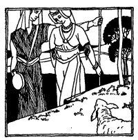
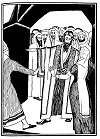

  
[Intangible Textual Heritage](../../index)  [Judaism](../index) 
[Index](index)  [Previous](tgm17)  [Next](tgm19) 

------------------------------------------------------------------------

p. 80

 

# 15. THE SHEPHERD RABBI

"IT'S so cool here. Let us sit down and rest," said Akiba, a tall, dark
youth. He and Rachel, the daughter of the rich landowner, Kalba Seabua,
were walking along the banks of a brook. They were very happy together.
Everything seemed beautiful to them.

Rachel, too, wanted to sit down. So they did.

Ah-h-h-h, Akiba heaved a big sigh.

"Why have you become so sad? Only a minute ago you seemed so gay," said
Rachel in her sweet, soft voice.

"How can I be happy when I know that I shall never be able to marry you?
I am only a poor shepherd. But you are beautiful and a rich man's
daughter."

"But you are not an ordinary shepherd," said Rachel angrily.

p. 81

"You think so because you love me." Akiba smiled a sweet, sad smile.

"Well, I do love you, and I am going to marry you. You will go to school
and become a rabbi in Israel." Akiba thought he hadn't heard aright.

"What did you say?" he asked, sure that he had been dreaming.

The sun was setting. How suddenly it had grown dark! Why, they had sat
there but a few minutes, thought Akiba and Rachel. Surprised at the
hour, they both quickly got up and parted.

With flushed cheeks and sparkling eyes, Rachel danced into her big,
beautiful, rich home singing:

"*Akiba, Akiba, a shepherd is he.  
Akiba, Akiba, a rabbi shall be*!"

Rachel's father looked at her closely as she came in.

"Again you have been in the company of that poor, dirty, ignorant
shepherd--that shepherd who knows nothing!"

"Yes, I have," said Rachel calmly. "And I'm going to marry that poor,
dirty, ignorant shepherd. And I will help him become a great rabbi in
Israel."

"Then you shall leave this house and never return to it again." And that
was exactly what Rachel did.

Akiba and Rachel were married. They were very,

p. 82

very poor. They slept on a bed of straw. And they had nothing but bread
to eat and water to drink. They lived this way for some time and were
very, very happy. But what were they to do? They couldn't live on bread
and water forever.

Rachel, however, was not only beautiful; she was also very clever and
sensible. So she said to Akiba:

"You go to Javneh and study there at Rabbi Johanan's school. And I will
wait. Meanwhile I shall live as best I can. Then, when you will have
become a great rabbi in Israel, you will come back and we shall be
together again."

Akiba felt both happy and sad. He loved Rachel and did not want to part
from her. But he loved the Torah, too, and he wanted to become a
scholar. So, after a few days, with a heavy heart, Akiba left his
beloved wife to study under the great Rabbi Johanan.

Do you know of any woman who made such a sacrifice? Think of it! Rachel
had no automobiles, no maids--why, she didn't even have a dining room!
Her living room, her bedroom, and her kitchen, all were one little hut.
But how she loved Akiba! How she wanted him to become a great man!
Therefore she did not mind giving up her comforts.

Many people said to her:

"Foolish girl, for whom are you waiting? Do you

p. 83

 

[  
Click to enlarge](img/08300.jpg)

 

p. 84

think Akiba will ever come back to you? Do you suppose he still
remembers you? Go--get married to a good man!"

"No--no," she would answer. "You don't know my Akiba. He will stay away
until he becomes a rabbi in Israel and then he will come back."

Rachel did not see her beloved Akiba for twelve years, while he was
studying hard at the school. For twelve long years, she lived all alone
in a poor little hut. Wasn't she a great heroine?

In the meantime, Akiba entered the school at Jamnia as a poor student.
After a few years, he became the head of that same school. He was
greatly respected and honored by everybody. At last he was ready to
return to his home, to his beloved Rachel.

Would she recognize him, he wondered. Would he recognize her? Was she
still as beautiful as when he had left her?

At last, the news came that the great Rabbi Akiba was coming to the
little town. All the important people in the town were busy. All were
excited. Each wanted his house to look the finest. Each wanted the Rabbi
to be his guest. No one knew, and no one dreamed that there was one
heart that beat faster than any of theirs,--that there was one soul that
was happier than even the happiest among them.

p. 85

At last the news spread through the town that the great Rabbi Akiba was
approaching. He was already in town. Young and old, man, woman and
child, all came forth to greet him.

Rachel, in her poor, shabby garments, stood silently by. When she saw
Akiba, she gave a little start, just a very little move to approach him.
But some of Akiba's students pushed her aside.

"Woman," they said gruffly, "where are you trying to go? Don't you know
this is the great Rabbi Akiba?"

Rachel blushed and hung her head. In the meantime, Akiba had already
seen her. Though she was no longer so beautiful, Akiba knew that it was
still his own dear Rachel who stood before him. Making his way through
the crowd of students, he said:

"Let that woman come up here." Then, changing his mind, "Nay--I will go
up to her. If I am a great man it is all due to her. Had she not given
up everything, I could never have become what I am. Had she not had so
much patience, I could never have reached this great position." Saying
these words, he embraced Rachel and kissed her.

Meanwhile a message had come from one of the rich men of the city asking
Rabbi Akiba to come to his house. Akiba explained to Rachel that he must

p. 86

leave her for a little while before he could come to their hut. As
always, Rachel understood, and Akiba hurried to the rich man.

When Akiba arrived, the rich man said:

"I want to talk to you about something which has been troubling me for
twelve years. You are a wise rabbi. Perhaps you will be able to help
me." Akiba modestly remained silent. The rich man continued, "Twelve
years ago, my daughter married an ignorant, stupid beggar. At that time
I took an oath that I would never, never see her again. Now I am getting
old. I may die very soon. And I do want to see my daughter, my only
child. Perhaps I shall be able to help her a little, just a little, to
make up for all the sorrow I have caused her." By this time, the old man
had begun to cry.

"Is there a way of doing that, without breaking my oath?"

"Had your daughter married a rabbi, would you have taken that oath?"
asked Rabbi Akiba.

"Ha, ha, a rabbi--if that shepherd had only been able to read the
prayers I should have been satisfied. Alas, she did not marry a rabbi.
She married a stupid beggar."

"Well," answered Akiba slowly, "I don't know whether I'm a famous rabbi,
but I surely am Akiba,

p. 87

the shepherd whom your daughter Rachel married." On hearing this,
Rachel's father fell at the feet of the great rabbi and begged for
forgiveness.

Akiba raised him up at once and said: "Do not be troubled about the
past. We all make mistakes." They both hurried to Rachel's hut and told
her the story.

So, on that day, Rachel was rewarded for her patience and hard work. Not
only had she regained the love and riches of her father, but her
husband, now a great rabbi, had also come back to her. And so they all
lived happily ever after.

 

 

------------------------------------------------------------------------

[Next: 16. The Cock, the Donkey, and the Candle](tgm19)
