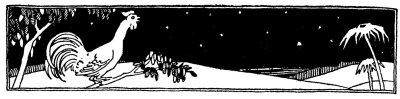
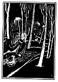

  
[Intangible Textual Heritage](../../index)  [Judaism](../index.md) 
[Index](index)  [Previous](tgm18)  [Next](tgm20.md) 

------------------------------------------------------------------------

p. 88

 

# 16. THE COCK, THE DONKEY, AND THE CANDLE

*Cock-a-doodle-doo.  
Cock-a-doodle-do*o.

DID you hear that cock crow? That was Akiba's cock. Do you wonder why
Akiba carried a cock with him wherever he went? Well, Akiba had no
clock, and surely no alarm clock. So whenever the cock crowed, Akiba
knew it was time to wake up. He knew that the morning had come.

*Cock-a-doodle-doo.  
Cock-a-doodle-doo.  
Get up, get up, Akiba,  
It's studying, time for you*.

"It's hard work studying to be a rabbi, but how fine it is to be a wise
and learned man," thought Akiba as he got up quickly.

He mounted his donkey, which like the cock, accompanied him on his
travels. For you remember, of

p. 89

course, that Akiba had no automobile, no train and not even a horse on
which to ride.

All day he traveled through hot, sandy places. At last, night came.
Akiba, tired, hungry, and thirsty, came into a little town. Bashfully,
he walked over to a house. Quietly he knocked on the door. He waited a
while. There was no answer. Again he knocked. This time a cross old lady
opened the door just far enough to stick her head out and say, "What
beggar is knocking now? Get you gone, you tramp." And bang! went the
door. Akiba was left outside, hungrier and thirstier than ever.

"Never mind," said Akiba to himself, "whatever God does, he does for the
best. Poor woman, she ought to be pitied for being so mean."

Slowly he led his donkey to the next house. Without knocking, he pleaded
quietly:

"Please, please let me in. I'm not a beggar; I'm only a poor traveler.
Give me a drink of water and some bread. I will pay you for it."

This time a gruff young man opened the door and growled, "Oh, we know
your kind. Leave this door, you drunkard, before I throw you into the
street."

Without saying a word, Akiba quietly walked away, and thought, "Whatever
God does, he does for the best."

p. 90

 

[  
Click to enlarge](img/09000.jpg.md)

 

p. 91

"Well--I'll try once more," he said good-naturedly. "But this is a
pretty bad town. Or else, maybe I do look like a dirty tramp now." Akiba
slowly dragged himself over to another door. Again he knocked lightly.

"Please open your door for a poor traveler," said Akiba. After what
seemed a long time, an old man opened the door, looked at Akiba once,
twice and three times.

"Will you let," Akiba began, but before he could finish his sentence,
the man slammed the door in his face. "That must be all right, too," he
thought, "for whatever God does, he does for the best."

Wearily, since there was no place where he might rest, Akiba mounted his
donkey again, and a little discouraged, he rode toward the woods.

On the way, he found a spring. He drank one cup of water, then another
and another. It seemed as though he would drink the spring dry. Then he
found a stale piece of bread in his bag. So Akiba made the best of what
he had.

In the midst of the woods, he came upon an open space. There he halted
his donkey and let the cock roost above him. He then spread a mat on the
ground, lit a candle, opened one of his books and began to study.

p. 92

Suddenly he heard his donkey bray, "Hee, hee, hee." Then there was a lot
of noise and uproar. Quickly Akiba ran over. There was a big lion
killing the donkey. "Poor animal," Akiba thought. He was so sorry he
could do nothing to help. How would he ever reach the school on foot?
The donkey had walked slowly enough. But now it would be still worse,
thought Rabbi Akiba.

But he wasn't upset; he didn't become excited. He simply said, "Whatever
the Lord does, he does for the best." Again he sat down, and opened his
book to study.

He had hardly finished a sentence, when again he heard a terrific noise.
As Akiba looked up, the cock fell at his feet. "Poor cock," said Akiba.
"But whatever God does, he does for the best." And once more Akiba sat
down and tried to study a little before going to sleep. When, whew-whew,
along came a strong wind and blew out the candle.

Wouldn't that have made you angry? But not so Akiba. He just lit the
candle again, and sat down to study. But the wind blew so hard it was
not possible to keep the candle lit. So Akiba gave up and went to sleep,
saying, "Whatever God does, he does for the best."

Akiba slept through the night and got up quite late

p. 93

the next morning. You see the cock was not there to wake him.

"Now Akiba took his little bundle of books and returned to the town
where he had been treated so unkindly the night before. To his great
surprise the people whom he had seen only the night before were dead.

At last he found a little boy weeping. "What has happened in this town,
my little son?" Akiba asked.

"Last--n-night," sobbed the little boy,--"robbers came and killed all
these people."

"Don't cry," said Akiba kindly, "come with me and I will help you find
your relatives in the next town." Then Akiba thought:

"So it was all for the best that 1 was not allowed to enter their homes.

"It was all for the best, too, that the donkey and the cock had been
killed. It was all for the best that the wind blew out the candle.

"Had the donkey brayed, had the cock crowed, had the candle burned, then
the robbers would have found me. I, too, would have been killed and I
should never have become a rabbi.

"I see more clearly than ever, whatever God does, he does for the best."
And Akiba continued on his journey.

------------------------------------------------------------------------

[Next: 17. Fish Out of Water](tgm20.md)
