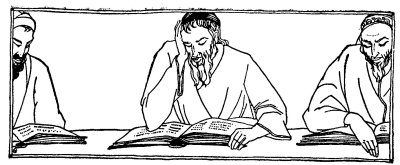
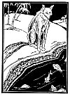
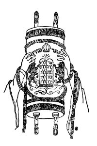

  
[Intangible Textual Heritage](../../index)  [Judaism](../index.md) 
[Index](index)  [Previous](tgm19)  [Next](tgm21.md) 

------------------------------------------------------------------------

p. 94

 

# 17. FISH OUT OF WATER

DAY after day, Akiba studied the Torah. Day after day, many pupils came
to listen to the great Rabbi Akiba. Akiba's school soon became a large
public assembly.

Meanwhile, the Romans were becoming more and more cruel to the Jews.
Jerusalem had been taken from them and most of the other cities, too.
And still the little nation of Jews was alive. The Romans began to
understand now. It was the schools that kept the Jews alive.

So one day the Roman king ordered that all Jewish schools be closed and
no one be allowed to study the Torah. When this order was sent out, what
do you suppose Akiba did? Did he give up his studies? Not at all. He
kept on studying and working just as hard as ever. It seemed as if Akiba
had never heard of the Roman law. His friends became greatly worried
about

p. 95

him. They feared the Romans would kill him; so they said to him:

"Akiba, please, for the sake of your wife and your friends, please stop
studying the Torah." But Akiba listened to no one.

At this time there lived a very wise man called Pappus. One day he came
to Akiba and spoke to him about the Romans. He asked him:

"Aren't you afraid of the government? Before long you will surely be
killed!"

Then Akiba became impatient and said: "Listen, Pappus, and I will tell
you a story------

"Once a fox came over to a pond. He saw the fish throwing themselves
hither and thither. There was great noise and excitement. So the fox
said to the fish:

'*Big fish and little fish  
In the water splashing,  
Big fish and little fish,  
Whither are you dashing*?'

Answered the Fish:

'*O big fox, O wise fox,  
The fisherman has his net,  
O great fox, O wise fox*,  
*Woe to the fish  
The fisherman met*.'

p. 96

 

[  
Click to enlarge](img/09600.jpg.md)

 

p. 97

'*Ha, ha, ha,' the fox laughed loud,  
'Ha, ha, ha,' the fox laughed long,  
'Come out, O fish, on dry land you'll be strong.  
Come out, O fish, on dry land you belong*.'

"'*Chee, chee, chee*,' now it was the fish who did the laughing.

"'*Is that you speaking? We have heard so much about your wisdom. But
now we see that you are only a stupid animal. Just think of it! Here in
the water, where we are at home, and where we can live, we are afraid.
How much more uncomfortable will we be on dry land! Uncomfortable! Why,
then we shall surely die*!"' When Akiba finished his story he looked
closely at Pappus.

"Do you understand that?" he finally asked Pappus. "You speak to me just
as the fox spoke to the fish. You say to me and to the Jewish people,
'Don't stay in the water, that is, don't study the Torah. Come out on
dry land, that is, stop teaching the Torah and kill yourself.'

"Don't you see, Pappus, that Torah is my whole life? If I give up the
Torah I can't live. Without Torah I may as well be dead, just like the
fish on dry land.

p. 98

"You see, Pappus, you say to me, 'Akiba, don't wait until you are
killed. Stop studying the Torah.' That is as if you would say, 'Don't
wait to be killed--but just go and kill yourself.'"

When Akiba had finished explaining the story, Pappus was ashamed and
walked away.

But soon thereafter, Akiba and nine other rabbis were killed because
they studied and taught Torah.

 

 

 

------------------------------------------------------------------------

[Next: 18. The Guardians of the Torah](tgm21.md)
