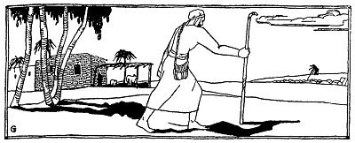
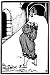
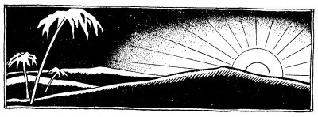

  
[Intangible Textual Heritage](../../index)  [Judaism](../index) 
[Index](index)  [Previous](tgm21)  [Next](tgm23) 

------------------------------------------------------------------------

p. 105

 

# 19. KI-TOV--’TWAS GOOD

"TODAY, I will tell you about Ki-Tov or ’Twas Good,"' Rabbi Meir said,
as the children were gathering round him.

"Some time ago I stopped at a little inn in a country town. At night I
heard the innkeeper call:

"'Get up, get up. Whoever will come now, I will take on my donkeys!'
Most of the guests were very happy. It would spare them so much trouble.
And think of all the time they would save. So I could hear them answer
sleepily,

"'Wait, I'll hurry------'

"'Wait, wait, I'm coming,' and quickly they got into their clothes.

"Now I thought it was strange for the innkeeper who was not known as a
generous man, to be so kind to his guests. Why should he take all of
them on his

donkeys? Of course I could not be certain, but I knew that the innkeeper
was not kind enough to do so much for his guests. I wanted to warn them
not to go, but before I knew it they were all gone. Afterwards I learnt
that the innkeeper had arranged with a band of robbers to wait for him
in the thick of the woods. When the innkeeper's guests arrived, they
were robbed and killed.

"So when the innkeeper called again, I said:

"'No, thank you, I appreciate your kindness, but I cannot go.'

"'Why not,' urged the innkeeper, 'tomorrow you will have to travel all
that way on foot.'

"'I know, but I must wait for my brother.'

"'Where is he? Maybe I can get him for you now. What's his name?'
anxiously asked the innkeeper.

"'Oh, he must be in some synagogue now, where the men are busy studying
Torah. His name is Ki-Tov or ’Twas Good.'

"The innkeeper went away and searched in every synagogue. He called,
'Ki-Tov, Ki-Tov, ’Twas Good, ’Twas Good, your brother is waiting for you
at my inn. Come out, come out, from wherever you are!' But all in vain.
Ki-Tov did not answer.

"After his other guests had been robbed and killed, the innkeeper came
home. By that time the sun

p. 107

 

[  
Click to enlarge](img/10700.jpg)

 

p. 108

had risen and I was not afraid to start on my journey. I packed up and
said good-bye to the innkeeper.

"'Oh, you are going without your brother! I thought you were waiting for
your brother Ki-Tov, last night.'

"'That's true. I didn't lie to you. My brother has already arrived.'

"'Where is he?' asked the innkeeper as he looked about him puzzled.'

"'Look up to the sky--do you see that big light-shedding sun? That's my
brother, ’Twas Good or Ki-Tov. You see why I call him Ki-Tov or ’Twas
Good? Because when God made the sun, he looked at it and said,
"Ki-Tov--for ’Twas Good."'

"'So good-bye, dear Sir. I'm off with my brother, Twas Good.'"

The children all clapped their hands and laughed heartily.

 

 

 

------------------------------------------------------------------------

[Next: 20. As Faithful As That](tgm23)
