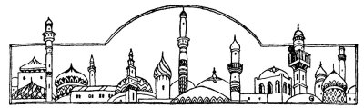
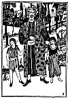

  
[Intangible Textual Heritage](../../index)  [Judaism](../index) 
[Index](index)  [Previous](tgm22)  [Next](tgm24) 

------------------------------------------------------------------------

p. 109

 

# 20. AS FAITHFUL AS THAT

"*Who knows one,  
Who knows one?  
One is Allah;  
One is Allah*------"

DO YOU hear that nasal, sing-song tune? Do you see that man wrapped in a
brown abaye (gown)? And do you see his tan turban wound round his head?

That man is an Arab of long ago. He is praying in one of those temples
with round domes above them. Those temples are the Arabic temples called
mosques.

"*Who knows one,  
Who knows one?  
One is Allah;  
One is Allah*."

\[paragraph continues\] His voice rings out through the silent air.

The Jews had scattered throughout the world, and were now in a country
called Arabia.

p. 110

Amongst the Arabian Jews, there was a man called Samuel Ibn Adijah. He
was a great warrior and also a great poet.

In beautiful poems, he told the Arabs what a wonderful nation the Jews
were. And in Arabic, the language of the Arabs, he told them what the
Jews hoped to do in the future.

Samuel was a very rich man. He lived in a beautiful castle which was
painted in many colors, and which had heavy, thick walls all around it.

One day it happened that an Arabian Prince had quarreled with his
enemies. The enemies became so angry that they wanted to kill the
Prince. They got up an army to fight against him. Even the Prince's best
friends were afraid to side with him so they, too, left him. Soon the
Prince found himself all alone, with only his daughter and his cousin to
stand by him. He had heard, however, of Samuel, the great Jewish
warrior.

"I will go to this Jewish warrior, Samuel Ibn Adijah," said the Prince
to his daughter and to his cousin. "They say he is a fine man, besides
being a great warrior. Maybe he will help me."

So, with his daughter and his cousin as his only companions, he came to
Samuel, who received him kindly and protected him, from all his enemies,

p. 111

 

[  
Click to enlarge](img/11100.jpg)

 

p. 112

Some time afterwards, the Prince left Samuel in order to try to win back
his kingdom. But before leaving for his mission, he entrusted to Samuel
his daughter, his cousin, and all of his arms. The Prince said:

"I know, my friend, that no one will keep my daughter and cousin, and my
armor more safely than you. Good-bye, I hope everything will go well
until I return."

Every day, Samuel and his little son, the Prince's daughter and her
cousin would walk through the beautiful gardens of Samuel's palace.
Every day they would await the return of the Prince. Every day Samuel
would tell the Prince's daughter not to worry, that her father would
surely return. But he himself felt that the Prince must have been
killed. In truth the Prince never did return.

Instead, the enemies of the Prince came upon Samuel. They surrounded his
castle with their horses and their big army. With wild cries they
commanded him to bring forth the Prince's daughter and his armor.

"Give us the Prince's daughter and his armor------or------or," they
shouted. "If you don't------"

Just then, Samuel's little son ran out of the castle.

"Oh, look, Grazia," he clapped his hands with joy

p. 113

and excitement, as he called to his nurse, "look at all those soldiers!"

Before he knew it, the wild soldiers had seized him and cried:

"If you don't--we will kill your son right here. Yes, right before your
eyes. Now you can choose. Either you give up the Prince's daughter or
see your son killed."

Samuel could hardly believe his ears. He was stunned but for a little
while only. Quickly he answered:

"No, I must protect the Prince's daughter, at any cost. She was placed
in my trust and I must not give her up. It is better that I lose my son
than that I lose my honor."

No sooner had Samuel announced his decision, than the cruel soldiers
killed the boy right before his eyes.

Ever after, Samuel was called "The Faithful Samuel." And whenever the
Arabs want to say that someone can be trusted, that he is very
faithful--they say:

"Why, that man--he is as faithful as Samuel."

Did you ever know anybody as faithful as that?

------------------------------------------------------------------------

[Next: 21. The Law is Kind](tgm24)
