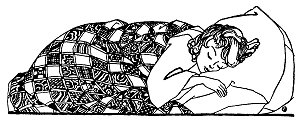
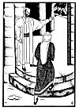
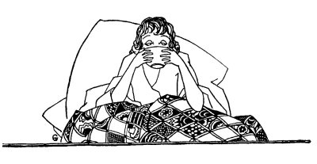

  
[Intangible Textual Heritage](../../index)  [Judaism](../index.md) 
[Index](index)  [Previous](tgm23)  [Next](tgm25.md) 

------------------------------------------------------------------------

p. 114

 

# 21. THE LAW IS KIND

"O DEAR me, I've done it again! Again I have poured the milk into that
*fleischig* (meat) pot. (You know that many Jews keep their meat dishes
separate from their milk dishes.) Since Aaron has become sick, I have
simply lost my head. I don't seem to remember anything. I just don't
know what I am about."

Suddenly Peninah ran into the child's bedroom. She thought that little
Aaron had called her. But she found him sleeping rather quietly. For the
past three days, Aaron had been very sick. The doctor had ordered a
fresh mustard-plaster every three hours on the boy's chest.

Peninah ran back to the kitchen, just as her husband was entering the
house.

"I'm so glad you've come," she said. "Aaron is sleeping. Now I can run
over to the College to ask them about the pot that I made *tref*. And at
the same

p. 115

time I can find out if I may make the plasters for Aaron tomorrow even
if it is the Sabbath."

"All right. Go ahead and don't worry. I am here. Watch where you are
going and don't be so upset," Peninah's husband said kindly.

When Peninah came into the school at Sura, all the students were seated
and were discussing various questions.

As Peninah was ushered in by the doorkeeper, they stopped talking.
Saadiah, the Head Gaon or president, asked her:

"What is the matter? What brings you here, my dear woman?"

Peninah could hardly catch her breath, for she had been running all the
way.

"You will excuse me for running in this way," Peninah said as she sat
down, "but you see, my little son is sick at home. And I do want to rush
back to him. Since he became sick, I hardly have a *kosher* pot left in
the house. When I should take a *fleischig* pot and spoon, I take a
*milchig* (milk) one. When I should take a *milchig* pot, I take a
*fleischig* one. Now I would like you to tell me whether I am to throw
away all those dishes."

Saadiah thought a while and then turned to the assembly and asked:

p. 116

 

[  
Click to enlarge](img/11600.jpg.md)

 

p. 117

"What do you folks think about that?" One scholar arose and said:

"It's not for us to say one way or another. Let us look up and see what
the rabbis teach us about such matters."

At this point a rather stern-looking man asked to be allowed to speak.
As he arose, he looked around impatiently. Saadiah called the assembly
to order. "We will now hear what Anan ben David, the Karaite, has to
say," he said.

In a very low voice, Anan began. "My friends," he said, "this way of
doing things is becoming too tiresome. Let us look up what the rabbis
say,--and again let us look up what the rabbis say! Have we not the
Bible? Can't we read what the Bible says? The Bible says very clearly:

"'You shall not cook the kid in its mother's milk.' That, my friends,
means exactly what it says. It's bad enough that you have to be cruel
and kill the little lamb. Then, after that, don't go and cook it in its
mother's milk. The laws in our Bible are very kind, my friends--very
kind. They have nothing to do with dishes. You may cook meat in the one
pot. Then take that same pot and boil milk in it. But, the Bible says,
don't cook the two at the same time. Don't boil the kid in its mother's
milk."

p. 118

Peninah sat by quietly and listened. But she became very impatient in
her eagerness to get back. And besides, she didn't understand what Anan
was trying to show. She arose and quietly said to Saadiah:

"Please, Gaon, please. All I want to know is whether or not I must throw
all those pots away. That's all."

The Karaite looked even sterner than before. He was about to say
something to the woman, but Saadiah turned to her and again very kindly
said:

"That is just what Anan is trying to tell us. According to him, there is
no milchig and no *fleischig*, so you can just keep all your dishes."

"But, don't I have to do anything to make them kosher again?" the woman
asked in surprise.

"Don't you see, my dear woman, nothing is *tref* because there is no
*fleischig* or *milchig* ."

"I'm afraid, I don't understand what Anan is saying. Does he expect me
to eat *tref* and spoil my whole household?" The woman spoke in an angry
tone and shut her lips very tightly, as she finished talking.

"Please sit down again and we will soon tell you just what you have to
do," Saadiah said.

Then he turned to the assembly and said:

"I am sorry that I cannot agree with Anan the

p. 119

\[paragraph continues\] Karaite. Of course, we know what is written in
the Bible. And we must make sure that we do know it. But we must also
know how the rabbis have explained it. Then we shall be able to help
this woman and others, too."

Another scholar arose and began to explain the law:

"Not to boil the kid in the mother's milk, means to have separate dishes
for *milchig* and *fleischig*. That is what the rabbis here taught us.
Now then, if this woman poured her milk into the *fleischig* pot, she
must throw that pot away."

At this point Saadiah Gaon interrupted again and said:

"No, my dear friend. Now that we know what the Bible has written down,
now that we know what the rabbis taught, we can judge this case.

"We agree that the pot is *tref*. It cannot be used as it is. But
neither does it have to be thrown away."

Turning to Peninah he said:

"You throw a red hot stone into that pot and pour water over it. Then
you may use the pot again. It shall be *kosher* again."

That decision Peninah understood. She thanked the scholars very much.
Peninah was just about to rush out, when she stopped and said:

p. 120

"O yes, I almost forgot. Since I am here I might as well ask you
everything."

"Surely, surely," Saadiah said kindly. "We shall be glad to answer you."

"You see, my Aaron has a very bad cough. The doctor ordered that we put
a mustard plaster on his chest every three hours. Now may I make the
plasters on the Sabbath?"

"What!" again called the Karaite. "On the Sabbath. To work on the
Sabbath! Of course, you are not allowed to make a plaster on the
Sabbath."

"But he is so sick--so sick, and the plaster keeps him from coughing,"
the woman begged.

"That would make no difference. The Bible says you must not work on the
Sabbath. You must work to make a plaster. Therefore it is settled. You
may not make a plaster on the Sabbath."

"But maybe the rabbis can find a way of explaining the law. Maybe to do
it for a sick person wouldn't really be working," Peninah pleaded. She
had already learned something from the other decision and she was
hopeful.

"You are right, my dear woman," Saadiah said kindly. "The rabbis teach
us that the Sabbath is not to be considered when the welfare of the sick
is concerned."

p. 121

"Oh, I knew the law would be kind," said the woman as she dried her
tears.

Peninah thanked the scholars and quickly rushed home to Aaron. As she
came into the house, she found Aaron sitting up, drinking some milk.

"God is good," Peninah cried for joy. "It seems the child is getting
better and I shall not have to make the plasters on the Sabbath after
all." Then she quickly ran into the kitchen to *kosher* her pots.

Aaron became well. When he grew up, his mother sent him to study in the
School of Saadiah, the Gaon, where he too learned to explain the Torah.

 

 

 

------------------------------------------------------------------------

[Next: 22. Even Though I Lose](tgm25.md)
