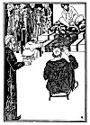

  
[Intangible Textual Heritage](../../index)  [Judaism](../index.md) 
[Index](index)  [Previous](tgm25)  [Next](tgm27.md) 

------------------------------------------------------------------------

p. 126

 

# 23. A GIFT TO THE CALIPH

IT WAS a very hot day in Spain. Hasdai, dressed in expensive silks, a
turban on his head, sat in the court of the Caliph. He was receiving
ambassadors from countries far, far away. Though Hasdai was a Jew, he
held a very high position in the government. He was just about to lie
back in his plush chair when the courtier announced:

"The Ambassadors from Constantine of Rome!"

"Oh, the Ambassadors from Rome!" Hasdai became greatly excited. He
ordered his servants to tidy up the room and put back a few chairs into
their proper places. He, himself, arranged some books and papers on his
desk, brushed some white spots off his coat, and then said:

"Very well, usher them in."

After the ambassadors had greeted Hasdai, they said:

"We have brought a very, very precious book to the Caliph. This is the
Great Book of Cures. It tells how to cure every illness."

The doctors of Spain had always hoped to get this book. Now here it was
at last!

p. 127

Hasdai was very well pleased to receive the book. He spoke to the
ambassadors about many things, for Hasdai was interested in many things,
but especially in his fellow-Jews all over the world. So after he had
been talking to the ambassadors for some time, he asked:

"Do you know anything about the Jews in Rome? How are they being treated
there?" But these ambassadors knew nothing about the Jews. So Hasdai
learned nothing from them. After a while the ambassadors left.

Hasdai picked up the Book of Cures very carefully and took it into the
Caliph's room. Placing the book before the Caliph, Hasdai said rather
proudly:

"This is the great Book of Cures, which Constantine has kindly sent to
Your Majesty."

The Caliph ordered all the physicians and great men of the court to come
in. They were all happy to hear the good news. But soon one of them
said:

"It is all very well to have the Book, but who will explain it to us? We
cannot read Greek."

"That's right, that's right," a few other men chimed in, scratching
their heads.

"We do not understand Greek."

For a while all were silent. Then the Caliph spoke:

p. 128

 

[  
Click to enlarge](img/12800.jpg.md)

 

p. 129

"Surely Constantine has a monk who can translate it for us. We will ask
him to please send us some one to translate the Book of Cures."

Constantine, very happy to secure the good-will of the Caliph,
immediately sent him a monk.

When the translator arrived, the Caliph again held court for the
physicians and the wise men. Eagerly they all sat down to listen to the
learned man. But to their surprise, he took the book in his hands,
arose, and began to blush and stammer.

"I'm sorry, I do not understand your language well enough to translate
this book into Arabic. However, I can translate it into Latin."

Those assembled were so disappointed that they could not speak. What was
the use of this wonderful book if they could not understand it? Suddenly
a voice broke the silence with "Let him translate it into Latin." It was
Hasdai speaking.

"You surprise me, Hasdai," said the Caliph, puzzled. "Of what help will
that be? The only language we understand is Arabic."

"Yes, your Majesty; but, if you will allow me, I can translate it into
Arabic from the Latin," Hasdai said modestly.

Think of it ! Of all the men in the court, Hasdai, the Jew, was the only
one who understood Latin. So

p. 130

it was Hasdai who translated the famous Book of Cures into Arabic.

Though Hasdai was busy translating the book, he nevertheless continued
to receive ambassadors. One day, ambassadors from Khorasan came to see
Hasdai. As it was his habit to inquire about the Jews of strange lands,
Hasdai asked them:

"Do you know how the Jews are faring in the Khorasan country?"

"There aren't any Jews in Khorasan, but in the land of the Kazars there
is a Jewish king on the throne," the ambassadors told Hasdai.

"Is that true?" asked Hasdai, with great joy. "What kind of people are
they? What language do they speak?"

"We are sorry, we can't answer your questions. But we shall be glad to
deliver a message from you to their king." And so Hasdai wrote a
beautiful letter in Hebrew. He told the king of the Kazars:

"The Jews in Spain are very rich, and they are learned too. They have a
large college where great men come to teach. Will you please write and
tell me all about the Jews of your country?"

The king of the Kazars wrote back this interesting story. Do you want to
hear it?

------------------------------------------------------------------------

[Next: 24. The Choice](tgm27.md)
