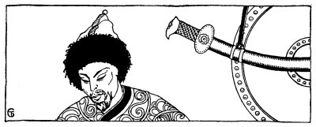
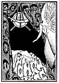

  
[Intangible Textual Heritage](../../index)  [Judaism](../index.md) 
[Index](index)  [Previous](tgm26)  [Next](tgm28.md) 

------------------------------------------------------------------------

p. 131

 

# 24. THE CHOICE

ONCE there lived in Russia a very fierce race of people, called Kazars.
They were very warlike all the time. So their kings went from country to
country fighting with the people. All the nations feared them.

These rough people hardly had any religion at all, but on their travels
they met Christians, Moslems, and Jews. When Bulan, one of their kings,
met these people and learned about their religions, he became greatly
dissatisfied with his own.

Day after day Bulan thought about it. One time when he was greatly
worried, he dreamed a dream. It seemed to him that an angel came to him
and said:

"You do not serve God in the right way. Send for a Jew, a. Christian and
a Moslem. Let them each explain his religion to you. Then you will
choose the best for your own."

The angel disappeared and Bulan awoke, He

p. 132

ordered that one of his wise men should come to him at once. The wise
man was tired and sleepy. Why should he be taken out of his bed at
night? But the king's orders must be obeyed. Therefore he dressed
quickly and came before Bulan.

Then Bulan spoke to him and said:

"*Tell me, Wise One,  
Tell me true,  
What does your God  
Mean to you*?"

Answered the Wise Man:

"*God is a Spirit,  
Far removed is He,  
How can He care  
For you or for me*?"

Bulan was not satisfied with this explanation.

"Bah," he said. "No--no. A god who does not guard over my kingdom, a god
who does not care about me, can't be my God."

A few days later, Bulan ordered that a Christian monk should come to
him. When the monk entered in his long black gown and three-cornered hat
of the same color, Bulan was interested.

Again he said:

p. 133

 

[  
Click to enlarge](img/13300.jpg.md)

 

p. 134

"*Tell me Monk,  
Tell me true,  
What religion  
Pleases you*?"

\[paragraph continues\] Answered the Monk:

"*My religion  
As you see,  
My religion  
Pleases me*."

Bulan asked: "If you had to choose between the religion of the Jew and
that of the Moslem, which would you choose?" The Monk answered-. "I
would choose the Jewish religion. It is the oldest, and our religion is
based on it."

Bulan thanked the Monk for his advice. The next day Bulan said: "I shall
call a Moslem and find out what he has to say."

So the next day, a Moslem came before Bulan. He had a very dark skin,
darker than any skin that Bulan had ever seen. His long grey gown and
the turban around his head made him very attractive. Bulan asked him the
same question that he had asked of the others.

"*Tell me Moslem,  
Tell me true*,p. 135  
*Which religion  
Pleases you*?"

\[paragraph continues\] Answered the Moslem:

"*My religion  
As you see,  
My religion  
Pleases me*."

"If you had to choose between the religion of the Jew, and that of the
Monk, which would you choose?"

The Moslem answered: "I would choose the Jewish religion. It is the
oldest, and our religion is based on it." Bulan thanked him for his
advice. The next day he called a Jew and put his question:

"*Tell me Jew,  
Tell me true,  
Which religion  
Pleases you*?"

\[paragraph continues\] The Jew answered:

"*My religion  
As you see,  
My religion  
Pleases me*."

\[paragraph continues\] Bulan asked:

p. 136

"*Tell me, Jew,  
Tell me true,  
What does God  
Mean to you*?"

\[paragraph continues\] The Jew answered:

"*Love thy neighbor as thyself  
And know the prophets too.  
This, the message of the Jew  
Forever will be tru*e."

Bulan then turned to the Jew and said: "You will be happy to know that I
asked the Monk this question: 'If you had to choose between the religion
of the Jew and that of the Moslem, which would you choose?' He answered:
'The Jewish religion.' I then asked the Moslem a similar question. He
answered: 'The Jewish religion.' Now, all religions seem good to me if
they teach us that there is one God who is the Father of us all, and
that all men are brothers. But as the Jewish religion is the oldest, my
folk and I shall come to you."

"So Bulan and his people became Jews. And I am one of his
great-great-grandchildren," the king of the Kazars wrote.

The story pleased Hasdai very much. It gave him courage to help the Jews
of Spain to become greater and greater.

------------------------------------------------------------------------

[Next: 25. The Slave Rabbi](tgm28.md)
