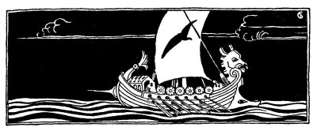
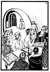
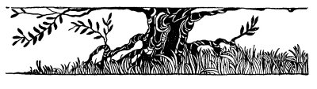

  
[Intangible Textual Heritage](../../index)  [Judaism](../index.md) 
[Index](index)  [Previous](tgm27)  [Next](tgm29.md) 

------------------------------------------------------------------------

p. 137

 

# 25. THE SLAVE RABBI

THERE were once two great Jewish colleges in Sura and Pumpeditha, famous
cities in Babylonia. It was in one of these colleges that Saadiah was
Gaon. When people had a quarrel and could not make peace, where do. you
think they went? To Babylonia. For, this great college also served as a
court. When a man wanted to become a rabbi, where do you think he went?
To Babylonia.

A time came, however, when the Jews stopped sending their students to
Babylonia. Little by little Babylonia was losing its greatness. It
seemed as if all the work that had been done there would be lost. What
was to be done? The Babylonian Jews, very much worried, called a meeting
of all the rabbis and all the important people. The question was: "What
should be done to keep up the great learning which had been started in
Babylonia?" Some said:

p. 138

 

[  
Click to enlarge](img/13800.jpg.md)

 

p. 139

"Send out letters to all the countries where Jews live. Tell them what
great colleges we have here, and ask them for the sake of Jewish
learning to help support these colleges. Tell them that otherwise all
the good work of the rabbis will be lost. The schools will have to be
closed."

"No, no," said others. "Don't send letters. Send people. Send our very
own great scholars."

So they decided to send out four of their greatest scholars to different
parts of the world. They were to assemble Jews wherever they went and
say to them:

"We have fine schools and colleges in Babylon. You remember that when
Johanan ben Zakkai risked his life to go before Vespasian, he asked for
only one thing--to build a little school.

"Now that we have all these great and fine colleges there, will you
allow them to be closed? If you do not send your students and your great
scholars to Babylonia--that is what will surely happen."

So, in accordance with this plan, these four great scholars started out
from Babylonia. On their travels they had to cross a big sea. On this
sea there were many pirates who fell on the vessel on which the rabbis
were sailing. The pirates captured the four rabbis and carried them off
to slave markets. Two of them were taken to Africa, the third to France,
and the fourth

p. 140

to Spain. Was this to be the end of the rabbis and the schools in
Babylon? Would the schools have to be closed after all? Would these
great rabbis be sold as slaves? Was this to be the sad end of such
well-laid plans?

In those days every country had a market place where the rich people
came to buy their slaves. To these market places the rabbis were
brought. And these old, learned men were placed on the block, on show,
where everybody could see them. These old rabbis, loved and honored by
the Jewish people, were put up for sale just like sheep or cows or
horses. Can you imagine the shame and sorrow these men felt?

The pirates, however, were very happy. Now they would get rich! These
Jewish men were worth thousands of dollars. In Spain the captain of the
pirates stepped up on the platform and called out:

"Hear ye; hear ye. Here we have an extraordinary slave, but of course he
is very expensive. It isn't every day that we can offer you slaves as
fine as this one."

There was great excitement in the market place. The Jews and even the
Gentiles were greatly astonished. How had these pirates succeeded in
capturing a great rabbi? What! A rabbi to be sold as a slave! What a
disgrace, they cried. It all seemed so impossible. A cry of horror arose
from the Jews. No,

p. 141

they would never allow it. That would be terrible!

Meanwhile the pirate cried again:

"Well, what am I offered for this one? A great man, a great scholar.
Tested him myself." At that the stupid crowd began to laugh. "What am I
bid? Guaranteed to know everything!" the pirate continued.

Jews and Gentiles alike could not bear to hear the pirate poke fun at
the great rabbi. The Gentiles offered high prices, but the Jews always
added to the offers. The Jews had made up their minds not to let the
rabbi be sold into slavery. To their joy, they did at last buy freedom
for this highly respected man.

Among the bidders in the slave market was a man whose name you have
heard before. Yes, that man was the famous Jewish scholar, Hasdai. When
Rabbi ben Enoch was put up on the platform, Hasdai offered a larger
price for him than anybody else there, so that he was sold to Hasdai. I
don't know whether you can imagine how happy Hasdai was. For surely, you
don't think that he had bought the rabbi for his slave! Hasdai was happy
because he knew that God had sent him a great treasure. He knew that no
amount of money could pay for that treasure. The first thing that Hasdai
did was to give Rabbi ben Enoch his liberty. Then, when Rabbi ben Enoch
had told him the whole story of his mission, Hasdai offered to help him
accomplish

p. 142

what he had set out to do. He took the learned Rabbi ben Enoch with him
to the college in Spain.

The rabbis who had been taken to the other countries were freed, too.

Can you imagine how happy the rabbis were to be free again? So their
trouble had not been in vain. Their hopes would be fulfilled. The work
at Babylonia would not be wasted.

Moses ben Enoch was so anxious to do his duty that he did not stop even
to take off his slave's clothes. As soon as he was set free, he went to
the college with Hasdai at once. There he asked Hasdai to let him stand
near the door and listen to the discussion. No one noticed him at all.
He had been standing there some time when a very hard problem came up.
It was so difficult that even the head of the college could not solve
it.

Suddenly a voice was heard asking:

"May I please try to answer the question?"

Everybody turned to see who was talking. Can you imagine their surprise
when they saw a slave in the school? And not only that, but the slave
trying to answer a question--and such a hard one at that.

"That must be some slave who has gone out of his mind," a number of
scholars said, But the head of the

p. 143

college being wiser than they, in his usual polite way, asked Ben Enoch
to come up to the front. When he had modestly done so, quietly and
slowly, he answered the question.

Seeing how wise Ben Enoch was, the head of the college said:

"So wise a man should take my place, for he knows more than I do." So
Moses ben Enoch, this rabbi from Babylonia, became the head of the
college in Spain.

Hasdai went up to the head of the college and asked his permission to
speak to the Assembly and Hasdai told the whole story of Rabbi Moses ben
Enoch.

Now, when a man wanted to become a rabbi, where do you think he went? To
Spain, of course. When people quarreled and could not make peace with
each other, where did they go? To Spain. And so Spain took the place of
Babylonia as the center of Jewish living and of Jewish learning.

 

 

 

------------------------------------------------------------------------

[Next: 26. The Wondrous Tree](tgm29.md)
