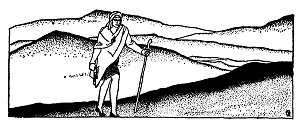
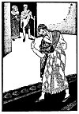
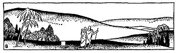

  
[Intangible Textual Heritage](../../index)  [Judaism](../index) 
[Index](index)  [Previous](tgm30)  [Next](tgm32) 

------------------------------------------------------------------------

p. 160

 

# 28. AN ANGEL DID IT

"IT'S hard to make a living in Spain. I think I'll try another country."
So spoke Abraham Ibn Ezra to his mother. "But," he added, with a smile,
"it seems I simply haven't any luck. If I were to begin to make shrouds,
I'm sure men would stop dying, or if I were to make candles, the sun
would not set until I gave up the candle trade."

His mother smiled a kind mother's smile; lightly tapping him on the
shoulder, she answered:

"Now, don't speak that way, Abraham. You mustn't lose courage, my son.
As you go from country to country you will surely find something at
which you can make a good livelihood."

Abraham had just returned to Spain for a little visit with his mother.
He had already been to Italy, France and England.

"But do you know, Mother," he said, "I think that

p. 161

\[paragraph continues\] I like to travel from country to country just
for the fun of traveling. I couldn't stay in one place, even if I could
earn enough to live on there. It's so much more interesting to keep
moving from place to place. Besides it helps me understand not only the
Jews, but other people as well."

What answer could his mother give Abraham? She too, thought it was
interesting to travel. However traveling takes time, you know. When you
travel you don't have much time for anything else. But Abraham was so
brilliant and so learned. He could do so much for his people, if he
would only settle down to work in one place. If only he would give his
time to one thing!

"Well," she heaved a heavy sigh, "maybe you will meet a nice girl, and
you'll get married--and then you will stay in one place and really do
something."

"Now, Mother, that isn't fair. You know I work all the time, and this
explanation of the Bible which I am writing will be an important piece
of work, I hope."

"This is the first time I have heard about it," his mother said. Her
wrinkles seemed to smooth out and she looked quite pretty and young
again. "Do tell me about it." She was very much excited.

"I don't know how interesting you will find it--but this is the idea.

p. 162

"You know there were the great teachers who wrote explanations of the
Bible but their explanations were altogether too long. They put all
kinds of strange meanings into the Bible. Well, I will write an
explanation of the Bible without putting fairy stories in it."

"Yes? What do you expect to do?" Abraham's mother asked. And the look in
her eyes said:

"Please go on and tell me."

"You see, it's not such a short story. If you really care to listen, I
will tell you."

"Why do you ask such foolish questions?" his mother said lovingly, as
she bent over and kissed him.

Pleased, Abraham continued:

"Then you remember, Mother, there came the Karaites and they thought
that every single letter in the Bible was important--every single
letter. These Karaites said the rabbis had nothing to teach them at all.
But I am trying to do this: First I find out what the rabbis wanted to
teach us. Then I explain what is written in the Bible. But I am trying
to do that in a clear, simple way. That is why I am working very hard to
write this explanation."

"May God bless you, may God bless you," his mother said as she wiped
away the tears from her eyes.

As he had promised his mother, Ibn Ezra did finish his explanation of
the Bible. And so clear was

p. 163

his explanation that young Jewish people began to study the Bible more
carefully than ever before.

But his work did not stop Ibn Ezra from traveling. He went to Egypt, to
Palestine, and to Babylon. In every country, he left behind the marks of
his great learning. In this way he taught all the Jews about the great
Spanish poets and philosophers. So it was a good thing after all that
Ibn Ezra went from country to country.

Now Judah Halevi lived in Spain at the time when Ibn Ezra was traveling.
It happened one day that Judah had been working for a whole day on a
Purim song. He had almost finished the whole song, only he could not
write the. last line. He tried again and again but he simply couldn't
find the right thought nor the right rhyme. He was quite upset. just as
he was straining every nerve to get that last line, his wife interrupted
him with this:

"Judah, you may be a great poet, but you are not doing your duty as a
father. We have only one daughter and you don't even take the trouble to
find her a good husband."

Judah, tired and angry because he couldn't find a rhyme for his Purim
song, called out in disgust:

"The first stranger that comes to the door can marry her. Will that
please you?"

p. 164

He had hardly finished saying these words when a knock was heard on the
door.

Judah's wife went to open the door. What she saw made her knees sink
under her. Before her stood a man in rags. He looked dirty and tired.

"Have you a room for a lodger over night? I have a long way to go and I
am very far from an inn."

Judah's wife was thinking, "Good God, will my daughter have to marry
this man?"

But what could she do? She couldn't refuse a lodging place to a
stranger. Therefore she said, "Come in, we can find room," but her mind
was troubled: "My daughter, my only child, will she have to marry this
beggar? Can Judah mean it?"

As the stranger entered, he noticed that Judah was pacing up and down
the room counting on his fingers and whispering to himself. Ibn Ezra
(for it was he) knew at once that Judah was not talking to himself. It
was clear to him that his host was counting the syllables of words for a
poem.

"Judah, too, sometimes finds it hard to get a good rhyme," Ibn Ezra
thought to himself.

Judah looked up for a second, greeted the stranger, and then continued
whispering and counting to himself.

His wife, seeing that Judah had no intention of

p. 165

 

[  
Click to enlarge](img/16500.jpg)

 

p. 166

speaking to the stranger, showed him his room and wished him good-night.

For some time Judah continued to work on his poem. But at last he gave
up and he, too, went to sleep.

During the night Judah's wife could not sleep well because she was
worried about her daughter. Did Judah really mean what he had said? And
would he really make her daughter marry the ragged and ignorant beggar?
She was hoping for the morning to come so they could talk the matter
over.

Neither could Judah sleep because his Purim song was going through his
head. Whenever he thought he had found the rhyme it always turned out
wrong in the end. As they were lying in bed awake, each thinking and
worrying, each thought he heard a noise in the study.

Quietly they both got up and watched him from a distance. To their
surprise they saw the stranger sitting at the desk where the unfinished
poem lay. They watched him closely as he sat there, thinking, the pen in
his hand. Then they saw him write something and go back to his bed.

Then Judah and his wife both ran into the room, and there they saw
Judah's song, beautifully finished! If they hadn't seen the stranger
write it, they couldn't have believed it.

p. 167

Judah picked up the paper. Suddenly he looked alarmed.

"What's wrong? What's troubling you, Judah?" his wife asked anxiously.

"There is something peculiar, something queer about this stranger,"
Judah answered. "Only an angel or Ibn Ezra, the young poet, could have
finished this poem. And here it is, all finished, with a beautiful line
and a beautiful rhyme. Didn't we both see the stranger do it?"

The sun had not yet risen, so Judah Halevi and his wife went back to
bed. But again they couldn't sleep. This time it was because they were
wondering who this stranger was. Could he really be the famous Abraham
Ibn Ezra? If so, how fortunate for their daughter!

When at last the sun began to rise, Judah and his wife could hardly wait
to get into their clothes.

They found the stranger in the sitting-room, in his *talith* and
*tefillin*, praying. Judah put on his *talith* and prayed too. Judah's
wife in the meantime quickly prepared some breakfast and set it on the
table.

At breakfast, Judah Halevi said to the stranger:

"We hardly had a chance to ask your name last night."

"Why, I thought everybody knew the Wandering

p. 168

\[paragraph continues\] Jew, Abraham Ibn Ezra," the young traveler in
his beggar's clothes replied.

Judah and his wife stopped eating and both stood up in great surprise.

Extending his hand to Abraham, Judah said: "I told my wife that only
Abraham Ibn Ezra or an angel could have finished that poem. You know we
saw you write it last night."

Abraham flushed, as he said with a smile: "Well, I am not an angel, but
they do call me Abraham Ibn Ezra,"

Just then Judah's daughter came in. This was the right moment for Judah
to tell Ibn Ezra as well as his daughter about his plans for their
marriage.

"Listen, my daughter, and, you too, our dear guest, to a rash vow I made
yesterday." He then told them the whole story. Both maid and man looked
embarrassed; but, as you may guess, Ibn Ezra married Judah's daughter.
And happily the two of them continued to travel.

 

 

 

------------------------------------------------------------------------

[Next: 29. The Doctor Arrives](tgm32)
