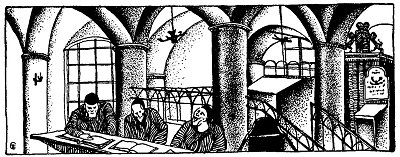
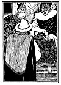
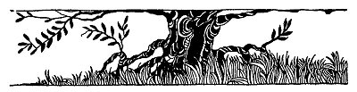

  
[Intangible Textual Heritage](../../index)  [Judaism](../index.md) 
[Index](index)  [Previous](tgm35)  [Next](tgm37.md) 

------------------------------------------------------------------------

p. 196

 

# 33. HOW RASHI WAS SAVED

"AND SO, my dear Brethren of Prague, I want to tell you that the Jews
are getting on very nicely in France. They are not as rich as our
Spanish brethren, nor are they allowed to take part in the government as
the Jews of Spain are, but they keep on studying the Bible and the
Talmud. And they continue to have great schools like those in Babylonia.

"Thank you, my friends, thank you for giving me such a big gift. Because
of that I shall not have to work for the rest of my life. But I don't
think that it is right. I believe a rabbi should earn a living by the
work of his hands, and no rabbi should receive money for serving his
people.

"I want to thank you again for the fine way in which you have welcomed
me to your city." With these words Rabbi Rashi ended his talk.

"Oh, what we have done does not begin to show

p. 197

you how much we appreciate the fine things you have written for us, and
for our children after us. You have made the Bible so clear that our
children will now be able to read it," answered the spokesman of the
congregation.

Rashi was about to say something, when suddenly officers rushed into the
synagogue and taking hold of him, said:

"By the order of the duke, you are arrested!" A few of the elders of the
synagogue became very angry and excited, and rushed up to the platform.

"Arrested?" they cried. "What for?"

"This man is a spy. He came to find out which parts of the land can be
easily attacked."

Rashi turned to the elders of the synagogue and said:

"Don't grieve, my dear friends. Nothing can happen to me, because I'm
not guilty. Wait for the trial and trust in God." So Rashi was
imprisoned for four days.

At last the day of the trial came. Rashi was brought before the duke.

"Are you the great Jewish scholar, the one whom the Jews have so
honored?" the duke asked angrily.

"Yes, they gave me a very fine welcome," said Rashi modestly.

p. 198

 

[  
Click to enlarge](img/19800.jpg.md)

 

p. 199

"Then you are the spy. And you shall surely be hanged."

During this time, the bishop, who was the chief judge, sat by looking
very closely at Rashi. It seemed to him he had seen this man somewhere
before, but he couldn't remember just where it had been. Little by
little, however, it came back to him. This man was a rabbi, a great
scholar.

"Oh, yes, yes, to be sure!" Suddenly he turned to Rashi and asked:

"Were you ever in Palestine?"

"Yes, I travel from country to country, trying to learn everywhere,"
answered Rashi. At the same time, Rashi also recognized the bishop.

The bishop then turned to the duke and said:

"Let no harm be done to this man. Neither shall he be put into prison,
for I know that not only is he a great and learned rabbi, but he is also
a very fine man. Let me tell you how I know this:

"Sometime ago when I was in Palestine, there was a learned Jew at the
inn where I had stopped. When I heard that, I asked to be introduced to
the learned rabbi. We sat together, and talked about religion. Rashi
told me about his work, and his teachings. He told me that he was trying
to continue the worthy work that had been done in Palestine and in
Babylonia

p. 200

by the many great rabbis who came before him. "That same night I
suddenly became very sick. And this rabbi, this Jewish man, sat up with
me all that night and the whole day after that and the whole night after
that, and prepared medicines for me, which he knew would help to cure
me. But for this man I might have been dead now. When I was better and
he was leaving the inn, I begged him to accept some money or at least
some little gift for all his kind services. But with many thanks he
refused and said:

"'You are not a Jew. You are not of my religion. But you were sick and I
did the best I could for you. Now, all I ask is that if ever you meet a
Jew who is in trouble you do all you can for him.' And Rashi shook hands
with me and left.

"And do you know, O duke, this man standing before us now is no spy. He
is the great rabbi who saved my life. Now then, can I do anything less
for him than beg that you grant him his freedom?"

And so all the Jews rejoiced, for Rashi was allowed to return to his
native France.

 

 

 

------------------------------------------------------------------------

[Next: 34. The Fourth Horse](tgm37.md)
