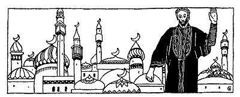
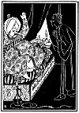
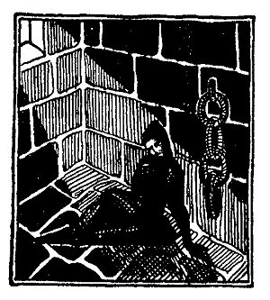

  
[Intangible Textual Heritage](../../index)  [Judaism](../index.md) 
[Index](index)  [Previous](tgm37)  [Next](tgm39.md) 

------------------------------------------------------------------------

p. 206

 

# 35. FLYING FROM THE ROOFS

"JEWS of Asia, hear ye! How long will you agree to be trodden under the
heel of the Mohammedans? The Jewish people must do something real,
something worth while. We can do that only in our own country,
Palestine. So join yourselves with me in this great undertaking. Onward!
Onward to the Holy Land!" Thus spoke David Alroy, a dark, handsome young
man. David knew the Bible and the Talmud well and also the Arabic
language.

"Hear ye, my fellow Jews," continued David, "the Lord has sent me to you
to take you out of the land of the Mohammedans, into our own holy city,
Jerusalem. In order to do this I need your help to fight the other
nations. In the name of the God of Israel, then, join my great army.
Come to Amadia and take with you under your coats as many swords and
spears as you can carry. Make sure that no one sees your

p. 207

weapons, and let no one have the least notion that you are hiding
weapons."

"Yea! Yea! Hail to the Messiah! Hail to David, the Messiah!"

The Jews were suffering so much because of the terrible crusades, that
they were glad to listen to anybody who promised to lead them away from
their sufferings. And didn't David Alroy say himself, that God had sent
him?

When the Sultan heard rumors of the arrival of a Jewish Messiah, he
ordered that that Messiah be brought before him. And when David, the
supposed Messiah, did appear before the Sultan, he was ordered to be put
into prison.

Just as the Sultan was thinking of a severe enough punishment for David
and his followers, David suddenly, to the great astonishment of all,
appeared before the Sultan and said:

"*By magic arts  
I come and go,  
By magic arts  
I swim,  
By magic arts  
I roam on high  
And all of you defy*."

p. 208

 

[  
Click to enlarge](img/20800.jpg.md)

 

p. 209

"Seize him! Seize him!" ordered the Sultan. And the guards laid hold on
Alroy but, again, to their great bewilderment they clasped air, thin
air. David suddenly made himself invisible, and in that way crossed a
big river. In one day David was back again in Amadia. It would have
taken an ordinary man at least ten days to get there.

By this time the fame of David Alroy had spread into many countries. In
one of these countries there lived two wicked men. These men saw a way
of getting rich through David Alroy, and this is what they did.

They wrote letters to the Jews of Bagdad. And they made believe that the
letters had been written by David Alroy. In these letters they told the
Jews that they should all prepare for Monday night. On that Monday night
they were going to be delivered. And how? By flying away to Jerusalem.

"Dress yourselves in green robes. Go up to the roof and wait. Wait for
the hour at which you will begin to fly." And the letter was signed
"David Alroy."

The Jews had such a firm belief in David, their Messiah, that they
thought anything could happen if only he promised it. So these Jews,
thinking they would fly to Jerusalem, handed over all their belongings
to these wicked men.

p. 210

At last the promised Monday night came. Crowds of Jews gathered on the
roofs. Everybody was excited. The children shouted with joy, while the
elders wept with happiness. Everybody was on edge. Think of it! They
would fly--and not in an airplane. But just like birds they would let
themselves go and fly, fly to Jerusalem.

Hour after hour passed. Each one looked at his neighbor to make sure
that all would begin to fly at the same time, or maybe to see who would
go off first. With great hope which later turned into anxiety they
waited. One and two hours passed. No. No one had begun to fly, not yet.
Three and four hours passed. Even the staunchest believers were getting
impatient.

The sun was already beginning to rise. Their confidence began to weaken.
Some began to wonder a little. How did they know that David had written
the letters? How could they be sure?

Some of the people were quite chilled by the morning air. And some
children had fallen asleep in spite of their great interest.

Daybreak at last! Now it became clear to them. Where were those two men
who had read the letter to them? What had they done with all the things
that had been given them? Where had those men gone? It did not take them
long to discover that it was all a fraud.

p. 211

They began to rush down from the roofs just as hurriedly as they had
come up. Like crazy people they rushed down and into their houses. But,
alas! Those two wicked men had already done their work. Every house had
been cleared of all of its belongings. And the two men were far, far
away, out of anybody's reach.

But you see, the Jews' hope for a Messiah, a redeemer, someone who would
save them from all their sufferings was so great that they had believed
anything possible. They had never thought that those two men were just
two wicked people.

Ever after the people of Bagdad called that the "year of flying" and
counted their calendar from that time. And though David Alroy knew
nothing about the letter the two wicked men had written, he was one of
the many false Messiahs.

 

 

 

------------------------------------------------------------------------

[Next: 36. The Messiah is Coming](tgm39.md)
