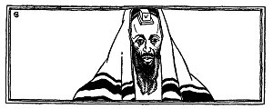
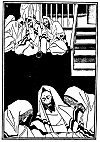
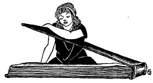

  
[Intangible Textual Heritage](../../index)  [Judaism](../index.md) 
[Index](index)  [Previous](tgm38)  [Next](tgm40.md) 

------------------------------------------------------------------------

p. 212

 

# 36. THE MESSIAH IS COMING

THE Jews were being driven from country to country. In no land were they
welcome. In no land could they feel safe. Because of this, many Jews
began to hope and yearn for a redeemer to take them out of their
trouble. Many longed for this redeemer so much that they began to think
that they themselves were sent down to redeem Israel! Others, seeing how
anxious the Jews were for a savior, thought it a good chance for them to
act as such. Just what Abraham Abulafia believed we cannot tell, but
this is what he did. Abulafia went about preaching thus:

"All of you who want to be saved, all you who wish to. be happy, shut
yourselves up in a quiet room. Shut yourselves away from the world.
Clothe yourselves in white garments. Wrap yourselves in a *talith* and
*tefillin*, and in that way prepare yourselves for the Lord.

p. 213

 

[  
Click to enlarge](img/21300.jpg.md)

 

p. 214

"Besides, if you would indeed have the Lord come to you then pronounce
the name of God every few minutes, '*Je-ho-vah*, *Je-ho-vah*,' and keep
changing your voice as you do so. And as you do all these things, sway,
sway back and forth. Then your head will become dizzy, and your heart
filled with a glow. Suddenly, sleep will come over you, and you will
feel as if the soul were going out of your body. In this way will the
Lord come to you."

Abulafia traveled from country to country preaching his strange idea to
all whom he met. Little by little he began to believe that he himself
was the Messiah. And many people believed him also. He wrote books
explaining just when and how the Messiah would arrive. He also set the
date when the Messiah would come.

The people prepared for the great day. To make sure that they would be
allowed to go along with the Messiah, they gave a great deal to the poor
and they fasted. On the day set, the people dressed themselves in long
white garments, as on the Day of Atonement, ran to the synagogue and
waited there for the long, loud note of the *Shofar*, the trumpet blast
by which the Messiah would be announced.

They waited and waited, but no blast was heard. Suddenly they looked
about. What do you think they

p. 215

saw? Some fainted at the sight that met their eyes. On their garments
were little, tiny crosses. What could this mean? How did these crosses
get there?

At first, great fear and alarm came over the people. Little by little,
however, they began to see how foolish they had been. To believe in such
silly things, to imagine that such stupid fasting and almost crazy
screeching would call down the Messiah! Of course, some one had played a
trick on them. When they had not been looking, the crosses had been
pinned on to their hems to frighten them. Though still disappointed that
the Messiah had not arrived, they returned home with clearer heads. No
one would again deceive them about the Messiah. But would no one?

 

 

 

------------------------------------------------------------------------

[Next: 37. So This is Your Answer](tgm40.md)
