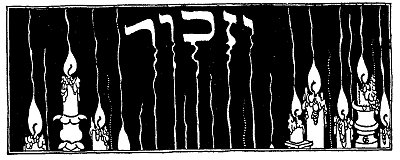
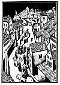

  
[Intangible Textual Heritage](../../index)  [Judaism](../index.md) 
[Index](index)  [Previous](tgm39)  [Next](tgm41.md) 

------------------------------------------------------------------------

p. 216

 

# 37. SO THIS IS YOUR ANSWER

IN ONE of the crowded streets of the city of Worms a priest was speaking
to a large gathering of people. All were listening with great interest
when suddenly a child called to his mother:

"Look, Mother, look at that man walking towards the priest. How dusty
and torn his clothes are! He looks tired, too. And, see, Mother, he has
a pilgrim's staff in his hand. I wonder from where he comes!"

Before his mother could reply, the man had walked up to the priest and
cried aloud in a trembling voice:

"Hear ye, brethren, I have just returned from the Holy Land. When I
first came there with my companions, we wanted to visit the grave of
Jesus. But when we came near it, we found it surrounded by hundreds of
infidels who would not let us see it. You

p. 217

who live quietly and peacefully here, cannot imagine all we pilgrims had
to suffer near that holy grave. This ought not to continue any longer.
We must rescue it from the hands of those infidels."

"That's right, that's right," shouted the people.

Then the priest called loudly: "All those who want to go to the Holy
Land to fight for the grave of Jesus, gather here!"

Some hundreds of people, not only in Worms but in other cities, too,
formed themselves into bands and started on the pilgrimage to the Holy
Land. They put a little red cross on their cloaks and so they were
called crusaders. In order to get many men to go on these crusades to
the Holy Grave, the popes sent out proclamations, called bulls, in which
they said:

"Let it be known that all men who join in this holy war, in this crusade
against the unbelievers in Jerusalem,--let it be known that the sins of
these crusaders will be forgiven, and they will be excused from paying
all their debts."

Now it happened that in those days many Christians owed money to the
Jews. When they heard the pope's bull, they thought:

"Now we can get even with those Jews! We won't pay our debts and they
will not be able to take us to court either." And they were very happy.

p. 218

 

[  
Click to enlarge](img/21800.jpg.md)

 

p. 219

There were also monks and priests who for many, many years had tried to
get the Jews to become Christians. These monks said: "Before going to
Palestine to fight the unbelievers there, why not begin with the
unbelievers right here?" So it came about that the crusaders while
traveling to the Holy Land turned upon the Jews in the cities of Europe,
whom they called infidels, and attacked them.

Since the popes in their bulls forgave all sins and excused all debts,
many bad people, such as thieves and robbers, joined the crusades. When
crusaders of this kind came through Jewish towns, they began to break
into Jewish homes.

In Worms, when the Jews heard that the crusaders had come, they rushed
to the bishop's castle. The bishop was a kind man and they were sure he
would protect them.

The crusaders ran from house to house and from synagogue to synagogue.
Furious because they found no one, they determined to destroy everything
belonging to the Jews. First they tore the holy books and the Torah;
then they set fire to the houses and synagogues. Still their anger was
unsatisfied. And so they stormed the bishop's castle, crying madly:
"Hand over those infidels! If they want to live they must become
Christians."

p. 220

When the bishop, who was in one of his rooms in the castle, heard this,
he came forward and pleaded with the crusaders:

"What good will it do to Christianity if many Jews, who really don't
want to become Christians, will make believe they are Christians?"

But the crazed mob would not listen. "We want those Jews!" they shouted.

The bishop, seeing he could no longer resist the mob which was growing
wilder all the time, came to the Jews and told them that he could not
protect them any longer.

"You must be baptized," he said, "or these men will compel me to hand
you over to them."

Can you imagine how the Jews felt? What were they to do? Shalom, chief
among the Jews, begged:

"Please give us just one hour in which to consider whether we shall die
as Jews or live as Christians."

"Very well," said the bishop, "I shall try to keep away this mad mob for
another hour. But remember, do not hold me responsible after that."

Yes, the Jews had only one hour in which to decide between life and
death. During that hour the mad mob kept on battering away at the castle
doors.

"We are giving those unbelievers too much time. Out with them! Death
upon them!"

p. 221

Meanwhile, what had the Jews decided? Do you think you can guess? Let us
see.

Some, a very few, said: "Oh, suppose we are baptized, suppose we do say
those words: 'In the name of the Father, the Son and the Holy Ghost, we
are baptized,' and then let them sprinkle a few drops of water on us!
When we are free, we will become Jews again."

"No, no, we will never listen to that," the others cried.

They considered this way out and that way out. At last they made their
decision. At the end of the hour, when the bishop returned, he was
stunned at the sight which met his eyes. There lay the Jews--dead. They
had chosen to kill themselves rather than to give up their religion.

"So," said the bishop, as a shudder went through him. "So this is your
answer."

And the Jews all over the world remember and honor these men of Worms as
"Kedoshim," holy ones, saints, who were strong enough to die for their
religion!

------------------------------------------------------------------------

[Next: 38. Whither--Now?](tgm41.md)
