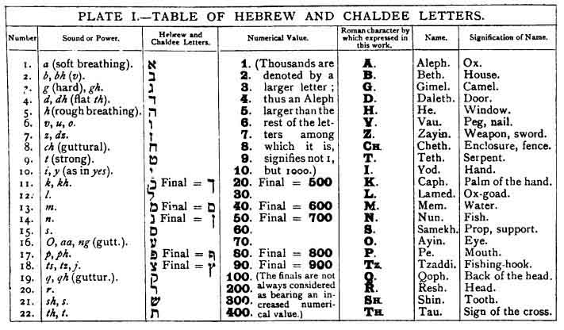
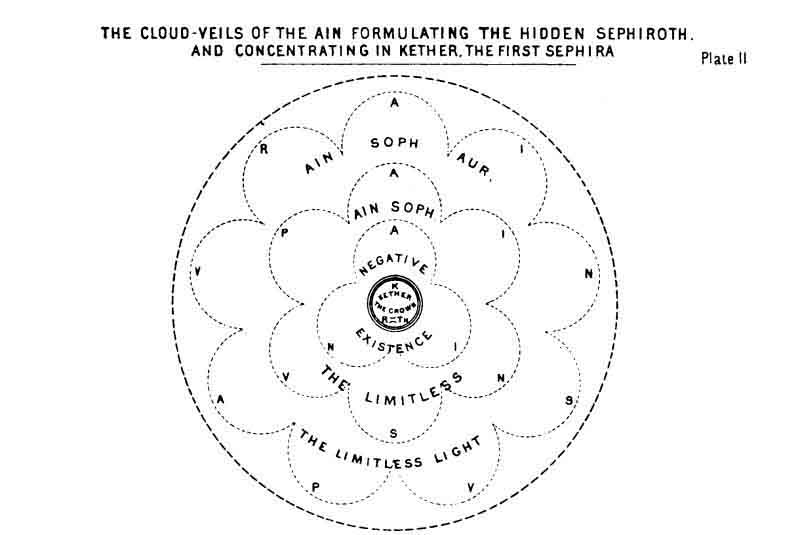
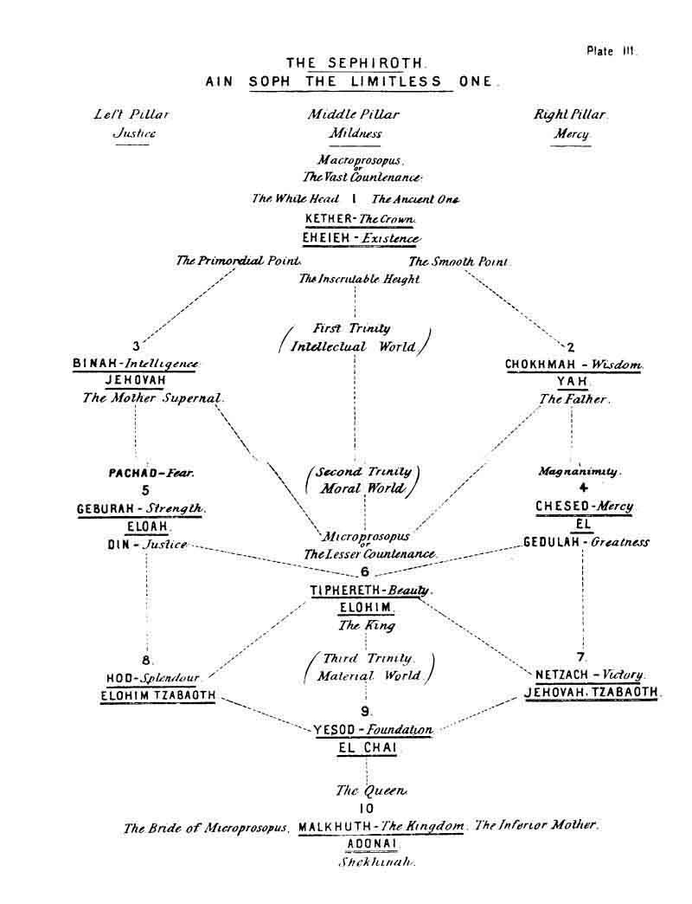
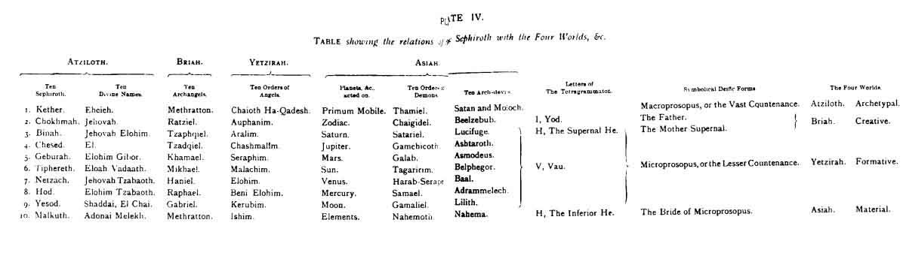
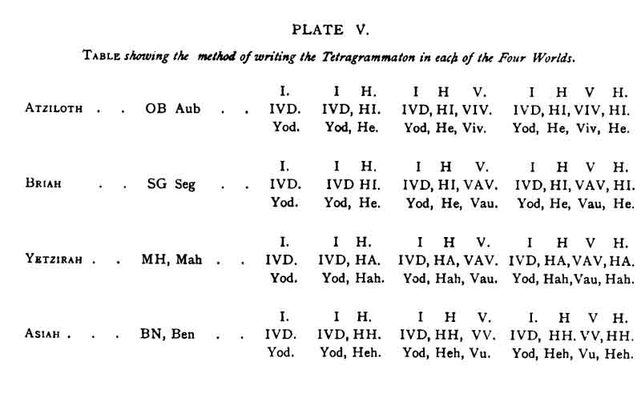
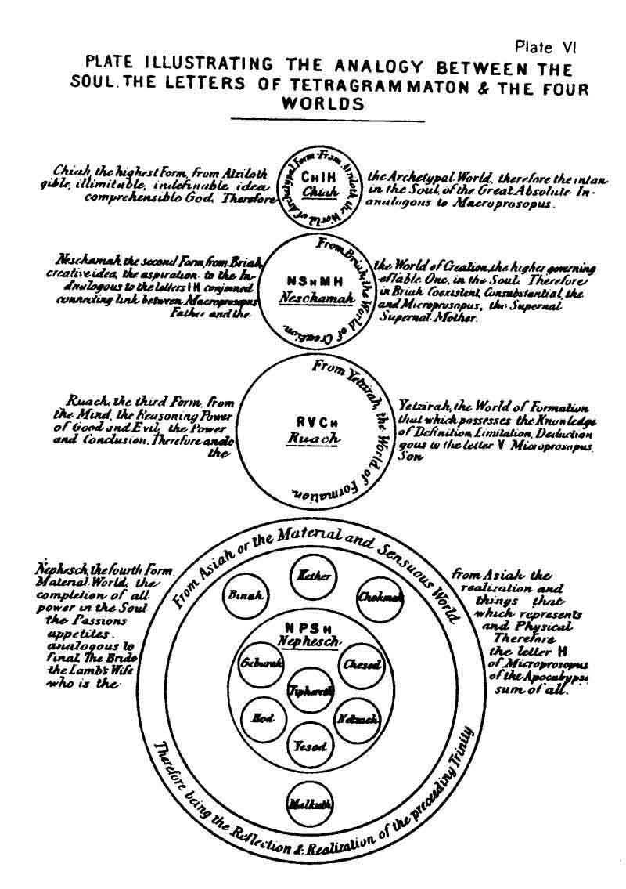
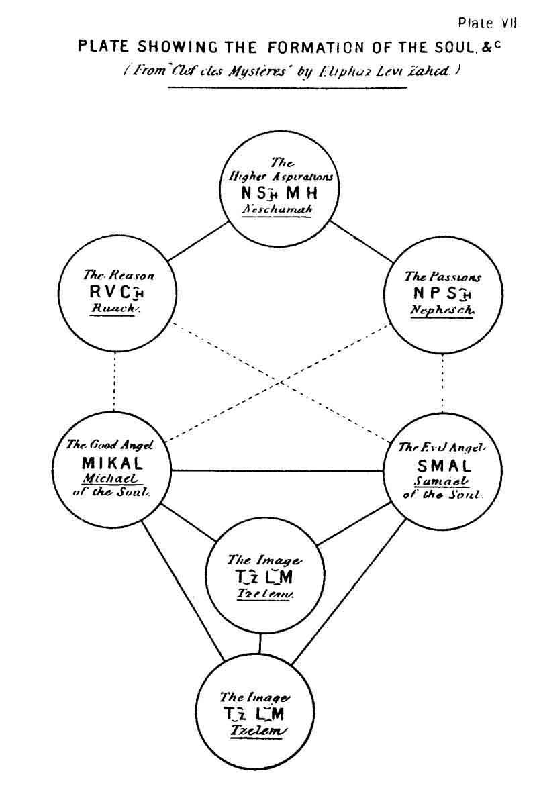
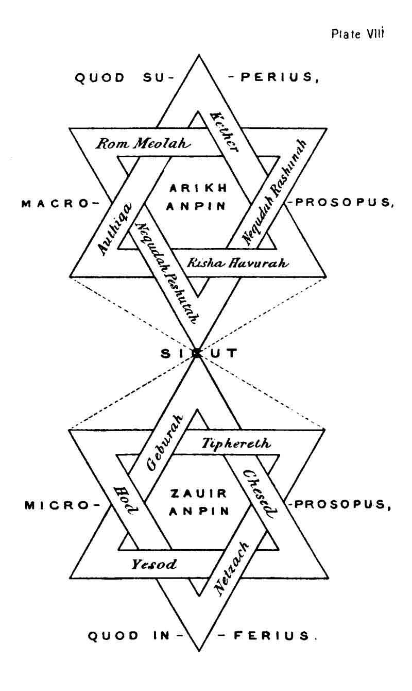

  
[Intangible Textual Heritage](../../index)  [Judaism](../index) 
[Index](index)  [Previous](tku02)  [Next](tku04) 

------------------------------------------------------------------------

p. 1

# KABBALAH.

### INTRODUCTION.

I. THE first questions which the non-qabalistical reader will probably
ask are: What is the Qabalah? Who was its author? What are its
sub-divisions? What are its general teachings? And why is a translation
of it required at the present time?

2\. I will answer the last question first. At the present time a
powerful wave of occult thought is spreading through society; thinking
men are beginning to awake to the fact that "there are more things in
heaven and earth than are dreamed of in their philosophy;" and, last but
not least, it is now felt that the Bible, which has been probably more
misconstrued than any other book ever written, contains numberless
obscure and mysterious passages which are utterly unintelligible without
some key wherewith to unlock their meaning. THAT KEY IS GIVEN IN THE
QABALAH. Therefore this work should be of interest to every biblical and
theological student. Let every Christian ask himself this question: "How
can I think to understand the Old Testament if I be ignorant of the
construction put upon it by that nation whose sacred book it formed; and
if I know not the meaning of the Old Testament, how can I expect to
understand the New?" Were the real and sublime philosophy of the Bible
better known, there would be

p. 2

fewer fanatics and sectarians. And who can calculate the vastness of the
harm done to impressionable and excitable persons by the bigoted
enthusiasts who ever and anon come forward as teachers of the people?
How many suicides are the result of religious mania and depression! What
farragos of sacrilegious nonsense have not been promulgated as the true
meanings of the books of the Prophets and the Apocalypse! Given a
translation of the sacred Hebrew Book, in many instances incorrect, as
the foundation, an inflamed and an ill-balanced mind as the worker
thereon, what sort of edifice can be expected as the result? I say
fearlessly to the fanatics and bigots of the present day: You have cast
down the Sublime and Infinite One from His throne, and in His stead have
placed the demon of unbalanced force; you have substituted a deity of
disorder and of jealousy for a God of order and of love; you have
perverted the teachings of the crucified One. Therefore at this present
time an English translation of the Qabalah is almost a necessity, for
the Zohar has never before been translated into the language of this
country, nor, as far as I am aware, into any modern European vernacular.

3\. The Qabalah may be defined as being the esoteric Jewish doctrine. It
is called in Hebrew QBLH, *Qabalah*, which is derived from the root QBL,
*Qibel*, meaning "to receive." This appellation refers to the custom of
handing down the esoteric knowledge by oral transmission, and is nearly
allied to "tradition."

4\. As in the present work a great number of Hebrew or Chaldee words
have to be used in the text, and the number of scholars in the Shemitic
languages is limited, I have thought it more advisable to print such
words in ordinary Roman characters, carefully retaining the exact
orthography. I therefore append a table showing at a glance the ordinary
Hebrew and Chaldee alphabet (which is common to both languages), the
Roman characters by

p. 3

 

 

 

p. 4

which I have expressed its letters in this work; also their names,
powers, and numerical values. There are no separate numeral characters
in Hebrew and Chaldee; therefore, as is also the case in Greek, each
letter has its own peculiar numerical value, and from this circumstance
results the important fact that *every word is a number, and every
number is a word*. This is alluded to in Revelations, where "the number
of the beast" is mentioned, and on this correspondence between words and
numbers the science of Gematria (the first division of the so-called
literal Qabalah) is based. I shall refer to this subject again. I have
selected the Roman letter Q to represent the Hebrew *Qoph* or *Koph*, a
precedent for the use of which without a following m may be found in Max
Müller's "Sacred Books of the East." The reader must remember that the
Hebrew is almost entirely a consonantal alphabet, the vowels being for
the most part supplied by small points and marks usually placed below
the letters. Another difficulty of the Hebrew alphabet consists in the
great similarity between the forms of certain letters--*e.g.*, V, Z, and
final N.

5\. With regard to the author and origin of the Qabalah, I cannot do
better than give the following extract from Dr. Ginsburg's "Essay on the
Kabbalah," first premising that this word has been spelt in a great
variety of ways--Cabala, Kabalah, Kabbala, &c. I have adopted the form
Qabalah, as being more consonant with the Hebrew writing of the word.

6\. "A system of religious philosophy, or, more properly, of theosophy,
which has not only exercised for hundreds of years an extraordinary
influence on the mental development of so shrewd a people as the Jews,
but has captivated the minds of some of the greatest thinkers of
Christendom in the sixteenth and seventeenth centuries, claims the
greatest attention of both the philosopher and the theologian. When it
is added that among its

p. 5

captives were Raymond Lully, the celebrated scholastic metaphysician and
chemist (died 1315); John Reuchlin, the renowned scholar. and reviver of
Oriental literature in Europe (born 1455, died 1522); John Picus de
Mirandola, the famous philosopher and classical scholar (1463-1494);
Cornelius Henry Agrippa, the distinguished philosopher, divine, and
physician (1486-1535); John Baptist Von Helmont, a remarkable chemist
and physician (1577-1644); as well as our own countrymen, Robert Fludd,
the famous physician and philosopher (1574-1637); and Dr. Henry More
(1614-1687); and that these men, after restlessly searching for a
scientific system which should disclose to them 'the deepest depths' of
the divine mature, and show them the real tie which binds all things
together, found the cravings of their minds satisfied by this theosophy,
the claims of the Kabbalah on the attention of students in literature
and philosophy will readily be admitted. The claims of the Kabbalah,
however, are not restricted to the literary man and the philosopher; the
poet too will find in it ample materials for the exercise of his lofty
genius. How can it be otherwise with a theosophy which, we are assured,
was born of God in Paradise, was nursed and reared by the choicest of
the angelic hosts in heaven, and only held converse with the holiest of
man's children upon earth. Listen to the story of. its birth, growth,
and maturity, as told by its followers.

7\. "The Kabbalah was first taught by God himself to a select company of
angels, who formed a theosophic school in Paradise. After the Fall the
angels most graciously communicated this heavenly doctrine to the
disobedient child of earth, to furnish the protoplasts with the means of
returning to their pristine nobility and felicity. From Adam it passed
over to Noah, and then to Abraham, the friend of God, who emigrated with
it to Egypt, where the patriarch allowed a portion of this mysterious
doctrine to ooze out. It was in this way

p. 6

that the Egyptians obtained some knowledge of it, and the other Eastern
nations could introduce it into their philosophical systems. Moses, who
was learned in all the wisdom of Egypt, was first initiated into the
Qabalah in the land of his birth, but became most proficient in it
during his wanderings in the wilderness, when he not only devoted to it
the leisure hours of the whole forty years, but received lessons in it
from one of the angels. By the aid of this mysterious science the
law-giver was enabled to solve the difficulties which arose during his
management of the Israelites, in spite of the pilgrimages, wars, and
frequent miseries of the nation. He covertly laid down the principles of
this secret doctrine in the first four books of the Pentateuch, but
withheld them from Deuteronomy. Moses also initiated the seventy elders
into the secrets of this doctrine, and they again transmitted them from
hand to hand. Of all who formed the unbroken line of tradition, David
and Solomon were the most deeply initiated into the Kabbalah. No one,
however, dared to write it down, till Schimeon Ben Jochai, who lived at
the time of the destruction of the second temple . . . . . After his
death, his son, Rabbi Eleazar, and his secretary, Rabbi Abba, as well as
his disciples, collated Rabbi Simon Ben Jochai's treatises, and out of
these composed the celebrated work called ZHR, *Zohar*, splendour, which
is the grand storehouse of Kabbalism."

8\. The Qabalah is usually classed under four heads:

(α) The practical Qabalah.

(β) The literal Qabalah.

(γ) The unwritten Qabalah.

(δ) The dogmatic Qabalah.

9\. The practical Qabalah deals with talismanic and ceremonial magic,
and does not come within the scope of this work.

10\. The literal Qabalah is referred to in several places,

p. 7

and therefore a knowledge of its leading principles is necessary. It is
divided into three parts: GMTRIA, *Gematria*; NVTRIQVN, *Notariqon*; and
ThMVRH, Temura.

11\. Gematria is a metathesis of the Greek word γραμματεια. It is based
on the relative numerical values of words, as I have before remarked.
Words of similar numerical values are considered to be explanatory of
each other, and this theory is also extended to phrases. Thus the letter
Shin, Sh, is 300, and is equivalent to the number obtained by adding up
the numerical values of the letters of the words RVCh ALHIM, *Ruach
Elohim*, the spirit of the Elohim; and it is therefore a symbol of the
spirit of the Elohim. For R = 200, V = 6, Ch = 8, A = z, L = 30, H = 5,
I = 10, M = 40; total = 300. Similarly, the words AChD, *Achad*, Unity,
One, and AHBH, Ahebah, love, each = 13; for A = 1, Ch = 8, D = 4, total
= 13; and A = 1, H = 5, B = 2, H = 5, total = 13. Again, the name of the
angel MTTRVN, *Metatron* or *Methraton*, and the name of the Deity,
ShDI, *Shaddaï*, each make 314; so the one is taken as symbolical of the
other. The angel Metraton is said to have been the conductor of the
children of Israel through the wilderness, of whom God says, "My Name is
in him." With regard to Gematria of phrases (Gen. xlix. 10), IBA ShILH,
*Yeba Shiloa*, "Shiloh shall come" = 358, which is the numeration of the
word MShICh, *Messiah*. Thus also the passage, Gen. xviii. 2 VHNH
ShLShH, *Vehenna Shalisha*, "And lo, three men," equals in numerical
value ALV MIKAL GBRIAL VRPAL, *Elo Mihkael Gabriel Ve-Raphael*, "These
are Mikhael, Gabriel and Raphael;" for each phrase = 70l. I think these
instances will suffice to make clear the nature of Gematria, especially
as many others will be found in the course of the ensuing work.

12\. Notariqon is derived from the Latin word *nothrius*, a shorthand
writer. Of Notariqon there are two forms.

p. 8

\[paragraph continues\] In the first every letter of a word is taken for
the initial or abbreviation of another word, so that from the letters of
a word a sentence may be formed. Thus every letter of the word BRAShITh,
*Berashith*, the first word in Genesis, is made the initial of a word,
and we obtain BRAShITh RAH ALHIM ShIQBLV IShRAL ThVRH, *Besrashith Rahi
Eloim Sheyequebelo Israel Torah*: "In the beginning the Elohim saw that
Israel would accept the law." In this connection I may give six very
interesting specimens of Notariqon formed from this same word BRAShITh
by Solomon Meir Ben Moses, a Jewish Qabalist, who embraced the Christian
faith in 1665, and took the name of Prosper Rugers. These have all a
Christian tendency, and by their means Prosper converted another Jew,
who had previously been bitterly opposed to Christianity. The first is
BN RVCh AB ShLVShThM IChD ThMIM, *Ben, Ruach, Ab, Shaloshethem Yechad
Themim*: "The Son, the Spirit, the Father, Their Trinity, Perfect
Unity." The second is, BN RVCh AB ShLVShThM IChD ThOBVDV, *Ben, Ruach,
Ab, Shaloshethem Yechad Thaubodo*: "The Son, the Spirit, the Father, ye
shall equally worship Their Trinity." The third is, BKVRI RAShVNI AShR
ShMV IShVO ThOBVDV, *Bekori Rashuni Asher Shamo Yeshuah Thaubodo*: "Ye
shall worship My first-born, My first, Whose Name is Jesus." The fourth
is, BBVA RBN AShR ShMV IShVO ThOBVDV, *Beboa Rabban Asher Shamo Yesuah
Thaubado*: "When the Master shall come Whose Name is Jesus ye shall
worship." The fifth is, BThVLH RAVIH ABChR ShThLD IShVO ThAShRVH,
*Bethulah Raviah Abachar Shethaled Yeshuah Thrashroah*: "I will choose a
virgin worthy to bring forth Jesus, and ye shall call her blessed." The
sixth is, BOVGTh RTzPIM ASThThR ShGVPI IShVO ThAKLV, *Beaugoth Ratzephim
Assattar Shegopi Yeshuah Thakelo*: "I will hide myself in cake (baked
with) coals, for ye shall eat Jesus, My Body." The Qabalistical
importance of these

p. 9

sentences as bearing upon the doctrines of Christianity can hardly be
overrated.

13\. The second form of Notariqon is the exact reverse of the first. By
this the initials or finals, or both, or the medials, of a sentence, are
taken to form a word or words. Thus the Qabalah is called ChKMh NSThRH,
*Chokhmah Nesethrah*, "the secret wisdom;" and if we take the initials
of these two words Ch and N, we form by the second kind of Notariqon the
word ChN, *Chen*, "grace." Similarly, from the initials and finals of
the words MI IOLH LNV HShMIMH, *Mi Iaulah Leno Ha-Shamayima*, "Who shall
go up for us to heaven?" (Deut. xxx. 12), are formed MILH, *Milah*,
"circumcision," and IHVH, the Tetragrammaton, implying that God hath
ordained circumcision as the way to heaven.

14\. Temura is permutation. According to certain rules, one letter is
substituted for another letter preceding or following it in the
alphabet, and thus from one word another word of totally different
orthography may be formed. Thus the alphabet is bent exactly in half, in
the middle, and one half is put over the other; and then by changing
alternately the first letter or the first two letters at the beginning
of the second line, twenty-two commutations are produced. These are
called the "Table of the Combinations of TzIRVP," *Tzirupa*. For
example's sake, I will give the method called ALBTh, *Albath*, thus:

|     |     |     |     |     |     |     |     |     |     |     |
|-----|-----|-----|-----|-----|-----|-----|-----|-----|-----|-----|
| 11  | 10  | 9   | 8   | 7   | 6   | 5   | 4   | 3   | 2   | 1   |
| K   | I   | T   | Ch  | Z   | V   | H   | D   | G   | B   | A   |
| M   | N   | S   | O   | P   | Tz  | Q   | R   | Sh  | Th  | L   |

 

Each method takes its name from the first two pairs composing it, the
system of pairs of letters being the groundwork of the whole, as either
letter in a pair is substituted for the other letter. Thus, by Albath,
from RVCh, *Ruach*, is formed DTzO, *Detzau*. The names of the other
twenty-one methods are: ABGTh, AGDTh

p. 10

ADBG, AHBD, AVBH, AZBV, AChBZ, ATBCh, AIBT, AKBI, ALBK, AMBL, ANBM,
ASBN, AOBS, APBO, ATzBP, AQBTz, ARBQ, AShBR, and AThBSh. To these must
be added the modes ABGD and ALBM. Then comes the "Rational Table of
Tziruph," another set of twenty-two combinations. There are also three
"Tables of the Commutations," known respectively as the Right, the
Averse, and the Irregular. To make any of these, a square, containing
484 squares, should be made, and the letters written in. For the "Right
Table" write the alphabet across from right to left; in the second row
of squares do the same, but begin with R and end with A; in the third
begin with G and end with B; and so on. For the "Averse Table" write the
alphabet from right to left backwards, beginning with Th and ending with
A; in the second row begin with Sh and end with Th, &c. The "Irregular
Table" would take too long to describe. Besides all these, there is the
method called ThShRQ, *Thashraq*, which is simply writing a word
backwards. There is one more very important form, called the "Qabalah of
the Nine Chambers," or AIQ BKR, *Aiq Bekar*. It is thus formed:

|         |     |     |         |     |     |         |     |     |
|---------|-----|-----|---------|-----|-----|---------|-----|-----|
| 300     | 30  | 3   | 200     | 20  | 2   | 100     | 10  | 1   |
| 000     | 00  | 0   | 000     | 00  | 0   | 000     | 00  | 0   |
| Sh      | L   | G   | R       | K   | B   | Q       | I   | A   |
| 600     | 60  | 6   | 500     | 50  | 5   | 400     | 40  | 4   |
| 000     | 00  | 0   | 000     | 00  | 0   | 000     | 00  | 0   |
| M final | S   | V   | K final | N   | H   | Th      | M   | D   |
| 900     | 90  | 9   | 800     | 80  | 8   | 700     | 70  | 7   |
| 000     | 00  | 0   | 000     | 00  | 0   | 000     | 00  | 0   |
| T final | Tz  | T   | P final | P   | Ch  | N final | O   | Z   |

 

I have put the numeration of each letter above to, show the affinity
between the letters in each chamber. Sometimes this is used as a cipher,
by taking the portions of the figure to show the letters they contain,
putting one point for the first letter, two for the second,

p. 11

&c. Thus the right angle, containing AIQ, will answer for the letter Q
if it have three dots or points within it. Again, a square will answer
for H, N, or K final, according to whether it has one, two, or three
points respectively placed within it. So also with regard to the other
letters. But there are many other ways of employing the Qabalah of the
Nine Chambers, which I have not space to describe. I will merely
mention, as an example, that by the mode of Temura called AThBSh,
*Athbash*, it is found that in Jeremiah xxv. 26, the word ShShK,
*Sheshakh*, symbolizes BBL, *Babel*.

15\. Besides all these rules, there are certain meanings hidden in the
shape of the letters of the Hebrew alphabet; in the form of a particular
letter at the end of a word being different from that which it generally
bears when it is a final letter, or in a letter being written in the
middle of a word in a character generally used only at the end; in any
letter or letters being written in a size smaller or larger than the
rest of the manuscript, or in a letter being written upside down; in the
variations found in the spelling of certain words, which have a letter
more in some places than they have in others; in peculiarities observed
in the position of any of the points or accents, and in certain
expressions supposed to be elliptic or redundant.

16\. For example the shape of the Hebrew letter *Aleph*, A (see Plate
I.), is said to symbolize a *Vau*, V, between a Yod, I, and a *Daleth*,
D; and thus the letter itself represents the word IVD, *Yod*. Similarly
the shape of the letter *He*, H, represents a *Daleth*, D, with a *Yod*,
I, written at the lower left-hand corner, &c.

17\. In Isaiah ix. 6, 7, the word LMRBH, *Lemarbah*, for multiplying, is
written with the character for M final in the middle of the word,
instead of with the ordinary initial and Medial M. The consequence of
this is that the total numerical value of the word, instead of being 30
+40+ 200+ 2+5 = 277, is 30 + 600 + 200

p. 12

\[paragraph continues\] + 2 + 5 = 837 = by Gematria ThTh ZL, *Tat Zal*,
the profuse Giver. Thus, by writing the M final instead of the ordinary
character, the word is made to bear a different qabalistical meaning.

18\. In Deuteronomy vi. 4, &c., is the prayer known as the "Shema
Yisrael." It begins, "ShMO IShRAL IHVH ALHINV IHVH AChD, *Shemaa
Yisrael, Tetragrammaton Elohino Tetragrammaton Achad*: "Hear, O Israel,
Tetragrammaton your God is Tetragrammaton Unity." In this verse the
terminal letter O in ShMO, and the D in AChD are written much larger
than the other letters of the text. The qabalistical symbology contained
in this circumstance is thus explained: The letter O, being of the value
of 70, shows that the law may be explained in seventy different ways,
and the D = 4 = the four cardinal points and the letters of the Holy
Name. The first word, ShMO, has the numerical value of 410, the number
of years of the duration of the first temple, &c. &c. There are many
other points worthy of consideration in this prayer, but time will not
permit me to dwell on them.

19\. Other examples of deficient and redundant spelling, peculiarities
of accent and pointing, &c., will be found in various places in the
ensuing work.

20\. It is to be further noted with regard to the first word in the
Bible, BRAShITh, *Berashith*, that the first three letters, BRA, are the
initial letters of the names of the three persons of the Trinity: BN,
*Ben*, the Son; RVCh, *Ruach*, the Spirit; and AB, *Ab*, the Father.
Furthermore, the first letter of the Bible is B, which is the initial
letter of BRKH, *Berakhah*, blessing; and not A, which is that of ARR,
*Arar*, cursing. Again, the letters of Berashith, taking their numerical
powers, express the number of years between the Creation and the birth
of Christ, thus:  [1](#fn_2)B = 2,000, R = 200,
 [1](#fn_2)A =

p. 13

1000, Sh = 300, I = 10, and Th = 400; total = 3910 years, being the time
in round numbers. Picus de Mirandola gives the following working out of
BRAShITh, Berashith:--By joining the third letter, A, to the first, B, A
B, *Ab* = Father, is obtained. If to the first letter B, doubled, the
second letter, R, be added, it makes BBR, *Bebar* = in or through the
Son. If all the letters be read except the first, it makes RAShITh,
*Rashith* = the beginning. If with the fourth letter, Sh, the first B
and the last Th be connected, it makes ShBTh, *Shebeth* = the end or
rest. If the first three letters be taken, they make BRA, *Bera* =
created. If, omitting the first, the three following be taken, they make
RASh, *Rash* = head. If, omitting the two first, the next two be taken,
they give ASh, Ash = fire. If the fourth and last be joined, they give
ShTh, *Sheth* = foundation. Again, if the second letter be put before
the first, it makes RB, *Rab* = great. If after the third be placed the
fifth and fourth, it gives AISh, *Aish* = man. If to the two first be
joined the two last, they give BRITh, *Berith* = covenant. And if the
first be added to the last, it gives ThB, *Theb*, which is sometimes
used for TVB, *Thob* = good.

21\. Taking the whole of these mystical anagrams in proper order, Picus
makes the following sentence out of this one word BRAShITh:--*Pater in
filio* (*aut per filium*), *principium et finem* (sive quietum) *creavit
caput, ignem, et fundamentum magni hominis fœdere bono*: "Through the
Son hath the Father created that Head which is the beginning and the
end, the fire-life and the foundation of the supernal man (the Adam
Qadmon) by His righteous covenant." Which is a short epitome of the
teachings of the "Book of Concealed Mystery." This notice of the literal
Qabalah has already extended beyond its proper limits. It was, however,
necessary to be thus explicit, as much of the metaphysical reasoning of
the ensuing work turns on its application.

22\. The term "Unwritten Qabalah" is applied to certain

p. 14

knowledge which is never entrusted to writing, but communicated orally.
I may say no more on this point, not even whether I myself have or have
not received it. Of course, till the time of Rabbi Schimeon Ben Jochai
none of the Qabalah was ever written.

23\. The Dogmatic Qabalah contains the doctrinal portion. There are a
large number of treatises of various dates and merits which go to make
up the written Qabalah, but they may be reduced to four heads:

(α) The Sepher Yetzirah and its dependencies.

(β) The Zohar with its developments and commentaries.

(γ) The Sepher Sephiroth and its expansions.

(δ) The Asch Metzareph and its symbolism.

24\. The SPR ITzIRH, *Sepher Yetzirah*, or "Book of Formation," is
ascribed to the patriarch Abraham. It treats of the cosmogony as
symbolized by the ten numbers and the twenty-two. letters of the
alphabet, which it calls the "thirty-two paths." On these latter Rabbi
Abraham Ben Dior has written a mystical commentary. The term "path" is
used throughout the Qabalah to signify a hieroglyphical idea, or rather
the sphere of ideas, which may be attached to any glyph or symbol.

25\. The ZHR, *Zohar*, or "Splendour," besides many other treatises of
less note, contains the following most important books, of which the
three first are translated in this volume:

(α) The SPRA DTzNIOVThA, *Siphra Dtzenioutha*, or "Book of Concealed
Mystery," which is the root and foundation of the Zohar.

(β) The ADRA RBA QDIShA, *Idra Rabba Qadisha* or "Greater Holy
Assembly:" this is a development of the "Book of Concealed Mystery."

(γ) The ADRA ZVTA QDIShA, *Idra Zuta Qadisha*, or "Lesser Holy
Assembly;" which is in the nature of a supplement to the "Idra Rabba."
These three books treat of the gradual development of the creative
Deity, and with Him the

p. 15

\[paragraph continues\] Creation. The text of these works has been
annotated by Knorr von Rosenroth (the author of the "Qabalah Denudata,")
from the Mantuan, Cremonensian, and Lublinensian Codices, which are
corrected printed copies; of these the Mantuan and Cremonensian are the
oldest. A species of commentary is also given, which is distinguished
from the actual text by being written within parentheses.

(δ) The pneumatical treatise called BITh ALHIM, *Beth Elohim*, or the
"House of the Elohim," edited by Rabbi Abraham Cohen Irira, from the
doctrines of Rabbi Yitzchaq Loria. It treats of angels, demons,
elemental spirits, and souls.

(ε) The "Book of the Revolutions of Souls" is a peculiar and discursive
treatise, and is an expansion of Rabbi Loria's ideas.

26\. The SPR SPIRVTh, *Sepher Sephiroth*, or "Book of the Emanations,"
describes, so to speak, the gradual evolution of the Deity from negative
into positive existence.

27\. The ASh MTzRP, *Asch Metzareph*, or "Purifying Fire," is hermatic
and alchemical, and is known to few, and when known is understood by
still fewer.

28\. The principal doctrines of the Qabalah are designed to solve the
following problems:--

(α) The Supreme Being, His nature and attributes.

(β) The Cosmogony.

(γ) The creation of angels and man.

(δ) The destiny of man and angels.

(ε) The nature of the soul.

(ζ) The nature of angels, demons, and elementals.

(η) The import of the revealed law.

(θ) The transcendental symbolism of numerals.

(ι) The peculiar mysteries contained in the Hebrew letters.

(κ) The equilibrium of contraries.

29\. The "Book of Concealed Mystery" opens with these

p. 16

words: "The Book of Concealed Mystery is the book of the equilibrium of
balance." What is here meant by the terms "equilibrium of balance"?
Equilibrium is that harmony which results from the analogy of
contraries, it is the dead centre where, the opposition of opposing
forces being equal in strength, rest succeeds motion. It is the central
point. It is the "point within the circle" of ancient symbolism. It is
the living synthesis of counterbalanced power. Thus form may be
described as the equilibrium of light and shade; take away either
factor, and form is viewless. The term balance is applied to the two
opposite natures in each triad of the Sephiroth, their equilibrium
forming the third Sephira in each ternary. I shall recur again to this
subject in explaining the Sephiroth. This doctrine of equilibrium and
balance is a fundamental qabalistical idea.

30\. The "Book of Concealed Mystery" goes on to, state that this
"Equilibrium hangeth in that region which is negatively existent." What
is negative existence? What is positive existence? The distinction
between these two is another fundamental idea. To define negative
existence clearly is impossible, *for when it is distinctly defined it
ceases to be negative existence*; it is then negative existence passing
into static condition. Therefore wisely have the Qabalists shut out from
mortal comprehension the primal AIN, *Ain*, the negatively existent One,
and the AIN SVP, *Ain Soph*, the limitless Expansion; while of even the
AIN SVP AVR, *Ain Soph Aur*, the illimitable Light, only a dim
conception can be formed. Yet, if we think deeply, we shall see that
such must be the primal forms of the unknowable and nameless One, whom
we, in the more manifest form speak of as GOD. He is the Absolute. But
how define the Absolute? Even as we define it, it slips from our grasp,
for it ceases when defined to be the Absolute. Shall we then say that
the Negative, the limitless, the Absolute are, logically speaking,
absurd, since they are ideas which our reason

p. 17

cannot define? No; for could we define them, we should make them, so to
speak, contained by our reason, and therefore not superior to it; for a
subject to be capable of definition it is requisite that certain limits
should be assignable to it. How then can we limit the Illimitable?

31\. The first principle and axiom of the Qabalah is the name of the
Deity, translated in our version of the Bible, "I am that I am," AHIH
AShR AHIH, *Eheieh Asher Eheieh*. A better translation is, "Existence is
existence," or "I am He who is."

32\. Eliphaz Levi Zahed, that great philosopher and Qabalist of the
present century, says in his "Histoire de la Magie" (bk. i. ch. 7): "The
Qabalists have a horror of everything that resembles idolatry; they,
however, ascribe the human form to God, but it is a purely
hieroglyphical figure. They consider God as the intelligent, living, and
loving Infinite One. He is for them neither the collection of other
beings, nor the abstraction of existence, nor a philosophically
definable being. He is in all, distinct from all, and greater than all.
His very name is ineffable; and yet this name only expresses the human
ideal of His Divinity. What God is in Himself it is not given to man to
know. God is the absolute of faith; existence is the absolute of reason,
existence exists by itself, and because it exists. The reason of the
existence of existence is existence itself. We may ask, 'Why does any
particular thing exist?' that is, 'Why does such or such a thing exist?'
But we cannot ask, without its being absurd to do so, Why does existence
exist?' For this would be to suppose existence prior to existence."
Again, the same author says (*ibid*. bk. iii. ch. 2): "To say, 'I will
believe when the truth of the dogma shall be scientifically proved to
me,' is the same as to say, 'I will believe when I have nothing more to
believe, and when the dogma shall be destroyed as dogma by becoming a
scientific theorem.'

p. 18

\[paragraph continues\] That is to say, in other words: 'I will only
admit the Infinite when it shall have been explained, determined,
circumscribed, and defined for my benefit; in one word, when it has
become finite. I will then believe in the Infinite when I am sure that
the Infinite does not exist. I will believe in the vastness of the ocean
when I shall have seen it put into bottles.' But when a thing has been
clearly proved and made comprehensible to you, you will no longer
*believe* it--you will *know* it."

33\. In the "Bhagavadgîtâ," ch. ix., it is said: "I am Immortality and
also death; and I, O Arguna! am that which is and that which is
not." [1](#fn_3) And again (ch. ix.): "And, O
descendant of Bharata! see wonders in numbers, unseen before. Within my
body, O Gudâkesa! see to-day the whole universe, including everything
movable and immovable, all in one." And again (*ibid*.) Arguna said: "O
Infinite Lord of the Gods! O Thou who pervadest the universe! Thou art
the Indestructible, that which is, that which is not, and what is beyond
them. Thou art the Primal God, the Ancient One; Thou are the highest
support of this universe. By Thee is this universe pervaded, O Thou of
the infinite forms . . . . Thou art of infinite power, of unmeasured
glory; Thou pervadest all, and therefore Thou art all!"

34\. The idea of negative existence can then exist *as an idea*, but it
will not bear definition, since the idea of definition is utterly
incompatible with its nature. "But," some of my readers will perhaps
say, "your term negative existence is surely a misnomer; the state you
describe would be better expressed by the title of negative
subsistence." Not so, I answer; for negative subsistence can never be
anything but negative subsistence; it cannot vary, it cannot develop;
for negative subsistence is literally and truly *no thing*. Therefore,
negative subsistence cannot *be* at all; it never has existed, it never
does exist, it never will exist. But negative existence bears hidden in

p. 19

itself, positive life; for in the limitless depths of the abyss of its
negativity lies hidden the power of standing forth from itself, the
power of projecting the scintilla of the thought unto the utter, the
power of re-involving the syntagma into the inner. Thus shrouded and
veiled is the absorbed intensity in the centreless whirl of the vastness
of expansion. Therefore have I employed the term "Ex-sto," rather than
"Sub-sto."

35\. But between two ideas so different as those of negative and
positive existence a certain nexus, or connecting-link, is required, and
hence we arrive at the form which is called potential existence, which
while more nearly approaching positive existence, will still scarcely
admit of clear definition. It is existence in its possible form. For
example, in a seed, the tree which may spring from it is hidden; it is
in a condition of potential existence; is there; but it will not admit
of definition. How much less, then, will those seeds which that tree in
its turn may yield. But these latter are in a condition which, while it
is somewhat analogous to potential existence, is in hardly so advanced a
stage; that is, they are negatively existent.

36\. But, on the other hand, positive existence is always capable of
definition; it is dynamic; it has certain evident powers, and it is
therefore the antithesis of negative existence, and still more so of
negative subsistence. It is the tree, no longer hidden in the seed, but
developed into the outer. But positive existence has a beginning and an
end, and it therefore requires another form from which to depend, for
without this other concealed negative ideal behind it, it is unstable
and unsatisfactory.

37\. Thus, then, have I faintly and with all reverence endeavoured to
shadow forth to the minds of my readers the idea of the Illimitable One.
And before that idea, and of that idea, I can only say, in the words of
an ancient oracle: "In Him is an illimitable abyss of glory, and from it
there goeth forth one little spark

p. 20

which maketh all the glory of the sun, and of the moon, and of the
stars. Mortal! behold how little I know of God; seek not to know more of
Him, for this is far beyond thy comprehension, however wise thou art; as
for us, who are His ministers, how small a part are we of Him! "

38\. There are three qabalistical veils of the negative existence, and
in themselves they formulate the *hidden ideas* of the Sephiroth not yet
called into being, and they are concentrated in Kether, which in this
sense is the Malkuth of the hidden ideas of the Sephiroth. I will
explain this. The first veil of the negative existence is the AIN, *Ain*
= Negativity. This word consists of three letters, which thus shadow
forth the first three Sephiroth or numbers. The second veil is the AIN
SVP, *Ain Soph* = the Limitless, This title consists of six letters, and
shadows forth the idea of the first six Sephiroth or numbers. The third
veil is the AIN SVP AVR, *Ain Soph Aur* = the Limitless Light. This
again consists of nine letters, and symbolizes the first nine Sephiroth,
but of course in their hidden idea only. But when we reach the number
nine we cannot progress farther without returning to the unity, or the
Dumber one, fur the number ten is but a repetition of unity freshly
derived from the negative, as is evident from a glance at its ordinary
representation in Arabic numerals, where the circle 0 represents the
Negative, and the 1 the Unity. Thus, then, the limitless ocean of
negative light *does not proceed from a centre, for it is centreless,
but it concentrates a centre*, which is the number one of the manifested
Sephiroth, Kether, the Crown, the First Sephira; which therefore may be
said to be the Malkuth or number ten of the hidden Sephiroth. (See Plate
II.). Thus, "Kether is in Malkuth, and Malkuth is in Kether." Or, as an
alchemical author of great repute (Thomas Vaughan, better known as
Eugenius Philalethes) says, [1](#fn_4)

 

 

 

p. 21

apparently quoting from Proclus: "That the heaven is in the earth, but
after an earthly manner; and that the earth is in the heaven, but after
a heavenly manner." But inasmuch as negative existence is a subject
incapable of definition, as I have before shown, it is rather considered
by the Qabalists as depending back from the number of unity than as a
separate consideration therefrom; wherefore they frequently apply the
same terms and epithets indiscriminately to either. Such epithets are
"The Concealed of the Concealed," "The Ancient of the Ancient Ones," the
"Most Holy Ancient One," &c.

39, I must now explain the real meaning of the terms Sephira and
Sephiroth. The first is singular, the second is plural. The best
rendering of the word is "numerical emanation." There are ten Sephiroth,
which are the most abstract forms of the ten numbers of the decimal
scale--i.e., the numbers 1, 2, 3, 4, 5, 6, 7, 8, 9, 10. Therefore, as in
the higher mathematics we reason of numbers in their abstract sense, so
in the Qabalah we reason of the Deity by the abstract forms of the
numbers; in other words, by the SPIRVTh, *Sephiroth*. It was from this
ancient Oriental theory that Pythagoras derived his numerical symbolic
ideas.

40\. Among these Sephiroth, jointly and severally, we find the
development of the persons and attributes of God. Of these *some are
male and some female*. Now, for some reason or other best known to
themselves, the translators of the Bible have carefully crowded out of
existence and smothered up every reference to the fact that the Deity is
both masculine and feminine. They have translated a *feminine plural* by
a *masculine singular* in the case of the word Elohim. They have,
however, left an inadvertent admission of their knowledge that it was
plural in Gen. iv. 26; "And Elohim said: Let Us make man." Again (V.
27), how could Adam be made in the image of the Elohim, male and female,
unless the Elohim were male and female also? The word Elohim

p. 22

is a plural formed from the feminine singular ALH, *Eloh*, by adding IM
to the word. But inasmuch as IM is usually the termination of the
masculine plural, and is here added to a feminine noun, it gives to the
word Elohim the sense of a female potency united to a masculine idea,
and thereby capable of producing an offspring. Now, we hear much of the
Father and the Son, but we hear nothing of the Mother in the ordinary
religions of the day. But in the Qabalah we find that the Ancient of
Days conforms Himself simultaneously into the Father and the Mother, and
thus begets the Son. Now, this Mother is Elohim. Again, we are usually
told that the Holy Spirit is masculine. But the word RVCh, *Ruach*,
Spirit, is feminine, as appears from the following passage of the Sepher
Yetzirah: "AChTh RVCh ALHIM ChIIM, *Achath* (*feminine, not Achad,
masculine*) *Ruach Elohim Chiim*: "One is She the Spirit of the Elohim
of Life."

41\. Now, we find that before the Deity conformed Himself thus--*i.e.*,
as male and female--that the worlds of the universe could not subsist,
or, in the words of Genesis, "The earth was formless and void." These
prior worlds are considered to be symbolized by the "kings who reigned
in Edom before there reigned a king in Israel," and they are therefore
spoken of in the Qabalah as the "Edomite kings." This will be found
fully explained in various parts of this work.

42\. We now come to the consideration of the first Sephira, or the
Number One, the Monad of Pythagoras. In this number are the other nine
hidden. It is indivisible, it is also incapable of multiplication;
divide 1 by itself and it still remains 1, multiply 1 by itself and it
is still 1 and unchanged. Thus it is a fitting representative of the
great unchangeable Father of all. Now this number of unity has a twofold
nature, and thus forms, as it were, the link between the negative and
the positive. In its unchangeable one-ness it is scarcely a number; but
in its property of capability of addition

p. 23

it may be called the first number of a numerical series. Now, the zero,
0, is incapable even of addition, just as also is negative existence.
How, then, if 1 can neither be multiplied nor divided, is another 1 to
be obtained to add to it; in other words, how is the number 2 to be
found? *By reflection of itself*. For though 0 be incapable of
definition, 1 is definable. And the effect of a definition is to form an
Eidolon, duplicate, or image, of the thing defined. Thus, then, we
obtain a duad composed of 1 and its reflection. Now also we have *the
commencement of a vibration* established, for the number 1 vibrates
alternately from changelessness to definition, and back to
changelessness again. Thus, then, is it the father of all numbers, and a
fitting type of the Father of all things.

The name of the first Sephira is KThR, *Kether*, the Crown.

The Divine Name attributed to it is the Name of the Father given in
Exod. iii. 4: AHIH, *Eheieh*, I am. It signifies Existence.

Among the Epithets applied to it, as containing in itself the idea of
negative existence depending back from it, are:

TMIRA DTMIRIN, *Temira De-Temirin*, the Concealed of the Concealed.

OThIQA DOThIQIN, *Authiqa De-Authiqin*, the Ancient of the Ancient Ones.

OThIQA QDIShA, *Authiqa Qadisha*, the Most Holy Ancient One.

OThIQA, *Authiqa*, the Ancient One.

OThIQ IVMIN, *Authiq Iomin*, the Ancient of Days.

It is also called:

NQDH RAShVNH, *Nequdah Rashunah*, the Primordial Point.

NQDH PShVTh, *Nequdah Peshutah*, the Smooth Point.

RIShA HVVRH, *Risha Havurah*, the White Head.

RVM MOLH, *Rom Meolah*, the Inscrutable Height.

p. 24

Besides all these there is another very important name applied to this
Sephira as representing the great Father of all things. It is ARIK
ANPIN, *Arikh Anpin*, the Vast Countenance, or Macroprosopus. Of Him it
is said that He is partly concealed (in the sense of His connection with
the negative existence) and partly manifest (as a positive Sephira).
Hence the symbolism of the Vast Countenance is that of a profile wherein
one side only of the countenance is seen; or, as it is said in the
Qabalah, "in Him all is right side." I shall refer to this title again.

The whole ten Sephiroth represent the Heavenly Man, or Primordial Being,
ADM OILAH, *Adam Auilah*.

Under this Sephira are classed the angelic order of ChIVTh HQDSh,
*Chioth Ha-Qadesh*, holy living-creatures, the kerubim or sphinxes of
Ezekiel's vision and of the Apocalypse of John. These are represented in
the Zodiac by the four signs, Taurus, Leo, Scorpio, and Aquarius--the
Bull, Lion, Eagle, and Man: Scorpio, as a good emblem, being symbolized
by the eagle, as an evil emblem by the scorpion, and as of a mixed
nature by the snake.

This first Sephira contained the other nine, and produced them in
succession, thus:--

43\. The number 2, or the Duad. The name of the second Sephira is ChKMH,
*Chokmah*, Wisdom, a masculine active potency reflected from Kether, as
I have before explained. This Sephira is the active and evident Father,
to whom the Mother is united, who is the number 3. This second Sephira
is represented by the Divine Names, IH, *Yah*, and IHVH; and among the
angelic hosts by AVPNIM, *Auphanim*, the Wheels (Ezek. i.). It is also
called AB, *Ab*, the Father.

44\. The third Sephira, or Triad, is a feminine passive potency, called
BINH, *Binah*, the Understanding, who is co-equal with Chokmah. For
Chokmah, the number 2, is like two straight lines which can never
enclose a space,

p. 25

and therefore it is powerless till the number 3 forms the triangle. Thus
this Sephira completes and makes evident the supernal Trinity. It is
also called AMA, *Ama*, Mother, and AIMA, *Aima*, the great productive
Mother, who is eternally conjoined with AB, the Father, for the
maintenance of the universe in order. Therefore is she the most evident
form in whom we can know the Father, and therefore is she worthy of all
honour. She is the supernal Mother, co-equal with Chokmah, and the great
feminine form of God, the Elohim, in whose image man and woman are
created, according to the teaching of the Qabalah, *equal before God*.
*Woman is equal with man, and certainly not inferior to him*, as it has
been the persistent endeavour of so-called Christians to make her. Aima
is the woman described in the Apocalypse (ch. xii.). This third Sephira
is also sometimes called the great sea. To her are attributed the Divine
names, ALHIM, *Elohim*, and IHVH ALHIM; and the angelic order, ARALIM,
*Aralim*, the Thrones. She is the supernal Mother, as distinguished from
Malkuth, the inferior Mother, Bride, and Queen.

45\. The number 4. This union of the second and third Sephiroth produced
ChSD, *Chesed*, Mercy or Love also called GDVLH, *Gedulah*, Greatness or
Magnificence; a masculine potency represented by the Divine Name AL,
*El*, the Mighty One, and the angelic name, ChShMLIM, *Chashmalim*,
Scintillating Flames (Ezek. iv, 4).

46\. The number 5. From this emanated the feminine passive potency
GBVRH, *Geburah*, strength or fortitude; or DIN, *Deen*, justice;
represented by the Divine Names, ALHIM GBVR, and ALH, *Eloh*, and the
angelic name ShRPIM, *Seraphim* (Isa. vi. 6). This Sephira is also
called PChD, *Pachad*, Fear.

47\. The number 6. And from these two issued the uniting Sephira,
ThPARTh, *Tiphereth*, Beauty or Mildness, represented by the Divine Name
ALVH VDOTh,

Eloah

p. 26

Va-Daath, and the angelic names, *Shinanim*, ShNANIM (Ps. lxviii. 18),
or MLKIM, *Melakim*, kings. Thus by the union of justice and mercy we
obtain beauty or clemency, and the second trinity of the Sephiroth is
complete. This Sephira, or "Path," or "Numeration"--for by these latter
appellations the emanations are sometimes called--together with the
fourth, fifth, seventh, eighth, and ninth Sephiroth, is spoken of as
ZOIR ANPIN, *Zauir Anpin*, the Lesser Countenance, or Microprosopus, by
way of antithesis to Macroprosopus, or the Vast Countenance, which is
one of the names of Kether, the first Sephira. The sixth Sephiroth of
which *Zauir Anpin* is composed, are then called His six members. He is
also called MLK, *Melekh*, the King.

48\. The number 7. The seventh Sephira is NTzCh, *Netzach*, or Firmness
and Victory, corresponding to the Divine Name *Jehovah Tzabaoth*, IHVH
TzBAVTh, the Lord of Armies, and the angelic names ALHIM, *Elohim*,
gods, and ThRShIShIM, *Tharshisim*, the brilliant ones (Dan. x. 6).

49\. The number 8. Thence proceeded the feminine passive potency HVD,
*Hod*, Splendour, answering to the Divine Name ALHIM TzBAVTh, *Elohim
Tzabaoth*, the Gods of Armies, and among the angels to BNI ALHIM, *Beni
Elohim*, the sons of the Gods (Gen. vi. 4).

50\. The number 9. These two produced ISVD, *Yesod*, the Foundation or
Basis, represented by AL ChI, *El Chai*, the Mighty Living One, and
ShDI, *Shaddaï*; and among the angels by AShIM, *Aishim*, the Flames
(Ps. civ. 4), yielding the third Trinity of the Sephiroth.

51\. The number 10. From this ninth Sephira came the tenth and last,
thus completing the decad of the numbers. It is called MLKVTh,
*Malkuth*, the Kingdom, and also the Queen, Matrona, the inferior
Mother, the Bride of Microprosopus; and ShKINH, *Shekinah*, represented
by the Divine Name *Adonai*, ADNI, and among the angelic hosts by the
kerubim, KRVBIM. Now, each of these Sephiroth will be in a certain
degree androgynous, for

p. 27

it will be feminine or receptive with regard to the Sephira which
immediately precedes it in the sephirotic scale, and masculine or
transmissive with regard to the Sephira which immediately follows it.
But there is no Sephira anterior to Kether, nor is there a Sephira which
succeeds Malkuth. By these remarks it will be understood how Chokmah is
a feminine noun, though marking a masculine Sephira. The connecting-link
of the Sephiroth is the Ruach, spirit, from Mezla, the hidden influence.

52\. I will now add a few more remarks on the qabalistical meaning of
the term MThQLA, *Metheqela*, balance. In each of the three trinities or
triads of the Sephiroth is a duad of opposite sexes, and a uniting
intelligence which is the result. In this, the masculine and feminine
potencies are regarded as the two scales of the balance, and the uniting
Sephira as the beam which joins them. Thus, then, the term balance may
be said to symbolize the Triune, Trinity in Unity, and the Unity
represented by the central point of the beam. But, again, in the
Sephiroth there is a triple Trinity, the upper, lower, and middle. Now,
these three are represented thus: the supernal, or highest, by the
Crown, Kether; the middle by the King, and the inferior by the Queen;
which will be the greatest trinity. And the earthly correlatives of
these will be the *primum mobile*, the sun and the moon. Here we at once
find alchemical symbolism.

53\. Now in the world the Sephiroth are represented by:

\(1\) RAShITh HGLGLIM, *Rashith Ha-Galgalim*, the commencement of
whirling motions, the

primum mobile

\(2\) MSLVTh, *Masloth*, the sphere of the Zodiac.

\(3\) ShBThAI, *Shabbathai*, rest, Saturn.

\(4\) TzDQ, *Tzedeq*, righteousness, Jupiter.

\(5\) MADIM, *Madim*, vehement strength, Mars.

\(6\) ShMSh, *Shemesh*, the solar light, the Sun.

\(7\) NVGH, *Nogah*, glittering splendour, Venus.

p. 28

\(8\) KVKB, *Kokab*, the stellar light, Mercury.

\(9\) LBNH, *Levanah*, the lunar flame, the Moon.

\(10\) ChLM ISVDVTh, *Cholom Yesodoth*, the breaker of the foundations,
the elements.

54\. The Sephiroth are further divided into three pillars--the
right-hand Pillar of Mercy, consisting of the second, fourth, and
seventh emanations; the left-hand Pillar of judgment, consisting of the
third, fifth, and eighth; and the middle Pillar of Mildness, consisting
of the first, sixth, ninth, and tenth emanations.

55\. In their totality and unity the ten Sephiroth represent the
archetypal man, ADM QDMVN, *Adam Qadmon*, the Protogonos. In looking at
the Sephiroth constituting the first triad, it is evident that they
represent the intellect; and hence this triad is called the intellectual
world, OVLM MVShKL, Olahm Mevshekal. The second triad corresponds to the
moral world, OVLM MVRGSh, *Olahm Morgash*. The third represents power
and stability, and is therefore called the material world, OVLM HMVTBO,
*Olahm Ha-Mevetbau*. These three aspects are called the faces, ANPIN,
*Anpin*. Thus is the tree of life, OTz ChIIM, *Otz Chaiim*, formed; the
first triad being placed above, the second and third below, in such a
manner that the three masculine Sephiroth are on the right, three
feminine on the left, whilst the four uniting Sephiroth occupy the
centre. This is the qabalistical "tree of life," on which all things
depend. There is considerable analogy between this and the tree
Yggdrasil of the Scandinavians.

56\. I have already remarked that there is one trinity which comprises
all the Sephiroth, and that it consists of the crown, the king, and the
queen. (In some senses this is the Christian Trinity of Father, Son, and
Holy Spirit, which in their highest divine nature are symbolized by the
first three Sephiroth, Kether, Chokmah, and Binah.) It is the Trinity
which created the world, or, in qabalistic language, the universe was
born from the

 

 

 

p. 29

union of the crowned king and queen. But according to the Qabalah,
before the complete form of the heavenly man (the ten Sephiroth) was
produced, there were certain primordial worlds created, but these could
not subsist, as the equilibrium of balance was not yet perfect, and they
were convulsed by the unbalanced force and destroyed. These primordial
worlds are called the "kings of ancient time," and the "kings of Edom
who reigned before the monarchs of Israel." In this sense, Edom is the
world of unbalanced force, and Israel is the balanced Sephiroth (Gen.
xxxvi. 31). This important fact, that worlds were created and destroyed
prior to the present creation, is again and again reiterated in the
Zohar.

57\. Now the Sephiroth are also called the World of Emanations, or the
Atziluthic World, or archetypal world, OVLM ATzILVTh, *Olahm Atziloth*;
and this world gave birth to three other worlds, each containing a
repetition of the Sephiroth, but in a descending scale of brightness.

58\. The second world is the Briatic world, OVLM HBRIAH, *Olahm
Ha-Briah*, the world of creation, also called KVRSIA, *Khorsia*, the
throne. It is an immediate emanation from the world of Atziloth, whose
ten Sephiroth are reflected herein, and are consequently more limited,
though they are still of the purest nature, and without any admixture of
matter.

59\. The third is the Jetziratic world, OVLM HITzIRH, *Olahm
Ha-Yetzirah*, or world of formation and of angels, which proceeds from
Briah, and though less refined in substance, is still without matter. It
is in this angelic world where those intelligent and incorporeal beings
reside who are wrapped in a luminous garment, and who assume a form when
they appear unto man.

60\. The fourth is the Asiatic world, OVLM HOShIH, *Olahm Ha-Asia*, the
world of action, called

p. 30

also the world of shells, OVLM HQLIPVTh, Olahm Ha-Qliphoth, which is
this world of matter, made up of the grosser elements of the other
three. In it is also the abode of the evil spirits which are called "the
shells" by the Qabalah, QLIPVTh, *Qliphoth*, material shells. The devils
are also divided into ten classes, and have suitable habitations. (See
Table.)

61\. The Demons are the grossest and most deficient of all forms. Their
ten degrees answer to the decad of the Sephiroth, but in inverse ratio,
as darkness and impurity increase with the descent of each degree. The
two first are nothing but absence of visible form and organization. The
third is the abode of darkness. Next follow seven Hells occupied by
those demons which represent incarnate human vices, and torture those
who have given themselves up to such vices in earth-life. Their prince
is *Samael*, SMAL, the angel of poison and of death. His wife is the
harlot, or woman of whoredom, AShTh ZNVNIM, *Isheth Zenunim*; and united
they are called the beast, CHIVA, *Chioa*. Thus the infernal trinity is
completed, which is, so to speak, the averse and caricature of the
supernal Creative One. Samael is considered to be identical with Satan.

62\. The name of the Deity, which we call Jehovah, is in Hebrew a name
of four letters, IHVH; and the true pronunciation of it is known to very
few. I myself know some score of different mystical pronunciations of
it. The true pronunciation is a most secret arcanum, and is a secret of
secrets. "He who can rightly pronounce it, causeth heaven and earth to
tremble, for it is the name which rusheth through the universe."
Therefore when a devout Jew comes upon it in reading the Scripture, he
either does not attempt to pronounce it, but instead makes a short
pause, or else he substitutes for it the name Adonai, ADNI, Lord. The
radical meaning of the word is "to be," and it is thus, like AHIH,
Eheieh, a glyph of existence. It is capable of twelve transpositions,

 

 

 

p. 31

which *all* convey the meaning of "to be"; it is the only word that will
bear so many transpositions without its meaning being altered. They are
called the "twelve banners of the mighty name," and are said by some to
rule the twelve signs of the Zodiac. These are the twelve
banners:--IHVH, IHHV, IVHH, HVHI, HVIH, HHIV, VHHI, VIHH, VHIH, HIHV,
HIVH, HHVI. There are three other tetragrammatic names, which are AHIH,
*Eheieh*, existence; ADNI, *Adonai*, Lord; and *Agla*, AGLA. This last
is not, properly speaking, a word, but is a notariqon of the sentence,
AThH GBVR LOVLM ADNI, *Ateh Gebor Le-Olahm Adonai*: "Thou are mighty for
ever, O Lord!" A brief explanation of Agla is this: A, the one first; A,
the one last; G, the Trinity in Unity; L, the completion of the great
work.

63\. The first thing we notice is that both AHIH and IHVH convey the
idea of existence; this is their first analogy. The second is, that in
each the letter H comes second and fourth; and the third is that by
Gematria AHIH equals IHV without the H (which, as we shall see
presently, is the symbol of Malkuth, the tenth Sephira). But now, if
they be written one above the others, thus, within the arms of a cross,

|     |     |
|-----|-----|
| AH  | IH  |
| IH  | VH  |

 

they read *downwards* as well as across, AHIH, IHVH.

64\. Now, if we examine the matter qabalistically we shall find the
reason of these analogies. For Eheieh, AHIH, is the Vast Countenance,
the Ancient One, Macroprosopus, Kether, the first Sephira, the Crown of
the Qabalistical Sephirotic greatest Trinity (which consists of the
Crown, King, and Queen; or Macroprosopus, Microprosopus and the Bride),
*and the Father in the Christian acceptation of the Trinity*.

65\. But IHVH, the Tetragrammaton, as we shall

p. 32

presently see, contains all the Sephiroth with the exception of Kether,
and specially signifies the Lesser Countenance, Microprosopus, the King
of the qabalistical Sephirotic greatest Trinity, *and the Son in His
human incarnation, in the Christian acceptation of the Trinity*.

Therefore, as the Son reveals the Father, so does IHVH, *Jehovah*,
reveal AHIH, *Eheieh*.

66\. And ADNI is the Queen "by whom alone Tetragrammaton can be
grasped," whose exaltation into Binah is found in the Christian
assumption of the Virgin.

67\. The Tetragrammaton IHVH is referred to the Sephiroth, thus: the
uppermost point of the letter Yod, I, is said to refer to *Kether*, the
letter I itself to *Chokmah*, the father of Microprosopus; the letter H,
or "the supernal *He*," to Binah, the supernal Mother; the letter V to
the next six Sephiroth, which are called the six members of
Microprosopus (and six is the numerical value of V, the Hebrew *Vau*);
lastly, the letter H, the "inferior *He*," to Malkuth, the tenth
Sephira, the bride of Microprosopus.

68\. Now, there are four secret names referred to the four worlds of
Atziloth, Briah, Yetzirah, and Asiah; and again, the Tetragrammaton is
said to go forth written in a certain manner in each of these four
worlds. The secret name of Atziloth is *Aub*, OB; that of Briah is
*Seg*, SG; that of Yetzirah is *Mah*, MH; and that of Asiah is
*Ben*, [1](#fn_5) BN. The subjoined Table will
show the mode of writing the name in each of the four worlds.

69\. These names operate together with the Sephiroth through the "231
gates," as the various combinations of the alphabet are called; but it
would take too much space to go fully into the subject here.

70\. Closely associated with the subject of the letters of the
Tetragrammaton is that of the four kerubim, to which I have already
referred in describing the first Sephira.

 

 

p. 34

\[paragraph continues\] Now it must not be forgotten that these forms in
Ezekiel's vision support the throne of the Deity, whereon the Heavenly
Man is seated--the Adam Qadmon, the sephirotic image; and that between
the throne and the living creatures is the firmament. Here then we have
the four worlds--Atziloth, the deific form; Briah, the throne; Yetzirah,
the firmament; Asiah, the kerubim. Therefore the kerubim represent the
powers of the letters of the Tetragrammaton on the material plain; and
the four represent the operation of the four letters in each of the four
worlds. Thus, then, the kerubim are the living forms of the letters,
symbolized in the Zodiac by Taurus, Leo, Aquarius, and Scorpio, as I
have before remarked.

71\. And "the mystery of the earthly and mortal man is after the mystery
of the supernal and immortal One;" and thus was he created the image of
God upon earth. In the form of the body is the Tetragrammaton found. The
head is I, [1](#fn_6) the arms and shoulders are
like H, the body is V, and the legs are represented by the H final.
Therefore, as the outward form of man corresponds to the Tetragrammaton,
so does the animating soul correspond to the ten supernal Sephiroth; and
as these find their ultimate expression in the trinity of the crown, the
king, and the queen, so is there a principal triple division of the
soul. Thus, then, the first is the *Neschamah*, NShMH, which is the
highest degree of being, corresponding to the crown (Kether), and
representing the highest triad of the Sephiroth, called the intellectual
world. The second is *Ruach*, RVCH, the seat of good and evil,
corresponding to Tiphereth, the moral world. And the third is
*Nephesch*, NPSh, the animal life and desires, corresponding to Yesod,
and the material and sensuous world. All souls are pre-existent in the
world of emanations, and are in their original state androgynous, but
when they descend upon earth they become separated into male and female,
and inhabit

p. 35

 

 

 

different bodies; if therefore in this mortal life the male half
encounters the female half, a strong attachment springs up between them,
and hence it is said that in marriage the separated halves are again
conjoined; and the hidden forms of the soul are akin to the kerubim.

72\. But this foregoing triple division of the soul is only applicable
to the triple form of the intellectual, moral, and material. Let us not
lose sight of the great qabalistical idea, *that the trinity is always
completed by and finds its realization in the quaternary*; that is IHV
completed and realized in IHVH--the trinity of

|           |            |              |
|-----------|------------|--------------|
| Crown;    | King;      | Queen;       |
| Father;   | Son;       | Spirit;      |
| Absolute; | Formation; | Realization; |

 

completed by the quaternary of--

|                                     |                   |                                       |                               |
|-------------------------------------|-------------------|---------------------------------------|-------------------------------|
| Absolute One                        | Father and Mother | Son                                   | Bride.                        |
| Macroprosopus, the Vast Countenance | Father and Mother | Microprosopus, the Lesser Countenance | Malkuth, the Queen and Bride. |
| Atziloth                            | Briah             | Yetzirah                              | Asiah.                        |
| Archetypal                          | Creative          | Formative                             | Material.                     |

 

And to these four the soul answers in the following four forms:--Chiah
to Atziloth; Neschamah to Briah; Ruach to Yetzirah; and Nephesch to
Asiah. See subjoined plate illustrating the analogy between the soul,
the letters of the Tetragrammaton, and the four worlds.

73\. But Chiah is in the soul the archetypal form analogous to
Macroprosopus. Wherefore Neschamah, Ruach, and Nephesch represent as it
were by themselves the Tetragrammaton, without Chiah, which is
nevertheless symbolized "in the uppermost point of the I, *yod*," of the
soul; as Macroprosopus is said to be symbolized by the uppermost point
of the I, *yod*, of IHVH. For "*yod* of the Ancient One is hidden and
concealed."

74\. I select the following résumé of the qabalistical teachings
regarding the nature of the soul from Eliphaz

p. 36

\[paragraph continues\] Levi's "Clef des Mystères," as also the
accompanying plate. This gives the chief heads of the ideas of Rabbi
Moses Korduero and of Rabbi Yitzchaq Loria.

"The soul is a veiled light. This light is triple:

"Neschamah = the pure spirit;

"Ruach = the soul or spirit;

"Nephesch = the plastic mediator.

"The veil of the soul is the shell of the image.

"The image is double because it reflects alike the good and the evil
angel of the soul.

"Nephesch is immortal by renewal of itself through the destruction of
forms;

"Ruach is progressive through the evolution of ideas;

"Neschamah is progressive without forgetfulness and without destruction.

There are three habitations of souls:--

"The Abyss of Life;

"The superior Eden;

"The inferior Eden."

"The image Tzelem is a sphinx which propounds the enigma of life.

"The fatal image (*i.e.*, *that which succumbs to the outer*) endows
Nephesch with his attributes, but Ruach can substitute the image
conquered by the inspirations of Neschamah.

"The body is the veil of Nephesch, Nephesch is the veil of Ruach, Ruach
is the veil of the shroud of Neschamah.

"Light personifies itself by veiling itself, and the personification is
only stable when the veil is perfect.

"This perfection upon earth is relative to the universal soul of the
earth (*i.e.*, *as the macrocosm or greater world, so the microcosm or
lesser world, which is man*).

There are three atmospheres for the souls.

The third atmosphere finishes where the planetary attraction of the
other worlds commences.

p. 37

 

 

 

Souls perfected on this earth pass on to another station.

"After traversing the planets they come to the sun; then they ascend
into another universe and recommence their planetary evolution from
world to world and from sun to sun.

"In the suns they remember, and in the planets they forget.

"The solar lives are the days of eternal life, and the planetary lives
are the nights with their dreams.

"Angels are luminous emanations personified, not by trial and veil, but
by divine influence and reflex.

"The angels aspire to become men, for the perfect man, the
man-God, [1](#fn_7) is above every angel.

"The planetary lives are composed of ten dreams of a hundred years each,
and each solar life is a thousand years; therefore is it said that a
thousand years are in the sight of God as one day.

"Every week--that is, every fourteen thousand years--the soul bathes
itself and reposes in the jubilee dream of forgetfulness.

"On waking therefrom it has forgotten the evil and only remembers the
good."

75\. In the accompanying plate of the formation of the soul there will
be seen in the upper part three circles, representing the three parts
known as Neschamah, Ruach, and Nephesch. From Ruach and Nephesch,
influenced by the good aspirations of Neschamah, proceeds Michael, the
good angel of the soul; that is to say, the synthetical hieroglyph of
the good ideas, or, in the esoteric Buddhist phraseology, the "Good
Karma" of a man. From Nephesch dominating Ruach, and uninfluenced by the
good aspirations of Neschamah, proceeds Samäel, the evil angel of the
soul; that is to say, the synthetical hieroglyph of the evil ideas, the
"evil

p. 38

Karma" of a man. And the Tzelem, or image, is double, for it reflects
alike Michael and Samäel.

76\. The following is Dr. Jellinek's [1](#fn_8)
analysis of the sephirotic ideas, according to the ethics of Spinoza:--

1\. DEFINITION.--By the Being who is the cause and governor of all
things I understand the *Ain Soph*--*i.e.*, a Being infinite, boundless,
absolutely identical with itself, united in itself, without attributes,
will, intention, desire, thought, word, or deed.

2\. DEFINITION.--By *Sephiroth* I understand the potencies which
emanated from the Absolute, *Ain Soph*, all entities limited by
quantity, which, like the will, without changing its nature, wills
diverse objects that are the possibilities of multifarious things.

I. PROPOSITION.--The primary cause and governor of the world is the *Ain
Soph*, who is both immanent and transcendent.

(*a*) PROOF.--Each effect has a cause, and everything which has order
and design has a governor.

(*b*) PROOF.--Everything visible has a limit, what is limited is finite,
what is finite is not absolutely identical; the primary cause of the
world is invisible, therefore unlimited, infinite, absolutely
identical--*i.e.*, he is the *Ain Soph*.

(*c*) PROOF.--As the primary cause of the world is infinite, nothing can
exist *without* (EXTRA) him; hence he is immanent.

Scholion.--As the *Ain Soph* is invisible and exalted, it is the root of
both faith and unbelief.

II\. PROPOSITION.-The *Sephiroth* are the medium between the absolute
*Ain Soph* and the real world.

PROOF.--As the real world is limited and not perfect, it cannot directly
proceed from the *Ain Soph*: still the *Ain Soph* must exercise his
influence over it, or his perfection would cease. Hence the *Sephiroth*,
which, in their intimate connection with

p. 39

the *Ain Soph*, are perfect, and in their severance are imperfect, must
be the medium.

Scholion.--Since all existing things originated by means of the
*Sephiroth*, there are a higher, a middle, and a lower degree of the
real world. (*Vide infra*, Proposition VI.)

III.--PROPOSITION.--There are ten intermediate *Sephiroth*.

PROOF.--All bodies have three dimensions, each of which repeats the
other (3 x 3); and by adding thereto space generally, we obtain the
*number ten*. As the *Sephiroth* are the potencies of all that is
limited they must be *ten*.

(*a*) *Scholion*.--The number ten does not contradict the absolute unity
of the *Ain Soph*; as *one* is the basis of all numbers, plurality
proceeds from unity, the germs contain the development, just as fire,
flame, sparks, and colour have one basis, though they differ from one
another.

(*b*) Scholion.--Just as cogitation or thought, and even the mind as a
cogitated object, is limited, becomes concrete, and has a measure,
although pure thought proceeds from the *Ain Soph*; so limit, measure,
and concretion are the attributes of the *Sephiroth*.

IV\. PROPOSITION.--The *Sephiroth* are emanations, and not creations.

1\. PROOF.--As the absolute. *Ain Soph* is perfect, the *Sephiroth*
proceeding therefrom must also be perfect hence they are not created.

2\. PROOF.--All created objects diminish by abstraction; the *Sephiroth*
do not lessen, as their activity never ceases; hence they cannot be
created.

Scholion.--The first *Sephira* was in the *Ain Soph* as a power before
it became a reality; then the second *Sephira* emanated as a potency for
the intellectual world; and afterwards the other *Sephiroth* emanated
for the moral and material worlds. This, however, does not imply a

p. 40

prius and posterius, or a gradation in the *Ain Soph*, but just as a
light whose kindled lights, which shine sooner and later, and variously,
so it embraces all in a unity.

V. PROPOSITION.--The Sephiroth are both active and passive (MQBIL
VMThQBL, *Meqabil Va-Metheqabel*.)

PROOF.--As the *Sephiroth* do not set aside the unity of the *Ain Soph*,
each one of them must receive from its predecessor and impart to its
successor--*i.e.*, be receptive and imparting.

VI\. PROPOSITION.--The first Sephira is called *Inscrutable Height*, RVM
MOLH, *Rom Maaulah*; the second, *Wisdom*, ChKMH, *Chokmah*; the third,
*Intelligence*, BINH, *Binah*; the fourth, Love, ChSD, *Chesed*; the
fifth, *Justice*, [PChD](errata.htm#0), *Pachad*; the sixth, *Beauty*,
ThPARTh, *Tiphereth*; the seventh, *Firmness*, NTZCh, *Netzach*; the
eighth, *Splendour*, HVD, *Hod*; the ninth, *the Righteous is the
Foundation of the World*, TzDIQ ISVD OVLM, *Tzediq Yesod Olahm*; and the
tenth, *Righteousness*, TzDQ, *Tzedeq*.

(*a*) *Scholion*.--The first three *Sephiroth* form the world of
thought; the second three the world of soul; and the four last the world
of body; thus corresponding to the intellectual, moral, and material
worlds.

(*b*) *Scholion*.--The first *Sephira* stands in relation to the soul,
inasmuch as it is called a *unity*, IChIDH, *Yechidah*; the second,
inasmuch as it is denominated living, ChIH, *Chiah*; the third, inasmuch
as it is termed, *Spirit*, RVCh, *Ruach*; the fourth, inasmuch as it is
called *vital principle*, NPSh, *Nephesch*; the fifth, inasmuch as it is
denominated soul, NShMH, *Neschamah*; the sixth operates on the blood,
the seventh on the bones, the eighth on the veins, the ninth on the
flesh, and the tenth on the skin.

(*e*) *Scholion*.--The first *Sephira* is like the concealed light, the
second like sky-blue, the third like yellow, the fourth like white, the
fifth like red, [1](#fn_9) the sixth like
white-red,

p. 41

 

 

 

the seventh like whitish-red, the eighth like reddish-white, the ninth
like white-red whitish-red reddish-white, and the tenth is like the
light reflecting all colours.

77\. I will now revert to the subject of Arikh Anpin and Zauir Anpin,
the Macroprosopus and the Microprosopus, or the Vast and the Lesser
Countenances. Macroprosopus is, it will be remembered, the first
Sephira, or Crown Kether; Microprosopus is composed of six of the
Sephiroth. (See subjoined plate.) In Macroprosopus all is light and
brilliancy; but Microprosopus only shineth by the reflected splendour of
Macroprosopus. The six days of creation correspond to the six forms of
Microprosopus. Therefore the symbol of the interlaced triangles, forming
the six-pointed star, is called the Sign of the Macrocosm, or of the
creation of the greater world, and is consequently analogous to. the two
countenances of the Zohar. This, however, is not the only occult reason
that I have placed this symbol in the plate, for it typifies other ideas
upon which I shall not here enter. The "Book of Concealed Mystery" fully
discusses the symbolism of Macroprosopus and Microprosopus; therefore it
is well, before reading it, to be cognizant of their similarities and
differences. The one is AHIH, *Eheieh*; the other is the V, *Vau*, of
the Tetragrammaton. The first two letters, I and H, *Yod* and *He*, are
the father and mother of Microprosopus, and the H final is his bride.
But in these forms is expressed the equilibrium of severity and
mercy; [1](#fn_10) severity being symbolized by
the two Hs, *Hes*, the mother and the bride, but especially by the
latter. But while the excess of Mercy is not an evil tendency, but
rather conveys a certain idea of weakness and want of force, too great
an excess of severity calls forth the executioner of judgment, the evil
and oppressive force,

p. 42

which is symbolized by Leviathan. Wherefore it is said, "Behind the
shoulders of the bride the serpent rears his head:" of the bride, but
not of the mother, for she is the supernal H, and bruises his head. "But
his head is broken by the waters of the great sea." The sea is Binah,
the supernal H, the mother. The serpent is the centripetal force, ever
seeking to penetrate into Paradise (the Sephiroth), and to tempt the
supernal Eve (the bride), so that in her turn she may tempt the supernal
Adam (Microprosopus).

It is utterly beyond the scope of this Introduction to examine this
symbolism thoroughly, especially as it forms the subject of this work;
so I will simply refer my reader to the actual text for further
elucidation, hoping that by the perusal of this introductory notice he
will be better fitted to understand and follow the course of qabalistic
teaching there given.

------------------------------------------------------------------------

### Footnotes

[12:1](tku03.htm#fr_3) See note to the numerical
values in the Table of the Hebrew Alphabet, &c.. Plate I.

[18:1](tku03.htm#fr_4) Or, "which exists
negatively."

[20:1](tku03.htm#fr_5) "Euphrates; or, The Waters
of the East."

[32:1](tku03.htm#fr_6) BN, *Ben*, means "Son."

[34:1](tku03.htm#fr_7) See Plate I., the Table of
the Hebrew Alphabet, for the forms of the letters of the Tetragrammaton.

[37:1](tku03.htm#fr_8) As distinguished from the
God-man.

[38:1](tku03.htm#fr_9) Beiträge zur Geschichte
der Kabbalah, Erstes Heft." Leipzig. 1852.

[40:1](tku03.htm#fr_10) This mixture of white and
red refers to Microprosopus, as will be seen in the greater and lesser
Holy Assembly.

[41:1](tku03.htm#fr_11) Regarding the
equilibrium of severity and mercy of which the universe is the result.
See especially Greater Holy Assembly," §838, *et seq*.

------------------------------------------------------------------------

[Next: Chapter I](tku04)
