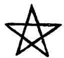

  
[Intangible Textual Heritage](../../index)  [Judaism](../index) 
[Index](index)  [Previous](tku47)  [Next](tku49) 

------------------------------------------------------------------------

p. 229

# CHAPTER XL.

### CONCERNING THE FEMININE PORTION OF MICROPROSOPUS; AND CONCERNING THE REMAINING PARTS OF THE BODY OF EACH.

945\. THUS in this Adam androgyneity hath commenced to be disposed when
it hath been formed in its disposition. It hath commenced from His back.
(Otherwise, from His breast.)

946\. Between the two arms, in that part whereunto the beard hangeth
down, which is called Tiphereth, the Beauty.

947\. And this Beauty is expanded and disposeth two breasts.

948\. And it is separated from the back, and produceth the Head of a
Woman completely covered on every side by Her hair as far as to (*the
limits of*) the face of Her head.

949\. Insomuch that through that Tiphereth, Beauty, Adam becometh in one
body, Male and Female.

950\. This is that which is written, Isa. xliv. 13: "According to the
beauty of a man, KThPARTh ADM, *Ke-Tiphereth Adam*, that it may remain
in the house."

951\. When the countenance of the Female Head is created, one curled
lock of hair at the back of Microprosopus hangeth over the head of the
Woman.

952\. And all hairs red gold are produced in Her head; yet so that other
colours are intermixed therewith.

953\. This is that which is written, Cant, vii. 5: "The hair of Thy head
like ARGMN, *Argaman*, purple."

954\. What is Argaman? Colours intermixed with other colours.

p. 230

955\. This Tiphereth, Beauty, hath been extended from the heart, and
penetrateth it, and passeth through unto the other side, and instituteth
the formations from the Countenance of the Woman even unto Her heart; so
that from the parts about the heart it taketh its rise on this side, and
in the parts about the heart it terminateth on that side.

956\. Moreover, this Tiphereth is extended, And it formeth the internal
parts of a Man.

957\. And it entereth into and disposeth therein all mercies and aspects
of mercies.

958\. Also we have learned that in those internal parts are comprehended
six hundred thousand Lords of Mercies, and that they are called the
Lords of the Internal Parts.

959\. Whence it is written, Jer. xxxi. 20: "Therefore My bowels are
troubled for him, I will surely have mercy upon him, saith
Tetragrammaton."

960\. We have learned that this Tiphereth, Beauty, embraceth Mercies and
Judgment, and that Mercy is extended in the Male.

961\. And it passeth over and goeth through unto (otherwise, shineth on)
the other side, and formeth the internal parts of a Woman on the side of
Judgment; and thus also are Her internal parts disposed.

962\. We have learned that the Male hath been conformed on His side
(otherwise, from His heart), in 248  [1](#fn_169) members; of which some are within, some
without; some Mercies, some Judgments.

963\. All which pertain unto Judgment, cohere in Judgment around the
hinder part, where the Woman is extended; and they coalesce and are
extended round about on that side.

964\. Also we have learned that five nakednesses can be revealed on that
side, which are the five judgments

p. 231

and these five judgments are extended into 248 paths. [1](#fn_170)

965\. And thus have we learned: the voice in the Woman is uncovered; the
hair in the Woman is uncovered; the leg [2](#fn_171) in the Woman is uncovered; the hand in
the Woman is uncovered; the foot in the Woman is uncovered.

966\. And also, furthermore, concerning these two our companions have
not inquired, yet them two have more nakedness.

967\. Also, we have learned in the "Book of Concealed Mystery" that the
Male is extended and conformed with His parts, and there is formed in
Him forma partis tegandæ puræ, at illud est membrum purum.

968\. Longitudo autem membri hujus est 248 mundorum, at omnes illi
pendent in orificio membri hujus quad dicitur, I, *Yod*.

969\. Et cum detegitur Yod, orificium membri; detegitur Benignitas
superna. [3](#fn_172)"

970\. And this member is the Benignity, quo nomine

p. 232

tamen proprie vocatur orificium membri; neither is it called Benignity
until I, *Yod*, orificii membri, is uncovered.

971\. And come, behold, Abraham is not called perfect in that Benignity,
until I, *Yod*, of the member is uncovered; but when that is uncovered
he is called perfect. [1](#fn_173)

972\. This is that which is written: "Walk before Me and be thou
perfect; really and truly perfect," Gen. xvii. i.

973\. Also it is written, Ps. xviii. 24: "I will be upright before Him,
and will keep myself from the sinner."

974\. Who is he concerning whom the discourse is both in the first and
second instance (*in this passage*)? Assuredly, he who uncovereth that
Yod; et cavet, ne Yod istud introducat in potestatem adversam; so that
he may have part in the world to come, and that he may be bound together
in the sheaf of life.

975\. What is this, "in potestatem adversam"? Even that which is
written, Mal. ii. 11: "And hath married the daughter of a strange god."

976\. And therefore is it written: "I will be upright before Him,"
because "he hath become perfect in the uncovering of *Yod*," and "I will
keep myself from the sinner."

977\. Et dum extenditur membrum hoc, etiam extenditur latus rigoris de
illis rigoribus sinistræ in fæmina.

978\. Et inseritur in fæminam, in loco quodam, et signatioram, facit in
nuditate, seu parte maxime contegenda in toto corpore fæminino.

p. 233

979\. Et ille locus dicitur nuditas ab omnibus occultanda, locus
scilicet pro membro illo, quod dicitur Benignitas, ut scilicet mitigetur
rigor iste, qui continet quinque rigores.

980\. And that Benignity comprehendeth in itself five Benignities
(otherwise, and herein existeth the Benignity from the other
Benignities). And Benignity is from those on the right, but Severity
from those on the left.

981\. And when the latter is mitigated by the former He is called man,
consisting in both aspects.

982\. And therefore in all the crowns (*the former state of things*) was
not permanent, before that the conformations of the King [1](#fn_174) were prepared by the Ancient of the
Ancient Ones, so that He might construct the worlds, and form (*their*)
conformations, for the purpose of establishing that Woman, [2](#fn_175) so that She might be mitigated.

983\. Until the supernal Benignity could descend, and then the
conformations of the Woman became permanent, and were mitigated by this
member (of Microprosopus), which is called the Benignity.

984\. This is that which is written, Gen. xxxvi.: "And these are the
kings which reigned in the land of Edom;" which is the place where all
the judgments are found, and they are the constitutions of the Woman.

985\. For it is not written, "Who were," but "Who reigned," because they
were not mitigated until all were formed, and that Benignity went forth.

986\. Therefore is it said, "And he died," because they were not
permanent, neither was Judgment mitigated through Judgment [3](#fn_176)

987\. But, and if thou sayest: "That if it be thus that all are
judgments, wherefore is it written, Gen. xxxvi. 37:

p. 234

\[paragraph continues\] 'And Saul of Rechoboth [1](#fn_177) by the waters reigned in his stead,' for
this man truly doth not appear (*to symbolize*) a judgment? "

988\. We have learned that all denote judgment, excepting one, which
last remaineth.

989\. But this Saul of Rechoboth by the waters is one order (otherwise,
one side or aspect), an order which is expanded, and goeth forth from
Rechoboth by the waters.

990\. And this is Binah, wherefrom are opened the fifty gates [2](#fn_178) in the aspects of the world of lights
and luminaries.

991\. This is what is said concerning Rechoboth by the waters. And they
were not all permanent. Thou shalt not say that they were abolished, but
that they were not permanent in that kingdom which is from the side of
the Woman.

992\. Until there was excited and extended that Last One of them all
concerning whom it is said: "And *Hadar*, HDR, reigned after him."

993\. Who is Hadar? The Supernal Benignity. [3](#fn_179)

994\. "And the name of his city was POV, *Paau* (*crying aloud*)." What
is Paau? Through this the man prayeth who is worthy of the Holy Spirit.

995\. "And the name of his wife was *Mechetabel*, MChITBAL," herein are
they mitigated together, and his (*Hadar's*) wife is named, which is not
written concerning any other of them. MChITBAL, *Mechetabel* (

which bears the

p. 235

signification of "as if were made better by the name of Benignity, AL,
EL, MChI TB AL") mitigation of the one by the other.

996\. "The daughter of MTRD, *Matred*," the elaborations, on the side of
Severity: "the daughter of MIZHB, *Mezahab*;" that is they have been
firmly contempered and intertwined together--namely MI, *Me*,
Mercury, [1](tku49.htm#fn_180) and ZHB,
*Zahab*, Gold, Mercy, and Judgment.

------------------------------------------------------------------------

### Footnotes

[230:1](tku48.htm#fr_170) The number of 248 =
RChM, *Rechem* = Mercy + 248; thus conveying this idea in the number.

[231:1](tku48.htm#fr_171)

 

For five is H, *He*, the number of the feminine letter in the
Tetragrammaton, the number also of the Microcosm or Lesser World, the
symbol or sign of which is the [Pentagram](errata.htm#8). The 248 paths
into which the five judgments are extended are the correlates of those
of mercy.

[231:2](tku48.htm#fr_172) This word is ShVQ,
*Shoq*, in the original. Fuerst translates it Leg, especially the part
from knee to ankle. So does Gesenius in his Lexicon; but in his large
Hebrew and Chaldee Thesaurus it is, apparently by an oversight, omitted.
Zanolini translates it "Armus, Crus," and adds: "In BRKVTh, *Berachoth*,
fol. 24,, ShVQA BAShH ORVH, Crura in muliere res pudenda sunt, scilicet
crura nuda. Hinc in more positum apud Judæos est, ut ipsorum mulieres,
et puellæ demissis ad talos vestibus verecundiæ caussa utantur, ne viros
ad libidinem excitent." ("Lexicon Chaldæo-Rabbinicum," art. ShVQ.)

[231:3](tku48.htm#fr_173) I have thought it
advisable to retain this piece in the Latin, as it will be equally
intelligible in that language to the ordinary student; and it is not so
well fitted for expression in English. It contains the symbolism of the
genitalia.

[232:1](tku48.htm#fr_174) This apparently
refers to the qabalistical symbolism of the changing of the names of
Abram and Sarai into Abraham and Sarah; ABRM and ShRI into ABRHM and
ShRH; ABRM = 243 is made into ABRHM = 248 by addition of the number 5,
the letter H, *He*; and ShRI = 510 is made ShRH = 505 by the subtraction
of five from the final I, *Yod*; 248 is the number of the members of
Microprosopus, and 5 is that of the five judgments. Hence the united
numbers of Abram and Sarai, 243+510 = 753. which number is also obtained
by the addition of Abraham and Sarah, 248+505 = 753; so that the total
numeration of the two names remains unchanged.

[233:1](tku48.htm#fr_175) Microprosopus.

[233:2](tku48.htm#fr_176) Malkuth, the tenth
Sephira, the Kingdom, the Queen, the Bride of Microprosopus; the Isis.
Rhea, Ceridwen, Hertha, &c., of other religions; Nature, the Great
Mother of us all.

[233:3](tku48.htm#fr_177) Compare with this the
meaning of the names of the two Pillars at the entrance to King
Solomon's Temple.

[234:1](tku48.htm#fr_178) It is not at first
sight clear why Saul of Rechoboth should be taken exception to as
symbolizing judgment. But if we examine the word RChVBVTh, *Rechoboth*,
by Gematria, we shall find a reason. For R + Ch +V+ B + V + Th = 200 + 9
+ 6 + 2 + 6 + 400 + 622 = BRKTh, *Berachoth*, Blessings, and also "pools
of water," which is also "Rechoboth by the waters." And "the waters" are
Binah, the third Sephira.

[234:2](tku48.htm#fr_179) *Vide ante* in the
"Book of Concealed Mystery."

[234:3](tku48.htm#fr_180) For HDR = 213. which
= ChSD OLAH DAL, *Chesed Aulaeh Da-El*, the Supernal Mercy of El = 213
also. And Chesed is the fourth Sephira, which succeeds Binah the third,
as Hadar succeeds Saul of Rechoboth by the waters.

------------------------------------------------------------------------

[Next: Chapter XLI: Concerning the Separate Members of Each
Personification, and Especially Concerning the arms of
Microprosopus](tku49)
