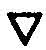
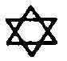

  
[Intangible Textual Heritage](../../index)  [Judaism](../index.md) 
[Index](index)  [Previous](tku71)  [Next](tku73.md) 

------------------------------------------------------------------------

p. 329

# CHAPTER XIX.

### CONCERNING THE LIPS AND MOUTH OF MICROPROSOPUS.

678\. THOSE hairs cover not the lips, and the entire lips are red and
rosy. As it is written, Cant. v. 13: "His lips as roses." (*In the
ordinary version ShVShNIM, Shushanim, is translated "lilies," not
"roses."*)

679\. His lips murmur Geburah, Severity, but they also murmur Chokmah,
Wisdom.

680\. From those lips alike depend good and evil, life and death.

681\. From these lips depend the Lords of Vigilance. For when those lips
murmur, they all are excited to bring forth secret things, as well as
the Lords of judgment in all the tribunals wherein they have their
abiding-place.

682\. And therefore are these called the Watchers; as it is written,
Dan. iv, 17: "This matter is by the decree of the Watchers, and the
demand by the word of the Holy Ones."

683\. What is a Watcher? In the book of the dissertation that is
explained from this passage, 1 Sam. xxviii. 16: "And is become thine
enemy."

684\. Seeing that judgments are stirred up against those who obtain not
mercy from the Supernals.

685\. Hence are those stirred up who are the lords of the enmity of all
things.

696\. And, nevertheless, in each case is there mercy and judgment. And
therefore is it said, Dan. iv. 13: "A watcher and a holy one;" judgment
and mercy.

687\. And between those lips when they are opened is the mouth
disclosed.

688\. By that RVCh, *Ruach*, breath, which goeth forth from His mouth,
many thousands and myriads are enshrouded; and when it is extended by
the same are the

p. 330

true prophets enfolded, and all are called the mouth of Tetragrammaton.

689\. When forth from His mouth the words proceed through His lips, the
same are muttered through the whole circuit of eighteen thousand
worlds, [1](#fn_290.md) until they are all bound
together at once in the twelve paths and the known ways. And one thing
ever expecteth another.

690\. By the tongue is the vocal expression of the sublime spoken, in
the middle nexus of the utterance.

691\. And therefore is it written, Cant. v. 16: "His mouth is most
sweet." And this same palate of His conveyeth a sweet taste; wherefore
He smileth when He tasteth food (*which is pleasant*). [2](#fn_291.md)

692\. "And He is altogether the desirablenesses (*or delights*)" (*of
the powers of*) fire and (*the powers of*) water, because the fire and
water are counterchanged with each other mutually (otherwise, are
conformed together), and are beautiful in his conformation. [3](#fn_292.md)

693\. For the colours are mutually associated together.

p. 331

694\. In His palate are the (*guttural*) letters (*of the Hebrew
Alphabet--namely, A, H, Ch, O*) formed and constructed; in the circuit
of His (*mouth*) are they condensed (*into the palatals G, I, X
Q*). [1](#fn_293.md)

695\. The letter A, *Aleph*, which cast forth the kings and constituted
the kings [2](#fn_294.md) (*i.e., that guttural
letter which is referred to the First Sephira, Kether, the Crown,
becometh the palatal letter G, Ghimel*).

696\. The letter Ch, *Cheth*, which goeth forth and descendeth and
ascendeth, and is crowned in the head (*referring to the Second Sephira,
Chokmah, Wisdom*), and is fire condensed in ether (*i.e., developeth in
the palatal letter I, Yod*).

697\. The letter H, *He*, the golden-yellow colour (otherwise,
germinating power) of the Mother, Aima, having been connected with the
Female Power, is extended in the Greater Female Potency into the desire
of the Holy City, which two (otherwise, for these places) are mutually
bound together the one unto the other (

these two are Aima, the

p. 332

\[paragraph continues\] *supernal H of IHVH, and the Holy City, the
Bride, as She is called in the Apocalypse, the final H of IHVH*). (*And
the guttural letter H, He, formeth the palatal letter K, Kaph, which is
referred unto the Queen.*) As it is written, Cant. iv. 6: "Unto the
mountain of myrrh, unto the hill of frankincense."

698\. The letter O, Ayin (*which denoteth the seven Inferiors which were
destroyed*) is the medium or splendour of mediation (*i.e., the internal
Light of the broken vessels*), hath been formed forth in His lips by
revolution therein (*and it hath been condensed in Q, Qoph, which goeth
forth from the middle of the palate unto the lips*). For the branches
(*of the Tree of Life, namely*) are connected in Him (*Microprosopus*)
in the spirits (*such as they were in the prior world*) formed forth
(*such as they are in the restored world*).

699\. For in the mysteries of the letters of Solomon the King, those
four letters, A, H, Ch, O, are surrounded by GIKQ.

700\. But it is written in Job vi. 6: "Can that which is unsavoury be
eaten without salt?" &c.

701\. Also it is written, Isa. xxxii. 17: "And the work of TzDQ,
*Tzedeq*, Righteousness (*or Justice*), shall be peace." Also, Ps. xix.
10: "More to be desired are they than gold, yea, than much fine gold,"
&c.

702\. But King David saith, *ibid*. 11: "Also by them is thy servant
warned."

703\. I affirm concerning myself, that I have been every day cautious
concerning them, so that concerning them I might not err (*i.e.,
concerning the judgments, Meshephath, referred to in verse* 9).

704\. Excepting a certain day when I was binding together the Crowns of
the King [1](#fn_295.md) in the Cave of Maranæa, I
beheld a Splendour of devouring Fire flashing from His

p. 333

wrathful Countenance of Flame, and with terror I trembled at the sight.

705\. From that day forth I ever acted with caution in my meditations
concerning them, neither have I omitted that all the days of my life.

706\. Blessed is his portion who is prudent regarding Him who is more
ancient than (otherwise, concerning the gentleness of) the King, so that
he may taste thereof, as is fitting.

707\. Therefore is it written, Ps. xxxiv. 9: "Taste and see that
Tetragrammaton is good," &c.

708\. Also it is written, Prov. ix. 5: "Come, eat of my bread," &c.

------------------------------------------------------------------------

### Footnotes

[330:1](tku72.htm#fr_293.md) That is the number
eighteen on the plane of Asiah. And 18 is the fourth part of 72. And 72
is the number of the Schemahamphorasch (*see ante*), and the number of
the Quinaries or sets of 5 degrees in the 360 degrees of the Zodiac. And
there are 6 such sets in 30 degrees of each sign. And thus we return to
the 12 signs of the Zodiac, and these are operated on from the to
Sephiroth through the "7 paths of the Queen," and these again depend
from the first 3 Sephiroth. and these again from Kether, and Kether is
Macroprosopus from whom backwards depend the Negative Existences in
their Veils; and Macroprosopus is called HVA, *Hoa*, which = 12, and
finds its expression in Aima Elohim. Thus rusheth through the Universe
the Flux and Reflux of the Eternal Word.

[330:2](tku72.htm#fr_294.md) I am doubtful as to
whether this is the best translation of the last clause of § 691.
Rosenroth has not translated it at all. The Chaldee is MMThQIM VDAI MAI
ChKV KDA VChIK ITOVM LAKVL, *Mamthaqim Vadeai Maai Chiko Kedea Vecheik
Yitauom Leakol*.

[330:3](tku72.htm#fr_295.md) This whole section
requires comment. I must first observe that Knorr de Rosenroth in his
Latin version has supposed that in the word MChMDIM, *Machemadim*, fire
and water, ASh and MIM, are hidden as in a sort of anagram. Now while it
is true that MIM can be thus extracted, ASh cannot, for the remaining
letters, ChMD will by no exegetical rule I know of form a word
signifying fire. The following I take to be the real meaning of the
passage. Chokmah is the fire. I, and Binah is the water, H, p. 331 the Father and Mother who, conjoined,
produce the Son. Now the fire is symbolized by a triangle with the apex
uppermost  , and water by
 , these two together
united form   the sign of
the Macrocosm, the external symbol of Vau, V, Microprosopus. And He
inherits the double qualities of the Father and the Mother, shown by the
word "delights" ("Machemadim") being written in the plural.

[331:1](tku72.htm#fr_296.md) The letters of the
Hebrew alphabet are usually classed in the following manner:--

Gutturals = A, H, Ch, O (R by some).

Palatals = G, I, K, Q.

Linguals = D, Th, T, L, N.

Dentals = Z, S, Sh, Tz (R by others).

Labials = B, V, M, P.

The "Sepher Yetzirah" further classes them as--

3 Mothers (Primitives) = A, M, Sh.

7 Duplicated = B, G. D, K, P, R, Th.

12 Simples = H, V, Z, Ch, T, I, L, N, S, O. Tz, Q.

In the above classification it classes R as a dental.

[331:2](tku72.htm#fr_297.md) This section and §
698, contain references to the Edomite kings and their
symbology--namely, as denoting the primal worlds which were destroyed
(See 'The Book of Concealed Mystery," ch. i. § 3; "The Greater Holy
Assembly," ch. ii. and ch. xxvi.; and "The Lesser Holy Assembly," ch. x.

[332:1](tku72.htm#fr_298.md) *I.e.*, Tracing out
the: properties. &c., of the Sephiroth which form the King.
Microprosopus, and, as appears from the latter part of this section,
those only in their aspect of Judgment and Wrath.

------------------------------------------------------------------------

[Next: Chapter XX: Concerning the Body of Microprosopus](tku73.md)
