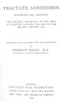

  
[Intangible Textual Heritage](../../index)  [Judaism](../index.md) 
[Index](index)  [Next](tsa01.md) 

------------------------------------------------------------------------

*Tractate Sanhedrin*, Herbert Danby tr. \[1919\], at Intangible Textual
Heritage

------------------------------------------------------------------------

# TRACTATE SANHEDRIN

##### MISHNAH AND TOSEFTA

#### THE JUDICIAL PROCEDURE OF THE JEWS

#### AS CODIFIED TOWARDS THE END OF THE

#### SECOND CENTURY A.D.

###### TRANSLATED FROM THE HEBREW WITH BRIEF ANNOTATIONS

##### BY

## HERBERT DANBY, M.A.

###### SUB-WARDEN OF ST. DEINIOL'S LIBRARY, HAWARDEN

#### LONDON:

#### SOCIETY FOR PROMOTING CHRISTIAN KNOWLEDGE

#### NEW YORK: THE MACMILLAN COMPANY

#### \[1919\]

Scanned at Intangible Textual Heritage, November 2006. Proofed and
formatted by John Bruno Hare. This text is in the public domain in the
United States because it was published prior to January 1st, 1923. These
files may be used for any non-commercial purpose provided this notice of
attribution is left intact in all copies.

[  
Click to enlarge](img/title.jpg.md)  
Title Page  

------------------------------------------------------------------------

[Next: Introduction](tsa01.md)
