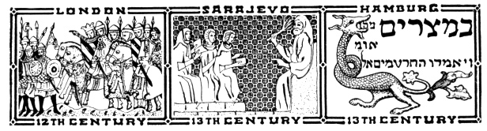
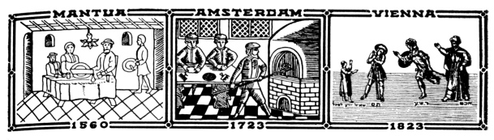
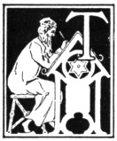

  
[Intangible Textual Heritage](../../index)  [Judaism](../index) 
[Index](index)  [Previous](uh03)  [Next](uh05) 

------------------------------------------------------------------------

[Buy this Book at
Amazon.com](https://www.amazon.com/exec/obidos/ASIN/B000BD19YW/internetsacredte)

------------------------------------------------------------------------

  
*The Union Haggadah*, ed. by The Central Council of American Rabbis
\[1923\], at Intangible Textual Heritage

------------------------------------------------------------------------

p. viii

 

 

### The Union Haggadah

|                    |
|--------------------|
|  |

THE MORAL and spiritual worth of the hallowed institution of the Seder,
which has become a vital part of the Jewish consciousness, is priceless.
We should suffer an irretrievable loss, were it allowed to pass into
neglect. To avert such a danger, has been the anxious thought to which
the Union Haggadah owes its origin.

In "carrying on the chain of piety which links the generations to each
other", it is necessary frankly to face and honestly to meet the needs
of our own day. The old Haggadah, while full of poetic charm, contains
passages and sentiments wholly out of harmony with the spirit of the
present time. Hence the proper editing of the old material demanded much
care and attention on the part of the editors of the first edition of
the Union Haggadah. Benefiting by their labors, those entrusted with the
task of its revision are able to present a work at once modern in spirit
and rich in those traditional elements that lend color to the service.

The Seder service was never purely devotional. Its intensely spiritual
tone mingled with bursts of good humor, its serious observations on
Jewish life and destiny with comments in a lighter vein, and its lofty
poetry with playful ditties for the entertainment of the

p. ix

children. It assumes the form of an historical drama presented at the
festal table, with the father and children as leading actors. The
children question and the father answers. He explains the nature of the
service, preaches, entertains, and prays. In the course of the evening,
a complete philosophy of Jewish history is revealed, dealing with
Israel's eventful past, with his deliverance from physical and from
spiritual bondage, and with his great future world-mission. In its
variety, the Haggadah reflects the moods of the Jewish spirit.
Rabbinical homily follows dignified narrative, soulful prayers and
Psalms mingle with the *Ḥad Gadyo* and the madrigal of numbers, *Eḥod Mi
Yode‘a*.

The assignment to the child of a prominent part in the Seder service is
in consonance with the biblical ordinance: "And thou shalt tell thy son
in that day" (Ex. XIII: 8). The visible symbols, the living word of
instruction, and the ceremonial acts, are sure to stimulate religious
feeling. Parent and child are thus brought into a union of warm
religious sympathy, which is all the more indissoluble because
strengthened by the ties of natural affection. Their souls are fired
with the love of liberty, and their hearts are roused to greater loyalty
to Israel and to Israel's God of Freedom.

------------------------------------------------------------------------

[Next: Rites and Symbols of the Seder](uh05)
