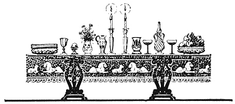
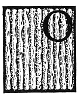

  
[Intangible Textual Heritage](../../index)  [Judaism](../index) 
[Index](index)  [Previous](uh05)  [Next](uh07) 

------------------------------------------------------------------------

[Buy this Book at
Amazon.com](https://www.amazon.com/exec/obidos/ASIN/B000BD19YW/internetsacredte)

------------------------------------------------------------------------

  
*The Union Haggadah*, ed. by The Central Council of American Rabbis
\[1923\], at Intangible Textual Heritage

------------------------------------------------------------------------

 

p. xiv

### Directions for Setting the Table

|                    |
|--------------------|
|  |

ON the table, in front of the person who conducts the service, place

A large platter containing Seder symbols:

a\. Three matzos each of which is covered separately in the folds of a
napkin or special cover. Two of them represent the "Leḥem Mishneh—double
portion" of the Sabbath and the holy days, and the third the "Leḥem
‘Oni—bread of affliction". These are also taken to represent the three
religious divisions of Israel: the "Cohen" (priest), "Levi" (associate
priest) and "Yisroel" (lay-Israelite).

b\. The roasted shank-bone (of a lamb).

c\. A roasted egg.

Also a piece of horseradish, a bit of haroses, and a spray of parsley.

Besides these, there are placed on the table for the company:

1\. A plate of bitter herbs (horseradish), cut into small pieces.

2\. A dish of haroses.

3\. Parsley or watercress.

4\. A dish of salt water.

p. xv

5\. A cup of wine is placed at each plate, and a large brimming goblet
in the center of the table for the prophet Elijah.

The meal served during the Seder follows the form of a banquet of olden
times. Hence the reference, in the Hebrew texts of the Four Questions,
to the custom of reclining on the left side—a position assumed by free
men. Preserving this custom, many households still provide a large
cushioned armchair for the person conducting the Seder.

The table is usually spread with the best of the family's china and
silverware, and adorned with flowers, in keeping with the festive
spirit.

------------------------------------------------------------------------

[Next: Order of the Service](uh07)
