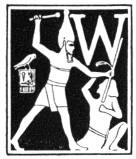

  
[Intangible Textual Heritage](../../index)  [Judaism](../index) 
[Index](index)  [Previous](uh09)  [Next](uh11) 

------------------------------------------------------------------------

[Buy this Book at
Amazon.com](https://www.amazon.com/exec/obidos/ASIN/B000BD19YW/internetsacredte)

------------------------------------------------------------------------

  
*The Union Haggadah*, ed. by The Central Council of American Rabbis
\[1923\], at Intangible Textual Heritage

------------------------------------------------------------------------

The leader replaces the dish upon the table.

#### The Four Questions

The youngest person at the table asks:

|                    |
|--------------------|
|  |

WHY IS this night different from all other nights? On all other nights,
we eat either leavened or unleavened bread. Why, on this night, do we
eat only unleavened bread?

2\. On all other nights, we eat all kinds of herbs. Why, on this night,
do we eat especially bitter herbs?

3\. On all other nights, we do not dip herbs in any condiment. Why, on
this night, do we dip them in salt water and ḥaroses?

4\. On all other nights, we eat without special festivities. Why, on
this night, do we hold this Seder service?

p. 19 p. 20

The leader answers:

We celebrate to-night because we were Pharaoh's bondmen in Egypt, and
the Lord our God delivered us with a mighty hand. Had not the Holy One,
blessed be He, redeemed our fathers from Egypt, we, our children, and
our children's children would have remained slaves. Therefore even if
all of us were wise and well-versed in the Torah, it would still be our
duty from year to year, to tell the story of the deliverance from Egypt.
Indeed to dwell at length on it, is accounted praiseworthy.

------------------------------------------------------------------------

[Next: The Four Sons](uh11)
