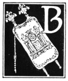

  
[Intangible Textual Heritage](../../index)  [Judaism](../index) 
[Index](index)  [Previous](uh10)  [Next](uh12) 

------------------------------------------------------------------------

[Buy this Book at
Amazon.com](https://www.amazon.com/exec/obidos/ASIN/B000BD19YW/internetsacredte)

------------------------------------------------------------------------

  
*The Union Haggadah*, ed. by The Central Council of American Rabbis
\[1923\], at Intangible Textual Heritage

------------------------------------------------------------------------

#### The Four Sons

|                     |
|---------------------|
|  |

BY A fitting answer to the questions of each of the four types of the
sons of Israel, does the Torah explain the meaning of this night's
celebration.

The wise son eager to learn asks earnestly: "What mean the testimonies
and the statutes and the ordinances, which the Lord our God hath
commanded us?" To him thou shalt say: "This service is held in order to
worship the Lord our God, that it may be well with us all the days of
our life".

The wicked son inquires in a mocking spirit: "What mean ye by this service?" As he says ye and not we,
he excludes himself from the household of Israel. Therefore thou
shouldst turn on him and say: "It is because of that which the Lord did
for me when I came forth out of Egypt".
For me and not for him, for had he been there, he would not have
been found worthy of being redeemed.

p. 21 p. 22

The simple son indifferently asks: "What is this?" To him thou shalt
say: "By strength of hand the Lord brought us out of Egypt, out of the
house of bondage".

And for the son who is unable to inquire, thou shalt explain the whole
story of the Passover; as it is said: "And thou shalt tell thy son in
that day, saying 'It is because of that which the Lord did for me when I
came forth out of Egypt'".

------------------------------------------------------------------------

[Next: The Story of the Oppression](uh12)
