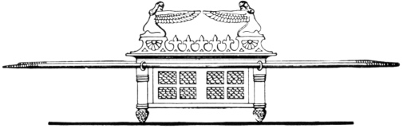
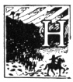
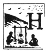
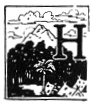
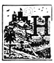
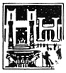
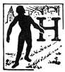

  
[Intangible Textual Heritage](../../index)  [Judaism](../index) 
[Index](index)  [Previous](uh12)  [Next](uh14) 

------------------------------------------------------------------------

[Buy this Book at
Amazon.com](https://www.amazon.com/exec/obidos/ASIN/B000BD19YW/internetsacredte)

------------------------------------------------------------------------

  
*The Union Haggadah*, ed. by The Central Council of American Rabbis
\[1923\], at Intangible Textual Heritage

------------------------------------------------------------------------

p. 27 p. 28

 

#### Dayenu

#### ‏דַּיֵּֽנוּ‎

The company repeats the refrain "Dayenu" which is
equivalent to "It would have satisfied us".

How manifold are the favors which God has conferred upon us!

<table data-border="0">
<colgroup>
<col style="width: 50%" />
<col style="width: 50%" />
</colgroup>
<tbody>
<tr class="odd">
<td data-valign="top">
 
</td>
<td data-valign="top">
HAD HE brought us out of Egypt, and not divided the sea for us, Dayenu!
</td>
</tr>
<tr class="even">
<td data-valign="top">
 
</td>
<td data-valign="top">
HAD HE divided the sea, and not permitted us to cross on dry land, Dayenu!
</td>
</tr>
<tr class="odd">
<td data-valign="top">
 
</td>
<td data-valign="top">
HAD HE permitted us to cross the sea on dry land, and not sustained us for forty years in the desert, Dayenu!
</td>
</tr>
<tr class="even">
<td data-valign="top">
 
</td>
<td data-valign="top">
HAD HE sustained us for forty years in the desert, and not fed us with manna, Dayenu! 
p. 29 p. 30
</td>
</tr>
<tr class="odd">
<td data-valign="top">

<table data-align="LEFT">
<tbody>
<tr class="odd">
<td data-valign="CENTER"></td>
</tr>
</tbody>
</table></td>
<td data-valign="top">
HAD HE fed us with manna, and not ordained the Sabbath, Dayenu!
</td>
</tr>
<tr class="even">
<td data-valign="top">

<table data-align="LEFT">
<tbody>
<tr class="odd">
<td data-valign="CENTER"></td>
</tr>
</tbody>
</table></td>
<td data-valign="top">
HAD HE ordained the Sabbath, and not brought us to Mount Sinai, Dayenu!
</td>
</tr>
<tr class="odd">
<td data-valign="top">

<table data-align="LEFT">
<tbody>
<tr class="odd">
<td data-valign="CENTER"></td>
</tr>
</tbody>
</table></td>
<td data-valign="top">
HAD HE brought us to Mount Sinai, and not given us the Torah, Dayenu!
</td>
</tr>
<tr class="even">
<td data-valign="top">

<table data-align="LEFT">
<tbody>
<tr class="odd">
<td data-valign="CENTER"></td>
</tr>
</tbody>
</table></td>
<td data-valign="top">
HAD HE given us the Torah, and not led us into the Land of Israel, Dayenu!
</td>
</tr>
<tr class="odd">
<td data-valign="top">

<table data-align="LEFT">
<tbody>
<tr class="odd">
<td data-valign="CENTER"></td>
</tr>
</tbody>
</table></td>
<td data-valign="top">
HAD HE led us into the Land of Israel, and not built for us the Temple, Dayenu!
</td>
</tr>
<tr class="even">
<td data-valign="top">

<table data-align="LEFT">
<tbody>
<tr class="odd">
<td data-valign="CENTER"></td>
</tr>
</tbody>
</table></td>
<td data-valign="top">
HAD HE built for us the Temple, and not sent us prophets of truth, Dayenu!
</td>
</tr>
<tr class="odd">
<td data-valign="top">

<table data-align="LEFT">
<tbody>
<tr class="odd">
<td data-valign="CENTER"></td>
</tr>
</tbody>
</table></td>
<td data-valign="top">
HAD HE sent us prophets of truth, and not made us a holy people, Dayenu!
</td>
</tr>
</tbody>
</table>

p. 31 p. 32

All read in unison:

How much more then are we to be grateful unto the Lord for the manifold
favors which He has bestowed upon us! He brought us out of Egypt,
divided the Red Sea for us, permitted us to cross on dry land, sustained
us for forty years in the desert, fed us with manna, ordained the
Sabbath, brought us to Mount Sinai, gave us the Torah, led us into the
Land of Israel, built for us the Temple, sent unto us prophets of truth,
and made us a holy people to perfect the world under the kingdom of the
Almighty, in truth and in righteousness.

 

------------------------------------------------------------------------

[Next: The Passover Symbols](uh14)
