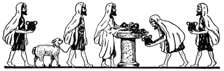
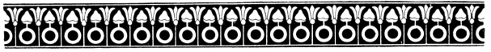

  
[Intangible Textual Heritage](../../index)  [Judaism](../index) 
[Index](index)  [Previous](uh13)  [Next](uh15) 

------------------------------------------------------------------------

[Buy this Book at
Amazon.com](https://www.amazon.com/exec/obidos/ASIN/B000BD19YW/internetsacredte)

------------------------------------------------------------------------

  
*The Union Haggadah*, ed. by The Central Council of American Rabbis
\[1923\], at Intangible Textual Heritage

------------------------------------------------------------------------

p. 33 p. 34

 

### The Passover Symbols

Should enemies again assail us, the remembrance of the exodus of our
fathers from Egypt will never fail to inspire us with new courage, and
the symbols of this festival will help to strengthen our faith in God,
who redeems the oppressed.

Therefore, Rabban Gamaliel, a noted sage, declared: "Whoever does not
well consider the meaning of these three symbols: Pesaḥ, Matzo and
Moror, has not truly celebrated this Festival".

##### PESAḤ

One of the company asks:

What is the meaning of Pesaḥ?

The leader lifts up the roasted shank-bone and
answers:

Pesaḥ means the Paschal Lamb, and is
symbolized by this shank-bone. It was eaten by our fathers while the
Temple was in existence, as a memorial of God's favors, as it is said:
"It is the sacrifice of the Lord's Passover, for that He passed over the houses of the children of
Israel in Egypt, when He smote the Egyptians and delivered our houses".
As God in the ancient "Watch-Night" passed over and spared the houses of
Israel, so did He save us in all kinds of distress, and so may He always
shield the afflicted, and for ever remove every trace of bondage from
among the children of man.

p. 35 p. 36

##### MATZO

One of the company asks:

What is the meaning of Matzo?

The leader lifts up the Matzo and answers:

Matzo, called The Bread Of Affliction,
was the hasty provision that our fathers made for their journey, as it
is said: "And they baked unleavened cakes of the dough which they
brought out of Egypt. There was not sufficient time to leaven it, for
they were driven out of Egypt and could not tarry, neither had they
prepared for themselves any provisions." The bread which of necessity
they baked unleavened, thus became a symbol of divine help.

##### MOROR

One of the company asks:

And what is the meaning of Moror?

The leader lifts up the bitter herbs and answers:

Moror means Bitter Herb. We eat it in
order to recall that the lives of our ancestors were embittered by the
Egyptians, as we read: 'And they made their lives bitter with hard labor
in mortar and bricks and in all manner of field labor. Whatever task was
imposed upon them, was executed with the utmost rigor." As we eat it in
the midst of the festivities of this night, we rejoice in the heroic
spirit which trials developed in our people. Instead of becoming
embittered by them, they were sustained and strengthened.

 

------------------------------------------------------------------------

[Next: The Watch-night of the Eternal](uh15)
