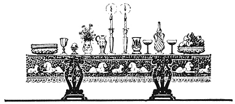

  
[Intangible Textual Heritage](../../index)  [Judaism](../index.md) 
[Index](index)  [Previous](uh16)  [Next](uh18.md) 

------------------------------------------------------------------------

[Buy this Book at
Amazon.com](https://www.amazon.com/exec/obidos/ASIN/B000BD19YW/internetsacredte.md)

------------------------------------------------------------------------

  
*The Union Haggadah*, ed. by The Central Council of American Rabbis
\[1923\], at Intangible Textual Heritage

------------------------------------------------------------------------

p. 45 p. 46 p. 47

p. 48

 

### Blessings

|                    |
|--------------------|
|  |

PRAISED art Thou, O Lord our God, King of the universe, who hast
redeemed us and our ancestors from Egypt, and hast enabled us to observe
this night of the Passover, the Feast of Unleavened Bread. O Lord our
God and God of our fathers, may we, with Thy help, live to celebrate
other feasts and holy seasons. May we rejoice in Thy salvation and be
gladdened by Thy righteousness. Grant deliverance to mankind through
Israel, Thy people. May Thy will be done through Jacob, Thy chosen
servant, so that Thy name shall be sanctified in the midst of all the
earth, and that all peoples be moved to worship Thee with one accord.
And we shall sing new songs of praise unto Thee, for our redemption and
for the deliverance of our souls. Praised art Thou, O God, Redeemer of
Israel.

The cups are filled for the second time.

All read in unison:

BORUCH ATTO ADONOI ELOHENU MELECH HO‘OLOM BORE P’RI HAGGOFEN.

Praised art Thou, O Lord our God, King of the universe, who hast created
the fruit of the vine.

Drink the second cup of wine.

p. 49 p. 50

#### 5. ‏מוֹצִיא, מַצָּה‎

The upper Matzo is broken and distributed. All then
read in unison:

BORUCH ATTO ADONOI ELOHENU MELECH HO‘OLOM HAMOTZI LEḤEM MIN HO’ORETZ.

Praised art Thou, O Lord our God, King of the universe, who bringest
forth bread from the earth.

BORUCH ATTO ADONOI ELOHENU MELECH HO‘OLOM ASHER KIDD’SHONU B’MITZVOSOV
V’TZIVONU AL ACHILAS MATZO.

Praised art Thou, O Lord our God, King of the universe, who hast
sanctified us through Thy commandments, and ordained that we should eat
unleavened bread.

Eat the Matzo.

#### 6. ‏כּוֹרֵךְ מָרוֹר‎

Each person receives some bitter herbs and ḥaroses,
which he places between two pieces of matzo. The leader then
reads:

This was the practice of Hillel, at the time the Temple was still in
existence. He combined the unleavened bread and the bitter herbs and ate
them together, to carry out the injunction concerning the Passover
sacrifice: "With unleavened bread and with bitter herbs, they shall eat
it."

All read in unison:

BORUCH ATTO ADONOI ELOHENU MELECH HO‘OLOM ASHER KIDD’SHONU B’MITZVOSOV
V’TZIVONU AL ACHILAS MOROR.

Praised art Thou, O Lord our God, King of the universe, who hast
sanctified us by Thy commandments, and ordained that we should eat
bitter herbs.

Eat the Moror.

 

p. 51 p. 52

 

#### 7. ‏שֻׁלְחָן עוֹרֵךְ‎

SUPPER IS SERVED.

#### 8. ‏צָפוּן‎

Partake of the Aphikomon.

At the conclusion of the meal, the children are given an opportunity to
find the Aphikomon. The reader redeems it and distributes pieces of it
to all present.

After partaking of the Aphikomon, it is customary to eat nothing else.

 

------------------------------------------------------------------------

[Next: Grace after the Meal](uh18.md)
