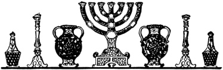
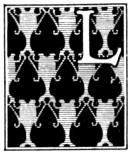
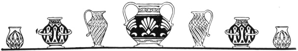
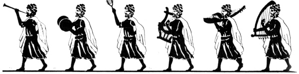
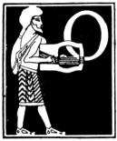
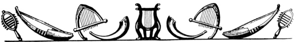
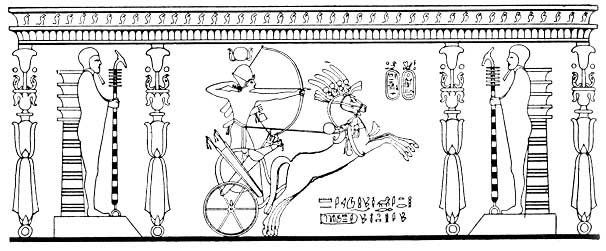
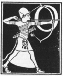
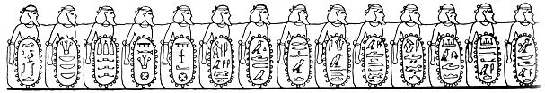

  
[Intangible Textual Heritage](../../index)  [Judaism](../index) 
[Index](index)  [Previous](uh17)  [Next](uh19) 

------------------------------------------------------------------------

[Buy this Book at
Amazon.com](https://www.amazon.com/exec/obidos/ASIN/B000BD19YW/internetsacredte)

------------------------------------------------------------------------

  
*The Union Haggadah*, ed. by The Central Council of American Rabbis
\[1923\], at Intangible Textual Heritage

------------------------------------------------------------------------

p. 53 p. 54

# B. After the Meal

p. 56

 

Grace after the Meal

‏בָּרֵךְ‎

*Leader:*

|                    |
|--------------------|
|  |

LET US say grace.

*Company:*

Let us bless Him of whose bounty we have partaken and through whose
goodness we live.

*Leader:*

Praised art Thou, O Lord our God, King of the universe, who sustainest
the world with goodness, with grace, and with infinite mercy. Thou
givest food unto every creature, for Thy mercy endureth for ever.

*Company:*

Through Thy great goodness, food has not failed us. May it never fail us
at any time, for the sake of Thy great name.

*Leader:*

Thou sustainest and dealest graciously with all Thy creatures.

*Company:*

Praised art Thou, O Lord, who givest food unto all.

All read in unison:

O God, our Father, sustain and protect us and grant us strength to bear
our burdens. Let us not, O God, become dependent upon men, but let us
rather depend

p. 57 p. 58

upon Thy hand, which is ever open and gracious, so that we may never be
put to shame.

*Leader:*

Our God and God of our fathers, be Thou ever mindful of us, as Thou hast
been of our fathers, so that we may find enlargement, grace, mercy, life
and peace on this Feast of Unleavened Bread.

*Company:* amen

Remember us this day in kindness.

*Company:* amen

Visit us this day with blessing.

*Company:* amen

Preserve us this day for life.

*Company:* amen

With Thy saving and gracious word have mercy upon us and save us, for
unto Thee, the compassionate and merciful One, our eyes are ever turned,
for Thou art a gracious and merciful King.

*Company:* amen

The All-merciful! May He reign over us for ever!

*Company:* amen

The All-merciful! May He sustain us in honor!

*Company:* amen

The All-merciful! May He bless this household and all assembled here.
May we all find favor in the eyes of God and men!

*Company:* amen

p. 59 p. 60

*Leader:*

Fear ye the Lord, ye His holy ones, for there is no want to them that
fear Him.

*Company:*

The young lions do lack and suffer hunger, but they that seek the Lord
shall not lack any good thing.

*Leader:*

O give thanks unto the Lord, for He is good, for His mercy endureth for
ever.

*Company:*

Thou openest Thy hand and satisfiest every living thing with favor.

*Leader:*

Blessed is the man that trusteth in the Lord; the Lord shall be unto him
for a help.

*Company:*

The Lord will give strength unto His people; The Lord will bless His
people with peace.

The cups are filled for the third time.

All read in unison:

BORUCH ATTO ADONOI ELOHENU MELECH HO‘OLOM BORE P’RI HAGGOFEN.

Blessed art Thou, O Lord our God, King of the universe, who createst the
fruit of the vine.

Drink the third cup of wine.

 

p. 61 p. 62

 

### 10. ‏הַלֵּל‎

THE DOOR IS OPENED FOR ELIJAH

PSALM CXVII

*Leader:*

 PRAISE the Lord, all ye
nations;

*Company:*

Laud Him, all ye peoples.

*Leader:*

For His mercy is great toward us;

*Company:*

And the truth of the Lord endureth for ever. Hallelujah!

THE DOOR IS CLOSED.

PSALM CXVIII: 1-4

*Leader:*

O give thanks unto the Lord, for He is good,

*Company:*

For His mercy endureth for ever.

*Leader:*

So let Israel now say,

*Company:*

For His mercy endureth for ever.

*Leader:*

So let the house of Aaron now say,

*Company:*

For His mercy endureth for ever.

*Leader:*

So let them now that fear the Lord say,

*Company:*

For His mercy endureth for ever.

 

p. 63 p. 64

 

*Leader:*

|                     |
|---------------------|
|  |

OUT OF distress I called upon the Lord; He answered me with great
enlargement.

*Company:*

The Lord is for me; I will not fear; what can man do unto me?

*Leader:*

It is better to take refuge in the Lord than to trust in man.

*Company:*

It is better to take refuge in the Lord than to trust in princes.

*Leader:*

The Lord is my strength and song; and He is become my salvation.

*Company:*

The voice of rejoicing and salvation is in the tents of the righteous.

 

 p. 70

p. 71 p. 72

*Leader:*

The right hand of the Lord doeth valiantly; the right hand of the Lord
is exalted.

*Company:*

I shall not die but live, and declare the works of the Lord.

*Leader:*

The Lord hath chastened me sore; but He hath not given me over unto
death.

*Company:*

Open to me the gates of righteousness; I will enter into them; I will
give thanks unto the Lord.

*Leader:*

This is the gate of the Lord; the righteous shall enter into it.

*Company:*

I will give thanks unto Thee, for Thou hast answered me, and art become
my salvation.

*Leader:*

The stone which the builders rejected is become the chief corner-stone.

*Company:*

This is the Lord's doing; it is marvelous in our eyes.

*Leader:*

This is the day which the Lord hath made; we will rejoice and be glad in
it.

*Company:*

We beseech Thee, O Lord, save now! We beseech Thee, O Lord, make us now
to prosper!

*Leader:*

Blessed be he that cometh in the name of the Lord;

p. 73 p. 74

*Company:*

We bless you out of the house of the Lord.

*Leader:*

Thou art my God, and I will give thanks unto Thee;

*Company:*

Thou art my God, I will exalt Thee.

*Leader:*

O give thanks unto the Lord, for He is good,

*Company:*

For His mercy endureth for ever.

 

p. 75 p. 76

------------------------------------------------------------------------

[Next: The Final Benediction](uh19)
