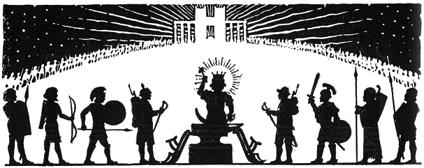
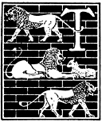

  
[Intangible Textual Heritage](../../index)  [Judaism](../index.md) 
[Index](index)  [Previous](uh18)  [Next](uh20.md) 

------------------------------------------------------------------------

[Buy this Book at
Amazon.com](https://www.amazon.com/exec/obidos/ASIN/B000BD19YW/internetsacredte.md)

------------------------------------------------------------------------

  
*The Union Haggadah*, ed. by The Central Council of American Rabbis
\[1923\], at Intangible Textual Heritage

------------------------------------------------------------------------

p. 77 p. 78

 

### 11. ‏נִרְצָה‎

### The Final Benediction

The cups are filled for the fourth time.

The leader lifts the cup of wine and reads:

|                     |
|---------------------|
|  |

THE FESTIVE service is completed. With songs of praise, we have lifted
up the cups symbolizing the divine promises of salvation, and have
called upon the name of God. As we offer the benediction over the fourth
cup, let us again lift our souls to God in faith and in hope. May He who
broke Pharaoh's yoke for ever shatter all fetters of oppression, and
hasten the day when swords shall, at last, be broken and wars ended.
Soon may He cause the glad tidings of redemption to be heard in all
lands, so that mankind—freed from violence and from wrong, and united in
an eternal covenant of brotherhood—may celebrate the universal Passover
in the name of our God of freedom.

All read in unison:

May God bless the whole house of Israel with freedom, and keep us safe
from danger everywhere. Amen.

p. 79

May God cause the light of His countenance to shine upon all men, and
dispel the darkness of ignorance and of prejudice. May He be gracious
unto us.

Amen.

May God lift up His countenance upon our country and render it a true
home of liberty and a bulwark of justice. And may He grant peace unto
all mankind.

Amen.

‏בָּרוּךְ אַתָּה יְיָ אֱלֹהֵֽינוּ מֶֽלֶךְ הָֽעוֹלָֽם בּוֹרֵא פְּרִי
הַגָּֽפָּן׃‎

BORUCH ATTO ADONOI ELOHENU MELECH HO‘OLOM BORE P’RI HAGGOFEN.

Praised art Thou, O Lord our God, King of the universe, who createst the
fruit of the vine.

Drink the fourth cup of wine.

 

p. 80 p. 81 p. 82 p. 83 p. 84 p. 85

------------------------------------------------------------------------

[Next: A Madrigal of Numbers](uh20.md)
