  
[Intangible Textual Heritage](../../index)  [Judaism](../index) 
[Index](index)  [Previous](uh20)  [Next](uh22) 

------------------------------------------------------------------------

[Buy this Book at
Amazon.com](https://www.amazon.com/exec/obidos/ASIN/B000BD19YW/internetsacredte)

------------------------------------------------------------------------

  
*The Union Haggadah*, ed. by The Central Council of American Rabbis
\[1923\], at Intangible Textual Heritage

------------------------------------------------------------------------

p. 94

 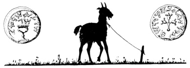

### Ḥad Gadyo

Allegorical meanings have been sought in the Ḥad
Gadyo, on the supposition that it illustrates the working of Divine
justice in the history of mankind. In reality, it is a rhyme for
children, to keep their interest to the end of the Seder. As in the
preceding number so in this one, grown people become children. The
company reads in unison (not racing as in "Who Knows One" but) with
regular rhythm, as to the beat of music; or sings it to one of the
following musical settings.

<table data-border="0">
<colgroup>
<col style="width: 50%" />
<col style="width: 50%" />
</colgroup>
<tbody>
<tr class="odd">
<td data-valign="top">
 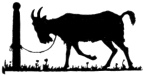
</td>
<td data-valign="top">
An only kid! An only kid, 
My father bought 
For two zuzim <a href="#fn_2">*</a>. 
An only kid! An only kid!

 
</td>
</tr>
<tr class="even">
<td data-valign="top">
 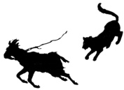
</td>
<td data-valign="top">
2. Then came the cat 
And ate the kid 
My father bought For two zuzim. 
An only kid! An only kid!

 
</td>
</tr>
<tr class="odd">
<td data-valign="top">
 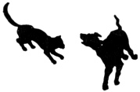
</td>
<td data-valign="top">
3. Then came the dog 
And bit the cat 
That ate the kid 
My father bought 
For two zuzim. 
An only kid! An only kid! p. 95 p. 96

 
</td>
</tr>
<tr class="even">
<td data-valign="top">
 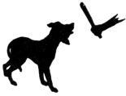
</td>
<td data-valign="top">
4. Then came the stick 
And beat the dog 
That bit the cat 
That ate the kid 
My father bought For two zuzim. 
An only kid! An only kid!

 
</td>
</tr>
<tr class="odd">
<td data-valign="top">
 
</td>
<td data-valign="top">
5. Then came the fire 
And burned the stick 
That beat the dog 
That bit the cat 
That ate the kid 
My father bought 
For two zuzim. 
An only kid! An only kid!

 
</td>
</tr>
<tr class="even">
<td data-valign="top">
 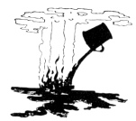
</td>
<td data-valign="top">
6. Then came the water 
And quenched the fire 
That burned the stick 
That beat the dog 
That bit the cat 
That ate the kid 
My father bought For two zuzim. 
An only kid! An only kid! p. 97 p. 98

 
</td>
</tr>
<tr class="odd">
<td data-valign="top">
 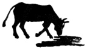
</td>
<td data-valign="top">
7. Then came the ox 
And drank the water 
That quenched the fire 
That burned the stick 
That beat the dog 
That bit the cat 
That ate the kid 
My father bought 
For two zuzim. 
An only kid! An only kid!

 
</td>
</tr>
<tr class="even">
<td data-valign="top">
 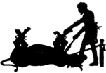
</td>
<td data-valign="top">
8. Then came the butcher 
And killed the ox 
That drank the water 
That quenched the fire 
That burned the stick 
That beat the dog 
That bit the cat 
That ate the kid 
My father bought 
For two zuzim. 
An only kid! An only kid!

 
</td>
</tr>
<tr class="odd">
<td data-valign="top">
 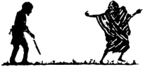
</td>
<td data-valign="top">
9 Then came the angel of death 
And slew the butcher 
That killed the ox p. 99 p. 100 
That drank the water 
That quenched the fire 
That burned the stick 
That beat the dog 
That bit the cat 
That ate the kid 
My father bought 
For two zuzim. 
An only kid! An only kid!
</td>
</tr>
<tr class="even">
<td data-valign="top">
 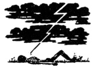
</td>
<td data-valign="top">
10. Then came the Holy One, blest be He! 
And destroyed the angel of death 
That slew the butcher 
That killed the ox 
That drank the water 
That quenched the fire 
That burned the stick 
That beat the dog 
That bit the cat 
That ate the kid 
My father bought 
For two zuzim. 
An only kid! An only kid!
</td>
</tr>
</tbody>
</table>

 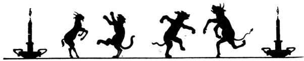

------------------------------------------------------------------------

### Footnotes

[94:\*](uh21.htm#fr_2) Pieces of money.

------------------------------------------------------------------------

[Next: Vay’hi Baḥatzi Halay'loh](uh22)
