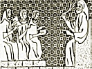
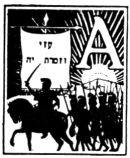

  
[Intangible Textual Heritage](../../index)  [Judaism](../index.md) 
[Index](index)  [Previous](uh22)  [Next](uh24.md) 

------------------------------------------------------------------------

[Buy this Book at
Amazon.com](https://www.amazon.com/exec/obidos/ASIN/B000BD19YW/internetsacredte.md)

------------------------------------------------------------------------

  
*The Union Haggadah*, ed. by The Central Council of American Rabbis
\[1923\], at Intangible Textual Heritage

------------------------------------------------------------------------

p. 125

### History of the Passover

   
THE PASSING GENERATIONS

|                    |
|--------------------|
|  |

AS THE rocks of granite yield to the trained eye of the scientist the
secret of their formation, so human institutions, properly examined,
present records of growth. Such a story of development, in response to
changing social conditions, is displayed by the feast of the Passover.

#### A. THE FESTIVAL OF THE SHEPHERDS.

Its name ḤAG HAPPESAḤ harks back to the misty dawn of history. Long
before the Exodus, the pastoral tribes of Israel celebrated this
festival of the shepherds. As among other pastoral tribes, so among our
forefathers, the joyous springtime, with its rich manifestation of
fertility through the offspring of the flocks and herds, called forth
special festivities. Moses pleaded with Pharaoh in behalf of the
Israelites: "Let us go, we pray thee, three days journey in the
wilderness, and sacrifice unto the Lord our God; lest He fall upon us
with pestilence, or with the sword". [\*](#fn_3.md)
When they were refused, the Israelite families offered the Pesaḥ
sacrifices in their homes in Egypt.

The exact meaning of the name given to this festival and the nature of
its ceremonies are matters of conjecture. Its celebration in the early
spring, was associated

p. 126

with the sacrifice of the firstlings of the flocks and herds. The
modified ordinance regarding its observance in Egypt, as given in Exodus
XII, reads: "In the tenth day of this month they shall take to them
every man a lamb, according to their fathers’ houses, a lamb for a
household; and if the household be too little for a lamb, then shall he
and his neighbor next unto his house take one according to the number of
the souls; according to every man's eating ye shall make your count for
the lamb. Your lamb shall be without blemish, a male of the first year;
ye shall take it from the sheep, or from the goats; and ye shall keep it
until the fourteenth day of the same month; and the whole assembly of
the congregation of Israel shall kill it at dusk. And they shall take of
the blood, and put it on the two side-posts and on the lintel, upon the
house wherein they shall eat it. And they shall eat the flesh in that
night, roast with fire, and unleavened bread; with bitter herbs they
shall eat it. Eat not of it raw, nor sodden at all with water, but roast
with fire; its head with its legs and with the inwards thereof. And ye
shall let nothing of it remain until the morning; but that which
remaineth of it until the morning ye shall burn with fire. And thus
shall ye eat it: with your loins girded, your shoes on your feet, and
your staff in your hand; and ye shall eat it in haste—it is the Lord's
passover." [\*](#fn_4.md)

Only Israelites and initiated strangers could participate in the
Passover. Through the partaking of the sacrificial meat, they sought to
strengthen their union with one another and with God, and by means of
consecrating their dwellings with the blood of the sacrifice, they hoped
to ward off every harm and danger.

The departure of the Israelites from Egypt during

p. 127

the spring festival vested the ancient rite with new historical
significance. The name Pesaḥ assumed the meaning of "passing over," of
sparing and delivering, and its observance came to be interpreted as a
memorial of God's appearance as the avenger of Israel's wrongs: The
blood upon the doorposts and lintels was construed to have been a sign
upon the homes of the Israelites to distinguish them from those of the
Egyptians. Tradition described it as "the sacrifice of the Lord's
passover, for that He passed over the houses of the children of Israel
in Egypt, when He smote the Egyptians, and delivered our houses". [\*](#fn_5.md)

#### B. THE FARMER'S SPRING FESTIVAL.

With their entrance into Canaan, the shepherd tribes of Israel began to
follow agricultural pursuits. Among the older settlers of the land they
found the custom of offering to the deity, at the spring of the year,
the first fruit of their early harvest. They not only adopted this idea
that an offering of their first grain was due to God, but extended it
also to the firstlings of their flocks and herds. Thus the Passover
sacrifice, while retaining its ancient ceremonials, received the new
meaning of being a tribute due to God from the fold. It was also
combined with the feast of Matzos or Unleavened Bread, the spring
festival of the agricultural Canaanite community, observed in the month
of Abib, before the beginning of the harvest season. The important
feature of this celebration was the eating of matzos or cakes prepared
of unleavened dough. As sacrificial food, it was to be free from
leaven. [\*\*](#fn_6.md) "It is very probable",
writes Dr. Julian Morgenstern, "that among the ancient Canaanites and
the early

p. 128

agricultural Israelites, the custom existed of destroying the usually
meager remains of the old crop before the new crop could be used or even
harvested. And if this hypothesis be correct, we must see in the
ceremonies of the destruction of all leaven, of the fasting before the
Matzos-festival and of the eating of the matzos themselves, the
religious, sacramental rites by which the last remains of the old crop
were destroyed as the necessary preparation for the cutting and eating
of the new crop. All of the old crop was thus burned except just enough
to prepare the matzos for the festival." [\*](#fn_7.md)

The later law, as given in Leviticus XXIII:5ff, combines the pastoral
and agricultural elements of the feast. It reads: "In the first month,
on the fourteenth day of the month at dusk, is the Lord's pass-over. And
on the fifteenth day of the same month is the feast of unleavened bread
unto the Lord; seven days shall ye eat unleavened bread". On the second
day of the feast, the barley harvest was ushered in by bringing a sheaf
of the new crop unto the priest. "And he shall wave the sheaf before the
Lord, to be accepted for you. . .And ye shall eat neither bread, nor
parched corn, nor fresh ears, until this selfsame day, until ye have
brought the offering of your God." From that day forty-nine days were
counted, and the fiftieth was observed as Shabuoth (Feast of Weeks) or
as Ḥag Habikkurim, the "feast of the first fruits". (In the orthodox
synagogues the seven weeks between the first day of Pesaḥ and Shabuoth
are still known as the season of S’firath Ho‘omer, of "counting the
sheaf".)

In the light of the association of the feast of Matzos with that of
Pesaḥ, the eating of the matzos was re-interpreted as a reminder of the
hurried flight of the

p. 129

\[paragraph continues\] Israelites from
Egypt. Exodus XII: 39 states: "And they baked unleavened cakes of the
dough which they brought forth out of Egypt, for it was not leavened;
because they were thrust out of Egypt, and could not tarry, neither had
they prepared for themselves any victual".

#### C. THE FEAST OF ISRAEL'S BIRTH.

It was the tradition of the Exodus that vitalized the old Pesaḥ and
Matzos festivals, and welded them into a distinctly Jewish institution,
rich in ethical and religious possibilities. The national consciousness
lovingly dwelt upon the fact that:

"When Israel came forth out of Egypt,  
The house of Jacob from a people of strange language,  
Judah became His sanctuary,  
Israel His dominion." [\*](#fn_8.md)

The hour which marked the birth of Israel as a holy nation, eloquently
demonstrated to the religious mind the love of God for Israel. Prophetic
idealism transformed this belief into a powerful lever of spiritual
progress. "Ye have seen what I did unto the Egyptians", resounded the
voice of God, "and how I bore you on eagles’ wings, and brought you unto
Myself. Now therefore, if ye will hearken unto My voice indeed and keep
My covenant, then ye shall be Mine own treasure from among all peoples;
for all the earth is Mine; and ye shall be unto Me a kingdom of priests,
and a holy nation." [\*\*](#fn_9.md) The belief in
God's choice of Israel, determined Israel's mission in the world. The
high privilege imposed great responsibility.

p. 130

\[paragraph continues\] As the people
chosen by God, in accordance with His plan of the universal salvation of
mankind, Israel must keep faith with God and be "a covenant of the
people" and "a light of the nations:

To open the blind eyes,  
To bring out the prisoners from the dungeon,  
And them that sit in darkness out of the prison-house". [\*](#fn_10.md)

The conviction that Israel was delivered from its low estate to become
the deliverer of the nations from moral and spiritual slavery, led to
the comforting Divine assurance:

"When thou passest through the waters, I will be with thee,  
 And through the rivers, they shall not overflow thee;  
 When thou walkest through the fire, thou shalt not be burned,  
 Neither shall the flame kindle upon thee.  
 For I am the Lord thy God,  
 The Holy One of Israel, thy Savior;  
 I have given Egypt as thy ransom,  
 Ethiopia and Seba for thee.  
 Since thou art precious in My sight, and honorable,  
 And I have loved thee;  
 Therefore will I give men for thee,  
 And peoples for thy life.  
 Fear not, for I am with thee." [\*\*](#fn_11.md)

#### D. THE NATIONAL CELEBRATION.

\(1\) *The Passover During the Second Temple*.

As the feast of Israel's independence, the Passover

p. 131

steadily grew in the hearts of the people. It gained new power, when
subsequent to the Deuteronomic reformation, under King Josiah (621
B.C.E.), the Passover sacrifices, like all other offerings, had to be
brought to the national sanctuary at Jerusalem. During the entire period
of the Second Temple the Passover celebration served as a strong
influence in the unification of Israel. Josephus refers to the great
alacrity with which the Jewish people celebrated the Passover, and
states that on it "they are required to slay more sacrifices in number
that at any other festival". He also points out that "an innumerable
multitude came thither out of the country, nay, from beyond its limits
also, in order to worship God". He estimates that one year, shortly
before the fall of the Temple, the number of sacrifices reached 256,500,
which, upon the allowance of ten to each sacrifice, together with the
considerable number of foreigners and of Jews who were prevented from
partaking of the Passover on account of bodily uncleanliness, [\*](#fn_12.md) made the vast crowd that thronged the
holy city upward of 2,700,200.

\(2\) *The Passover Sacrifice*. [\*\*](#fn_13.md)

For many days before the Passover, the people would come from every
village and hamlet to celebrate the feast of unleavened bread in
Jerusalem. By the fourteenth of Nisan the houses were crowded with
guests, the open spaces were dotted with tents and the streets filled
with the joyous pilgrims. Beneath the merrymaking, ran an undercurrent
of earnest haste, for the great feast was close at hand. The houses were
being

p. 132

cleaned of leaven, and special ovens were being prepared for the
roasting of the paschal lambs.

Frequently in the midst of their labors, the people would look up to the
Temple mount, where on one of the Temple galleries lay two sacrificial
loaves, which served as a signal to them. As long as the priests allowed
these loaves to remain, leavened bread could still be kept in the
houses. But soon one loaf was removed, and then immediately afterwards
the second loaf was taken away. At that signal fires leaped up all over
the city. The last leaven was being burnt. For seven days thereafter
only unleavened bread would be found in all the habitations of Israel.

Now the seventh hour of the day had passed and the regular daily
offering had already been brought up. The time for the sacrifice of the
paschal offering itself had come. Great throngs of people pressed
against the gates of the Temple, each man leading his sacrificial lamb.
Soon the gates were opened but only one-third of the throng was
admitted. As they poured into the Temple courts, they beheld three rows
of priests extending across the sacred precinct. The first and last rows
carried silver basins, the intervening carried basins of gold. The first
man carried his lamb to the altar where it was sacrificed. The blood was
caught in one of the basins and handed from priest to priest, each one
receiving the empty basin in return for the filled one. Thus with very
little delay, all the sacrifices were completed. While these sacrifices
were being performed, the Levites chanted aloud the Hallel Psalms, the
people responding in unison. After the first group of pilgrims completed
its sacrifices, the second group was admitted, and then the third. When
all the sacrifices were over, the people went to their houses and
proceeded to roast the paschal lamb and make all preparations

p. 133

for the great Seder service, which was to take place in every home that
evening.

#### E. THE FEAST OF FREEDOM.

During the centuries of Roman oppression, when the Jewish people groaned
under the crushing burden of the Caesars, even as did their forefathers
in Egypt, the ancient Feast of Freedom was charged with new vitality.
Its annual recurrence came like a summons to new life and to liberty,
making each Israelite feel as if he personally had shared in the Exodus.
This sentiment was fostered by the new ritual for the home which
replaced the Passover sacrifice after the Temple and the altar had been
destroyed. While the Seder service was commemorative of the sacrificial
rites at the Temple (the roast bone representing the paschal lamb, and
the egg the additional festive offerings, the Ḥagigah), it was
essentially propagandist in nature. The recital of the story of the
Exodus was calculated to awaken the national consciousness. It became a
duty to tell the young and to rehearse to one another the tale of the
deliverance from Egyptian bondage. To dwell at length on it was
considered praiseworthy. During the Hadrianic persecution, we find Rabbi
Akiba, the moving spirit in Bar Cochba's heroic struggle to regain the
independence of the Jewish people, together with other leaders in
Israel, at B’nai B’rak, absorbed in the story of the Exodus all night,
looking to the fulfillment of the prophetic promise to Israel:

As in the days of thy coming forth out of the land of Egypt  
Will I show unto him marvelous things. [\*](#fn_14.md)

p. 134

Commemorating the deliverance from Egyptian bondage ("Pesaḥ Mitzrayim"),
the Passover held out the promise of the future redemption from Roman
bondage ("Pesaḥ L’osid"). Another belief, too, became current that God's
anointed (the Messiah) would appear on the anniversary of Israel's
liberation, to reestablish the fallen tabernacle of David. Several
self-deluded men, under the spell of this belief, proclaimed themselves
as the long expected Messiahs. Thus in all ages, the Passover proved to
be a perennial source of hope. Celebrating it, the Jewish people defied
their ever new Pharaohs and Caesars, declaring prayerfully: "This year
we are slaves; next year may we be free men". To souls crushed with
anguish the "Z’man Ḥerusenu—the season of our liberation" held out the
promise of the coming day when all fetters of oppression would be
broken, when the clouds of religious bigotry and racial prejudice and
hatred would be dispelled by the dawning light of God's truth, and when
Israel's dormant powers would awaken to new life and blossom forth in
renewed glory.

#### THE ETHICAL SIGNIFICANCE OF THE PASSOVER.

Israel's experience was unique from the first when it departed from
Egypt. Again and again races have been subjugated, reduced to slavery or
villenage; but does history know of another horde of slaves that
recovered itself, regained freedom, reestablished its own civilization,
its own government? It is eminently proper, therefore, that in the
prophetic as well as the Rabbinic cycle of ideas the Exodus from Egypt
should occupy a prominent place. Its importance had been recognized
still earlier, in the code, the Torah. The most exalted moral statutes
concerning the treatment of strangers are connected with the Exodus, and

p. 135

are, from a psychologic point of view, impressively inculcated by means
of the reminder: "Ye know the heart of the stranger!" [\*](#fn_15.md) It is remarkable how even the law of the
Sabbath rest, at first sight unconnected with the story of Israel's
slavery and redemption, is brought into relation with and illuminated by
it. The fourth commandment in the second version of the Ten
Commandments, in Deuteronomy, disregards the dogmatic reason attached to
the first ("for in six days the Lord made" etc). [\*\*](#fn_16.md) It emphasizes the ethical motive, that
the manservant and the maid-servant should be granted a day of rest, and
employs the memory of the Egyptian experience to urge consideration for
subordinates. This method, characteristic of the Bible and still more of
the Rabbis, of establishing a connection between the most important
moral laws and the history of Israel in Egypt, at the same time
illustrates how nations should draw instruction from their fortunes.

The Prophets and Psalmists employ the great historical event to give
reality chiefly to the religious idea of God's providence and grace. The
Rabbis, finally, deduce from it the two fundamental elements of man's
ethical [education](errata.htm#0.md): the notion of liberty and the notion
of man's ethical task.

Political and even civil freedom was lost. The Roman Pharaohs, if they
did not exact labor, the more despotically exacted property and blood,
and aimed at the annihilation of ideal possessions—the Law, its study,
and its execution. Yet the notion of liberty, inner moral and spiritual
liberty, cherished as a pure, exalted ideal, possible only under and
through the Law, was associated with the memory of the redemption

p. 136

from Egyptian slavery, and this memory in turn was connected with
symbolic practices accompanying every act, pleasure, and celebration.

Moritz Lazarus,  
The Ethics of Judaism, Part 1, p. 231-2 and 29.

  [  
Click to enlarge](img/13600.jpg.md)  
MOSES AND THE TABLES OF THE LAW  

p. 137

#### Moses

"How small Sinai appears when Moses stands upon it! This mountain is
only the pedestal for the feet of the man whose head reaches up to the
heavens, where he speaks with God."

The artistic spirit was directed by Moses, "as by his Egyptian
compatriots, to colossal and indestructible undertakings. He built human
pyramids, carved human obelisks; he took a poor shepherd family and
created a nation from it --a great eternal, holy people; a people of
God, destined to outlive the centuries, and to serve as pattern to all
other nations, even as a prototype to the whole of mankind. He created
Israel," . . . a people that has "fought and suffered on every
battlefield of human thought."

Heinrich Heine

\_\_\_\_\_\_\_\_\_\_\_\_\_

To lead into freedom a people long crushed by tyranny; to discipline and
order such a mighty host; to harden them into fighting men, before whom
warlike tribes quailed and walled cities went down; to repress
discontent and jealousy and mutiny; to combat reactions and reversions;
to turn the quick, fierce flame of enthusiasm to the service of a steady
purpose, require some towering character—a character blending in highest
expression the qualities of politician, patriot, philosopher, and
statesman—the anion of the wisdom of the Egyptians with the unselfish
devotion of the meekest of men.

The striking differences between Egyptian and Hebrew polity are not of
form but of essence. The tendency of the one is to subordination and
oppression; of the other, to individual freedom. Strangest of recorded
birth! From

p. 138

the strongest and most splendid despotism of antiquity comes the freest
republic. From between the paws of the rock-hewn Sphinx rises the genius
of human liberty, and the trumpets of the Exodus throb with the defiant
proclamation of the rights of man. . . In the characteristics of the
Mosaic institutions, as in the fragments of a Colossus, we may read the
greatness of the mind whose impress they bear—of a mind in advance of
its surroundings, in advance of its age; of one of those star souls that
dwindle not with distance, but, glowing with the radiance of essential
truth, hold their light while institutions and languages and creeds
change and pass.

Leader and servant of men! Law-giver and benefactor! Toiler towards the
Promised Land seen only by the eye of faith! Type of the high souls who
in every age have given to earth its heroes and its martyrs, whose deeds
are the precious possession of the race, whose memories are its sacred
heritage! With whom among the founders of Empire shall we compare him?

To dispute about the inspiration of such a man were to dispute about
words. From the depths of the Unseen such characters must draw their
strength; from fountains that flow only for the pure in heart must come
their wisdom. Of something more real than matter, of something higher
than the stars, of a light that will endure when suns are dead and dark,
of a purpose of which the physical universe is but a passing phase, such
lives tell.

Henry George, Lecture on Moses, 1884

------------------------------------------------------------------------

### Footnotes

[125:\*](uh23.htm#fr_3.md) Exodus V: 3.

[126:\*](uh23.htm#fr_4.md) Exodus XII: 3-11

[127:\*](uh23.htm#fr_5.md) Exodus XII: 27.

[127:\*\*](uh23.htm#fr_6.md) Leviticus II: 11; VI:
10. 127

[128:\*](uh23.htm#fr_7.md) The American Journal of
Theology, vol. XXI, p. 288.

[129:\*](uh23.htm#fr_8.md) Psalm CXIV: 1-2.

[129:\*\*](uh23.htm#fr_9.md) Exodus XIX: 4-5.

[130:\*](uh23.htm#fr_10.md) Isaiah XLII: 6-7.

[130:\*\*](uh23.htm#fr_11.md) Isaiah XLIII: 2-5.

[131:\*](uh23.htm#fr_12.md) Those that were
prevented from performing their duty on the 14th of Nisan were allowed
to offer the Passover sacrifice on the 14th of Iyar. See Numbers IX:
9-14.

[131:\*\*](uh23.htm#fr_13.md) According to the
Mishnah Pesaḥim.

[133:\*](uh23.htm#fr_14.md) Micah VII, 15.

[135:\*](uh23.htm#fr_15.md) Exodus XXIII: 9.

[135:\*\*](uh23.htm#fr_16.md) Exodus XX: 11.

------------------------------------------------------------------------

[Next: Preparations for Passover](uh24.md)
